# SPSS | Data Analysis

## Frequencies (Frequencies and Descriptives) 

### Obtaining Frequency-Related Statistics

1. First, enter the data (described elsewhere). 

2. After the data are entered, select the "Analyze → Descriptive Statistics → Frequencies" option from the main menu. 

<kbd></kbd>

### Obtaining a Frequency Distribution

3. A dialogue box will then appear for you to choose the variables of interest. 

4. Select the variables you wish to analyze by clicking on them and then the arrow to move them  into the "variables" box.

5. Be sure that "Display frequency tables" is checked. Without this checked, you will not get a frequency distribution.

6. If all you wish is a frequency table (with no histogram or summary statistics), click "OK." A separate window with the output will appear.

<kbd>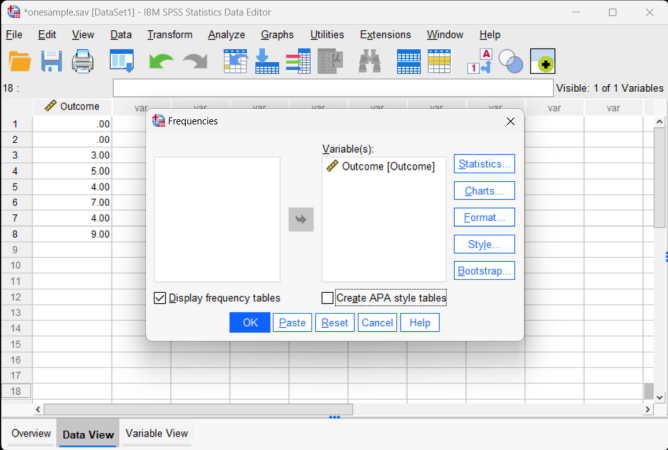</kbd>

### Obtaining Summary Statistics 
 
7. To obtain summary statistics, select "Statistics." Another dialogue box will appear.

8. In this box, you can request that SPSS calculate the mean, variance, and standard deviation (or median and quartiles). 

9. Once you have selected the desired statistics, click "Continue." This will return you to the original dialogue box.

<kbd></kbd>

### Obtaining a Histogram 

10. To obtain a histogram, click on the "Charts" button. Another dialogue box will appear.

11. In this box, select "Histogram." 

12. Click "Continue." This will return you to the original dialogue box.

13. After clicking on "OK" in the original dialogue box, a separate window with the output will appear.

<kbd>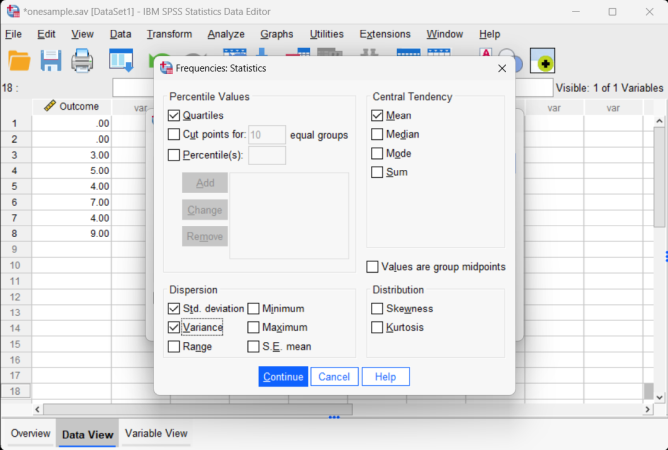</kbd>

## Correlations (Bivariate) 

### Obtaining Correlational Statistics

1. First, enter data involving multiple variables. This is described elsewhere.

2. After the data are entered, select the "Analyze → Correlate → Bivariate" option from the main menu. 

<kbd></kbd>

### Obtaining the Correlations (and Significance Tests)

3. A dialogue box will then appear for you to choose the variables of interest. 

4. Select the variables you wish to analyze by clicking on them and hitting the arrow to move them into the "Variables" box. 

5. By default, SPSS will have the "Pearson" box checked. Similarly, having "two-tailed" and "flag significant correlations" checked will create and display the significance tests.

6. If all you wish is a table of correlations (with no other descriptive statistics), click "OK." A separate window with the output will appear. 

<kbd></kbd>

### Obtaining Descriptive Statistics

7. If you wish to get the descriptive statistics as well, select the "Options" button.

8. Another dialogue box will appear where you can choose various statistics. Select "Means and standard deviations" and "cross-product deviations and covariances."

9. When you are done, click  "Continue." This will return you to the original dialogue box.

10. Now click "OK" in the original dialogue box. A separate window with the output will appear.

<kbd></kbd>

## Descriptives (Standardized Scores and Transformations) 

### Obtaining Descriptive-Related Statistics 

1. First, enter the data (described elsewhere). 

2. After the data are entered, select the "Analyze → Descriptive Statistics → Descriptives" option from the main menu. 

<kbd>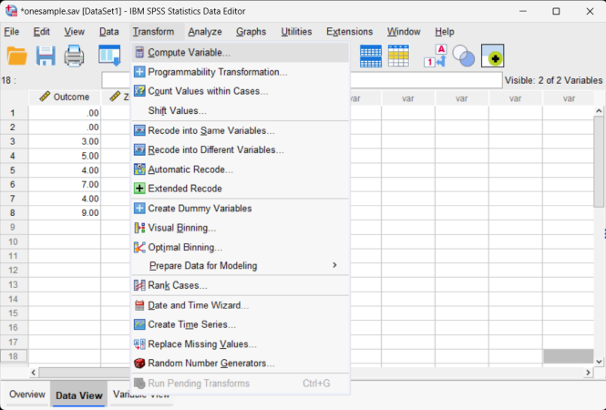</kbd>

### Obtaining Standardized (z) Scores 

3. A dialogue box will then appear for you to choose the variables of interest. 

4. Select the variables you wish to analyze by clicking on them and hitting the arrow to move them into the "variables" box. 

5. Be sure that "Save standardized values as variables" is checked. Without this checked, you will not get the standardized scores. 

6. If all you wish are the standardized scores (with descriptive summary statistics), click "OK." A separate window with the output will appear.

<kbd></kbd>

### Obtaining Summary Statistics

7. To obtain summary statistics, select "Options." Another dialogue box will appear.

8. In this box, you can request that SPSS calculate the mean, variance, and standard deviation (and other statistics). 

9. Once you have selected the desired statistics, click "Continue." This will return you to the original dialogue box.

<kbd></kbd>

### Viewing the Standardized Scores  

10. After clicking on "OK" in the original dialogue box, a separate window with the output will appear.

11. Finally, note that the standardized variables are not included in the output. Rather, they are saved as new variables in the data view window. These variables can be used in subsequent analyses.

<kbd></kbd>

### Obtaining the Compute Menu

12. In addition to (or instead of) calculating standardized scores, you can perform other data transformations. First, enter the data (described elsewhere).

13. After the data are entered, select the "Transform → Compute Variable" option from the main menu.

<kbd></kbd>

### Calculating Other Transformations 

 14. A dialogue box will then appear for you to choose the variables of interest to transform.

 15. Under "Target Variables," type the name of the new variable that you are creating. Here "trOutcome" is the name of the new variable.

 16. In the "Numeric Expression" box, type the formula that will be used in the transformation. In this example, the "trOutcome" is calculated by taking the original score and adding one.

 17. After clicking on "OK" in the original dialogue box, the transformed variables will appear in the data view window. These variables can be used in subsequent analyses. 

<kbd>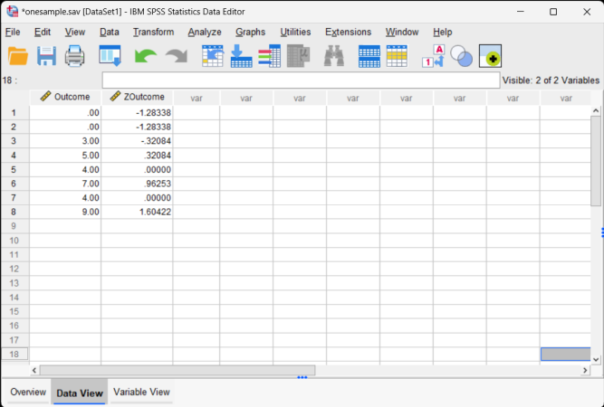</kbd>

## Explore (Descriptives and Confidence Intervals) 

### Obtaining Exploratory-Related Statistics 

 1. First, enter the data (described elsewhere). 

 2. After the data are entered, select the "Analyze → Descriptive Statistics → Explore" option from the main menu. 

<kbd></kbd>

### Obtaining the Exploratory Statistics

3. A dialogue box will then appear for you to choose the variables of interest. 

4. Select the variables you wish to analyze by clicking on them and hitting the arrow to move them into the "Dependent List" box.

5. Be sure that "Statistics" is checked. This will limit your output to basic descriptive statistics and confidence intervals.

6. If you do not wish to alter the default (95%) confidence level, click "OK." A separate window with the output will appear.

<kbd></kbd>

### Altering the Confidence Interval

7. If you wish to alter the width of the confidence interval, select the "Statistics" button. 

8. Another dialogue box will appear where you can change the confidence level. When you are done, click "Continue." This will return you to the original dialogue box. 

9. After clicking on "OK" in the original dialogue box, a separate window with the output will appear.

<kbd></kbd>

### Obtaining a Graph of the Confidence Intervals 

10. First, enter the data (described elsewhere). 

11. To obtain a graph, select the "Graphs → Legacy Dialogs → Error Bar" option from the main menu. 

<kbd></kbd>

### Choosing the Graph Layout

 12. A dialogue box will then appear for you to choose the general graph layout of interest.

 13. Click on the box labeled "Simple" (it should then be highlighted).

 14. Then click on the option that states that you want "Summaries of separate variables."

 15. Click "Define."

<kbd></kbd>

### Obtaining the Confidence Interval Graph

 16. A dialogue box will then appear for you to choose the variables of interest to graph.

 17. Under "Error Bars," move the name(s) of the variable(s) you want to include in the graph. 

 18. If you want to change the width of the confidence intervals, type the appropriate percentage in the "Level" box. 

 19. After clicking on "OK", a separate window with the output will appear.

<kbd></kbd>

## T Test (One Sample) 

### Obtaining One-Sample Inferential Statistics

 1. First, enter the data (described elsewhere). 

 2. After the data are entered, select the "Analyze → Compare Means → One-Sample T Test" option from the main menu.

<kbd>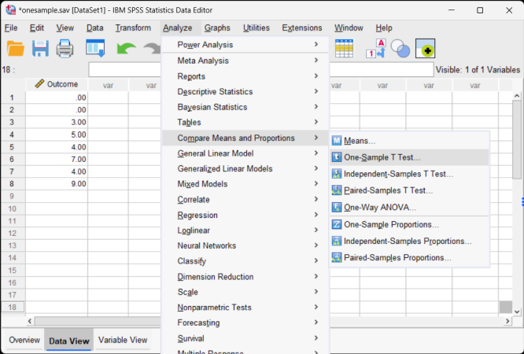</kbd>

### Obtaining the Significance Test 

3. A dialogue box will then appear for you to choose the variables of interest. 

4. Select the variables you wish to analyze by clicking on them and hitting the arrow to move them into the "Test Variables" box.

5. Be sure to enter a known or hypothesized mean into the "Test Value" field. If you do not enter a value here, SPSS will automatically use zero as the comparison mean. 

6. If you do not wish to alter the default (95%) confidence level, click "OK." A separate window with the output will appear.

<kbd>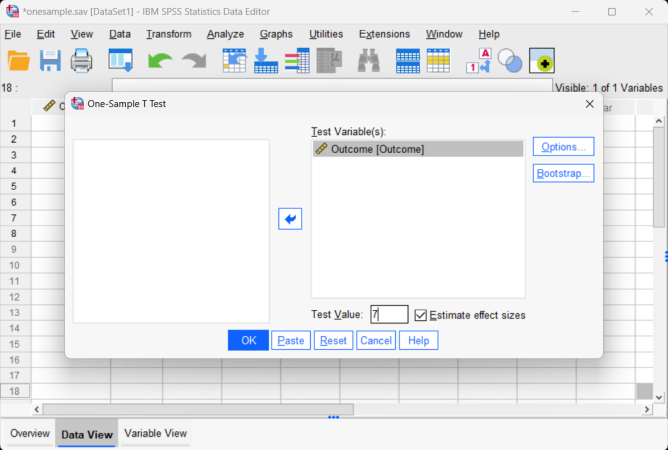</kbd>

### Altering the Confidence Interval

7. If you wish to alter the  width of the confidence interval, select the "Options" button.

8. Another dialogue box will appear where you can change the confidence level. When you are done, click "Continue." This will return you to the original dialogue box. 

9. After clicking on "OK" in the original dialogue box, a separate window with the output will appear.

<kbd></kbd>

## T Test (Paired Samples) 

### Obtaining Paired-Sample Statistics

1. First, enter the data (described elsewhere). 

2. After the data are entered, select the "Analyze → Compare Means → Paired-Samples T Test" option from the main menu. 

<kbd>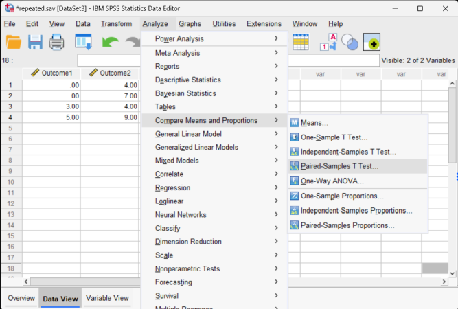</kbd>

### Obtaining the Significance Test 

3. A dialogue box will then appear for you to choose the variables of interest. 

4. Select the variables you wish to analyze by clicking on both of them while holding down the "CTRL" key. Then click on the arrow to move the pair of variables to the "Paired Variables" box.

4. If you do not wish to alter the default (95%) confidence level, click "OK." A separate window with the output will appear.

<kbd></kbd>

### Altering the Confidence Interval 
 
5. If you wish to alter the width of the confidence interval, select the "Options" button.

6. Another dialogue box will appear where you can change the confidence level. When you are done, click "Continue." This will return you to the original dialogue box. 

7. After clicking on "OK" in the original dialogue box, a separate window with the output will appear.

<kbd>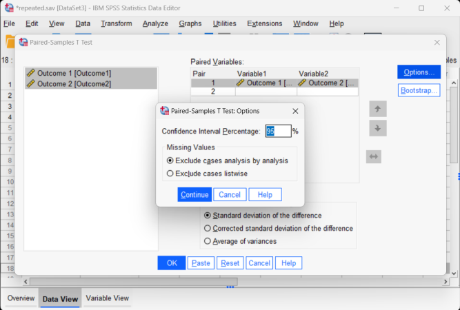</kbd>

## T Test (Independent Samples) 

### Obtaining Two-Sample Inferential Statistics

1. First, enter the data (described elsewhere). 

2. After the data are entered, select the "Analyze → Compare Means → Independent-Samples T Test" ption from the main menu.

<kbd></kbd>

### Obtaining the Significance Test 

3. A dialogue box will then appear for you to choose the variables of interest. 

4. Select the outcome variables you wish to analyze by clicking on them and hitting the arrow to move them into the "Test Variables" box.

5. Move the variable that defines the different groups to the "Grouping Variable" box. Note that  question marks will appear here and that you will need to follow the next set of steps in order to run the analyses.

<kbd>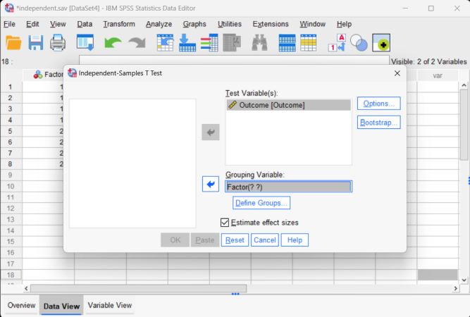</kbd>

### Defining the Groups to be Analyzed

6. In order to tell SPSS which two groups you wish to compare, click on the "Define Groups" box. 

7. A new dialog box will appear. Here you will need to indicate the numeric values you used in setting up the data file to refer to the groups. In this example, a value of 1 for the variable "group" referred to Group 1 and a value of 2 for the variable "group" referred to Group 2.

8. When you are done, click "Continue." This will return you to the original dialogue box.

9. If you do not wish to alter the default (95%) confidence level, click "OK." A separate window with the output will appear.

<kbd>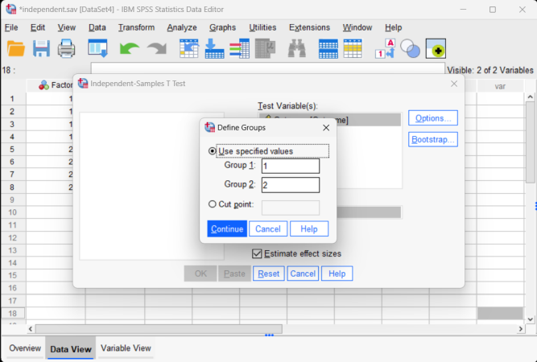</kbd>

### Altering the Confidence Interval

10. If you wish to alter the width of the confidence interval, select the "Options" button.

11. Another dialogue box will appear where you can change the confidence level. When you are done, click "Continue." This will return you to the original dialogue box. 

12. After clicking on "OK" in the original dialogue box, a separate window with the output will appear.

<kbd></kbd>

## One-Way (OneWay ANOVA) 

### Obtaining Multiple-Sample Inferential Statistics

1. First, enter the data. This is done in the same manner as entering two sample data (described elsewhere) but with additional groups.

2. After the data are entered, select the "Analyze → Compare Means → One-Way ANOVA" option from the main menu. 

<kbd></kbd>

### Obtaining the Significance Test

3. A dialogue box will then appear for you to choose the variables of interest. 

4. Select the outcome variables you wish to analyze by clicking on them and then the arrow to move them into the "Dependent List" box. 

5. Move the variable that defines the different groups to the "Factor" box. SPSS will not ask you  to define the groups you wish to compare; it simply will compare all groups defined by the factor. 

6. If all you wish is an ANOVA source table (with no descriptive statistics or post hoc tests), click "OK." A separate window with the output will appear.

<kbd></kbd>

### Obtaining Descriptive Statistics

 7. If you wish to get the means, standard deviations, standard errors, and 95% confidence  intervals for each group, select the "Options" button.

 8. Another dialogue box will appear where you can choose various statistics. Select "Descriptive". When you are done, click "Continue". This will return you to the original dialogue box.

 9. If all you wish is an ANOVA with the descriptive statistics (and no post hoc tests), click "OK". A separate window with the output will appear.

<kbd></kbd>

## Post Hoc Comparisons (OneWay ANOVA) 

### Obtaining Multiple-Sample Inferential Statistics

1. First, enter the data. This is done in the same manner as entering two sample data (described elsewhere) but with additional groups.

2. After the data are entered, select the "Analyze → Compare Means → One-Way ANOVA" option from the main menu.

<kbd></kbd>

### Obtaining the Significance Test 
 
3. A dialogue box will then appear for you to choose the variables of interest. 

4. Select the outcome variables you wish to analyze by clicking on them and clicking the arrow to move them into the "Dependent List" box.

5. Move the variable that defines the different groups to the "Factor" box. SPSS will not ask you to define the groups you wish to compare; it simply will compare all groups defined by the factor. 

6. If all you wish is an ANOVA source table (with no descriptive statistics or post hoc tests), click "OK." A separate window with the output will appear.

<kbd></kbd>

### Obtaining Descriptive Statistics

7. If you wish to get the means, standard deviations, standard errors, and 95%  confidence intervals for each group, select the "Options" button.

 8. Another dialogue box will appear where you can choose various statistics. Select "Descriptive." When you are done, click "Continue." This will return you to the  original dialogue box. 

 9. If all you wish is an ANOVA with the descriptive  statistics (and no post hoc tests), click "OK." A separate window with the output will appear.

<kbd></kbd>

### Obtaining Post Hoc Tests

10. If you wish to obtain post hoc tests for the purpose of making comparisons between  groups, click the "Post Hoc" button.

11. Another dialogue box will appear where you can choose which post hoc tests you wish. Select "Tukey" to get Tukey HSD post hoc tests. When you are done, click "Continue."

12. After clicking on "OK" in the original dialogue box, a separate window with the output will appear.

<kbd></kbd>

## General Linear Model (Repeated Measures ANOVA) 

### Obtaining Repeated Measures Inferential Statistics

1. First, enter the repeated measures data. This is described elsewhere. 

2. After the data are entered, select the "Analyze → General Linear Model → Repeated Measures" option from the main menu.

<kbd></kbd>

### Labeling the Within-Subjects Variable/Factor 

3. A dialogue box will then appear for you to create the repeated measures factor. This box is necessary because SPSS does not yet know which columns you wish to identify as repeated measurements of the same underlying factor. 

4. In the "Within-Subject Factor Name" box, type in the name you wish to give to the repeated measures factor. In this example, since the measurements/columns reflect quizzes at two different times, "Time" is used as the name.

5. In the "Number of Levels" box, indicate the number of levels of the within-subjects factor. In  this example, the quiz was given twice, so there were 2 levels of the factor.

<kbd></kbd>

### Creating the Within-Subjects Factor

6. It is then important that you finalize the creation of the within-subjects factor by clicking on the "Add" button. This officially declares the new factor in SPSS.

7. Note that this factor only exists in the computer's memory. For examples, nowhere in the data set will you see a variable called "Time." 

8. When you have done this, click on "Define." This will take you to the next step in setting up the analysis.

<kbd></kbd>

### Obtaining the Significance Test

9. A dialogue box will then appear for you to define which columns/variables reflect the levels of the within-subjects factor.

10. Select the outcome variables you wish to analyze by clicking on them and clicking the arrow to move them into the "Within-Subjects Variable" box. In this example, "Outcome1" reflects the first level of the factor and "Outcome2" reflects the second level of the factor.

11. If all you wish is are ANOVA source tables (with no descriptive statistics or comparisons), click "OK." A separate window with the  output will appear.

<kbd>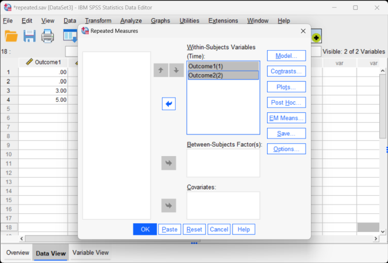</kbd>

### Obtaining Descriptive Statistics

 12. If you wish to get the means, standard deviations, standard errors, and 95% confidence  intervals for each group, select the "Options" button.

 13. Another dialogue box will appear where you can choose various statistics. For means and standard deviations, select "Descriptive." When you are done, click "Continue." This will return you to the original dialogue box.

 14. After clicking on "OK" in the original dialogue box, a separate window with the output will appear.

<kbd>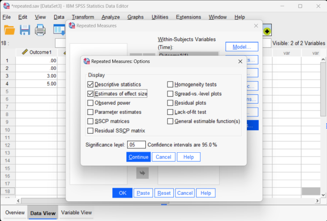</kbd>

### Obtaining Confidence Intervals

 15. If you wish to get the confidence intervals for each mean, select the "EM Means" button. 

 16. Another dialogue box will appear where you can specify the Factor. Move the relevant term to the "Display Means" box. 

 17. When you are done, click "Continue." This will return you to the original dialogue box.

 18. After clicking on "OK" in the original dialogue box, a separate window with the  output will appear.

<kbd>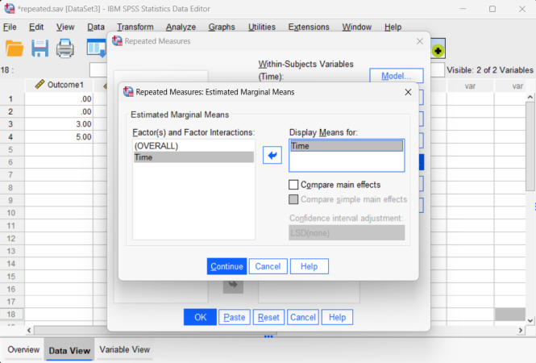</kbd>

## Univariate Analysis of Variance (Factorial ANOVA) 

### Obtaining Factorial Inferential Statistics

1. First, enter the data (described elsewhere). 

2. After the data are entered, select the "Analyze → General Linear Model → Univariate" option from the main menu. 

<kbd>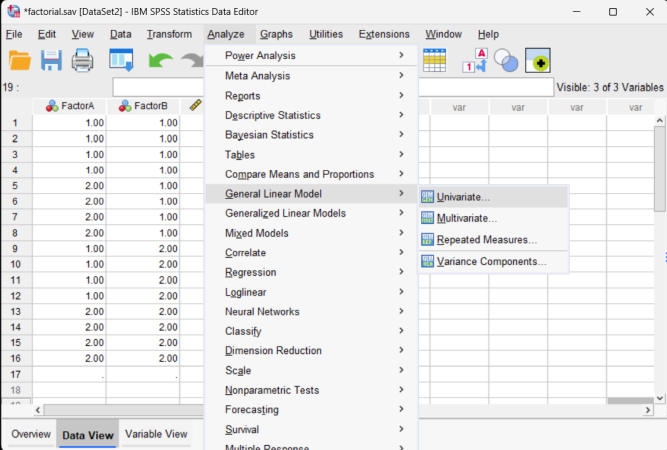</kbd>

### Obtaining the Significance Test 

3. A dialogue box will then appear for you to choose the variables of interest. 

4. Select the outcome variable you wish to analyze by clicking on it and clicking the arrow to move them into the "Dependent Variable" box. 

5. Move the variable(s) that defines the different groups to the "Fixed  Factor(s)" box. Note that SPSS will not require you to enter anything for the interaction if there are multiple factors; it will automatically create the interactions defined by the factor(s). 

6. If all you wish is an ANOVA source table (with no descriptive statistics), click "OK." A separate window with the output will appear. 

<kbd>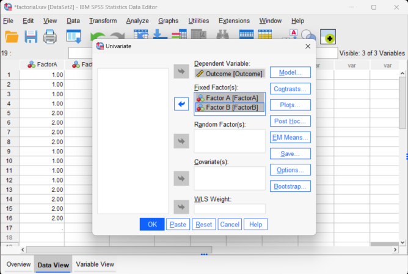</kbd>

### Obtaining Descriptive Statistics

7. If you wish to get the means and standard deviations for each group, select the "Options" button.

8. Another dialogue box will appear where you can choose various statistics. Select "Descriptive statistics." 

9. If you wish to get eta-squared measures for each factor (and the interaction), click on "Estimates of effect size." 

 10. When you are done, click "Continue." This will return you to the original dialogue box.

 11. After clicking on "OK" in the original dialogue box, a separate window with the  output will appear.

<kbd>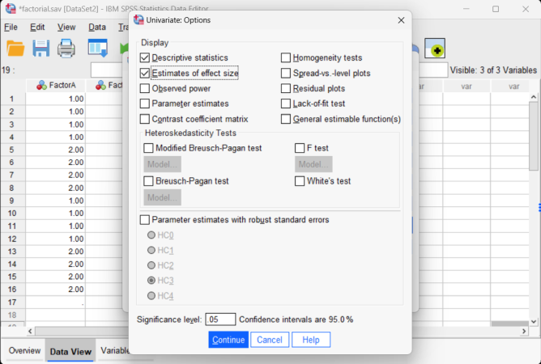</kbd>

### Obtaining Confidence Intervals

12. If you wish to get the confidence intervals for each mean, select the "EM Means" button. 

13. Another dialogue box will appear where you can specify which effects (main effects and interactions) to analyze. Move the relevant terms to the "Display Means" box. 

14. When you are done, click "Continue." This will return you to the original dialogue box.

15. After clicking on "OK" in the original dialogue box, a separate window with the output will appear.

<kbd>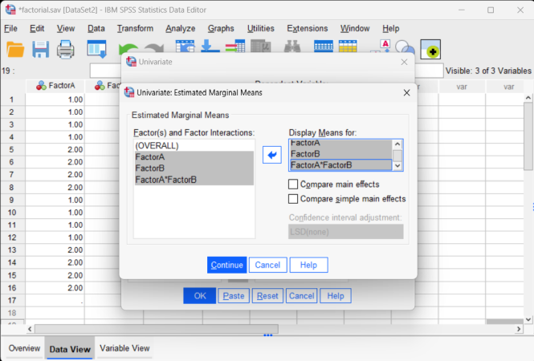</kbd>

