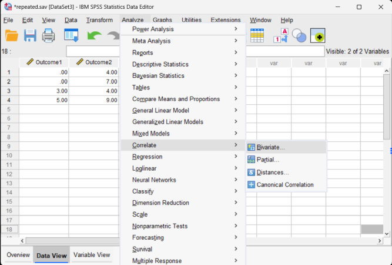
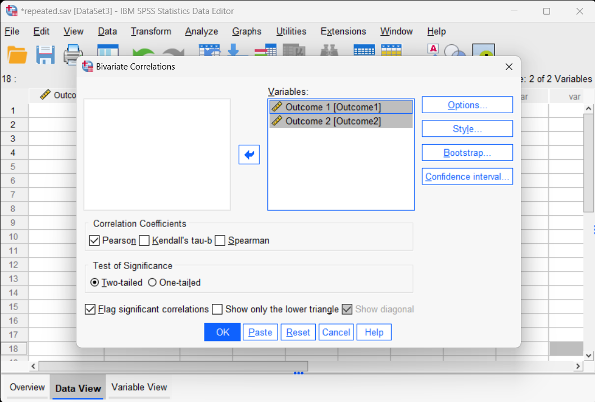
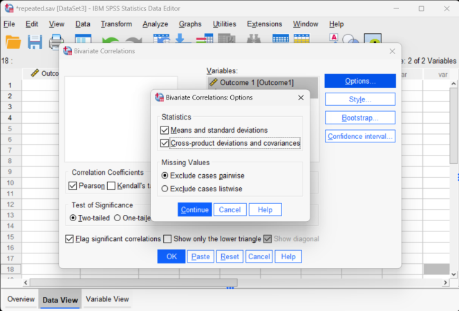

# SPSS | Data Analysis

## Correlations

### Obtaining Correlational Statistics

1. First, enter data involving multiple variables. This is described elsewhere.

2. After the data are entered, select the "Analyze → Correlate → Bivariate" option from the main menu. 

<kbd></kbd>

### Obtaining the Significance Tests

3. A dialogue box will then appear for you to choose the variables of interest. 

4. Select the variables you wish to analyze by clicking on them and hitting the arrow to move them into the "Variables" box. 

5. By default, SPSS will have the "Pearson" box checked. Similarly, having "two-tailed" and "flag significant correlations" checked will create and display the significance tests.

6. If all you wish is a table of correlations (with no other descriptive statistics), click "OK." A separate window with the output will appear. 

<kbd></kbd>

### Obtaining Descriptive Statistics

7. If you wish to get the descriptive statistics as well, select the "Options" button.

8. Another dialogue box will appear where you can choose various statistics. Select "Means and standard deviations" and "cross-product deviations and covariances."

9. When you are done, click  "Continue." This will return you to the original dialogue box.

10. Now click "OK" in the original dialogue box. A separate window with the output will appear.

<kbd></kbd>

