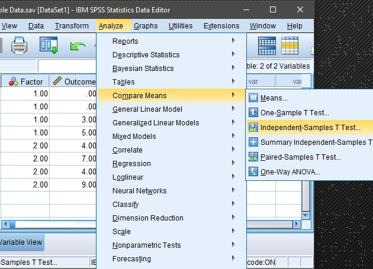
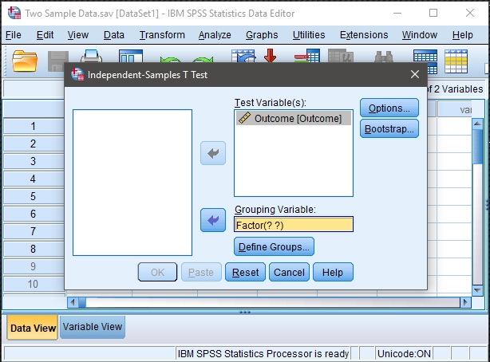
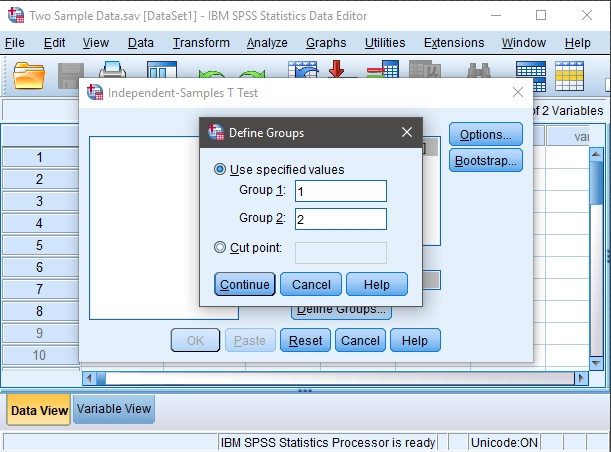
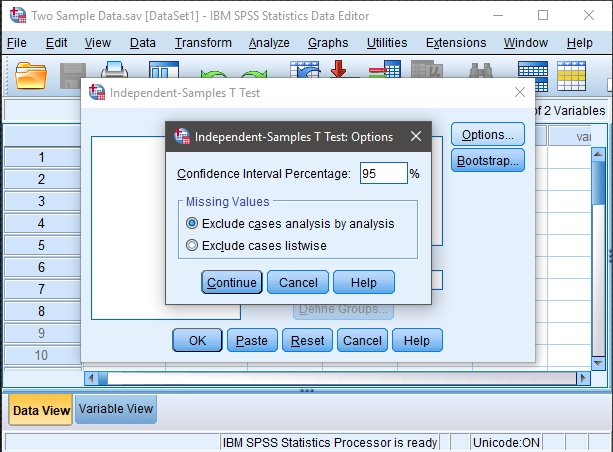

## SPSS: Data Analysis

### T Test (Independent Samples) 

#### Obtaining Two-Sample Inferential Statistics

1. First, enter the data
 (described elsewhere). 

2. After the data are entered,
 select the "Analyze →
 Compare Means →
 Independent-Samples T
 Test" option from the main 
 menu.

<kbd></kbd>

#### Obtaining the Significance Test 

3. A dialogue box will then 
 appear for you to choose 
 the variables of interest. 

4. Select the outcome variables 
 you wish to analyze by 
 clicking on them and 
 hitting the arrow to move
 them into the "Test
 Variables" box.

5. Move the variable that 
 defines the different
 groups to the "Grouping
 Variable" box. Note that 
 question marks will appear 
 here and that you will 
 need to follow the next
 set of steps in order to 
 run the analyses.

<kbd></kbd>

#### Defining the Groups to be Analyzed

6. In order to tell SPSS which
 two groups you wish to 
 compare, click on the
 "Define Groups" box. 

7. A new dialog box will
 appear. Here you will need 
 to indicate the numeric
 values you used in setting 
 up the data file to refer
 to the groups. In this 
 example, a value of 1 for
 the variable "group" 
 referred to Group 1 and a
 value of 2 for the 
 variable "group" referred
 to Group 2.

8. When you are done, click 
 "Continue." This will
 return you to the original 
 dialogue box.

9. If you do not wish to alter
 the default (95%)
 confidence level, click
 "OK." A separate window
 with the output will 
 appear.

<kbd></kbd>

#### Altering the Confidence Interval

10. If you wish to alter the 
 width of the confidence
 interval, select the 
 "Options" button.

11. Another dialogue box will
 appear where you can 
 change the confidence
 level. When you are done,
 click "Continue." This 
 will return you to the 
 original dialogue box. 

12. After clicking on "OK" in
 the original dialogue box, 
 a separate window with the 
 output will appear.

<kbd></kbd>

