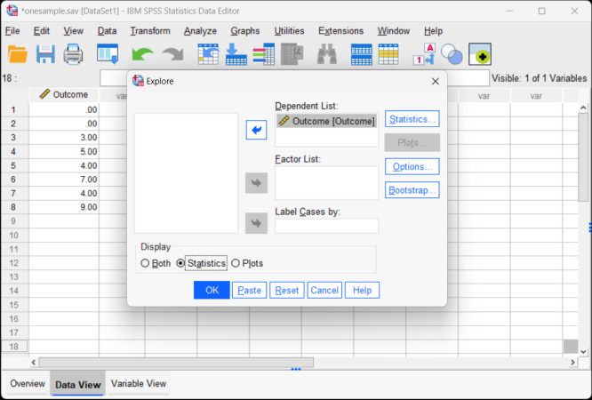

# SPSS Articles

## Data Analysis | Confidence Intervals

### Selecting the Analysis 

 1. First, enter the data (described elsewhere). 

 2. After the data are entered, select the "Analyze → Descriptive Statistics → Explore" option from the main menu. 

<kbd></kbd>

### Obtaining the Exploratory Statistics

3. A dialogue box will then appear for you to choose the variables of interest. 

4. Select the variables you wish to analyze by clicking on them and hitting the arrow to move them into the "Dependent List" box.

5. Be sure that "Statistics" is checked. This will limit your output to basic descriptive statistics and confidence intervals.

6. If you do not wish to alter the default (95%) confidence level, click "OK." A separate window with the output will appear.

<kbd></kbd>

### Altering the Confidence Interval

7. If you wish to alter the width of the confidence interval, select the "Statistics" button. 

8. Another dialogue box will appear where you can change the confidence level. When you are done, click "Continue." This will return you to the original dialogue box. 

9. After clicking on "OK" in the original dialogue box, a separate window with the output will appear.

<kbd></kbd>

