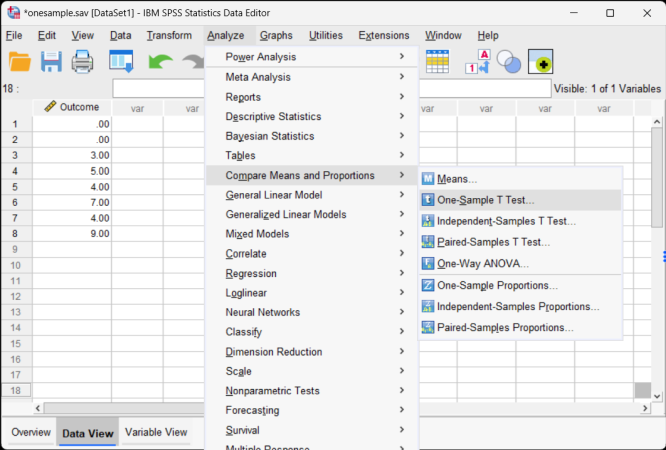
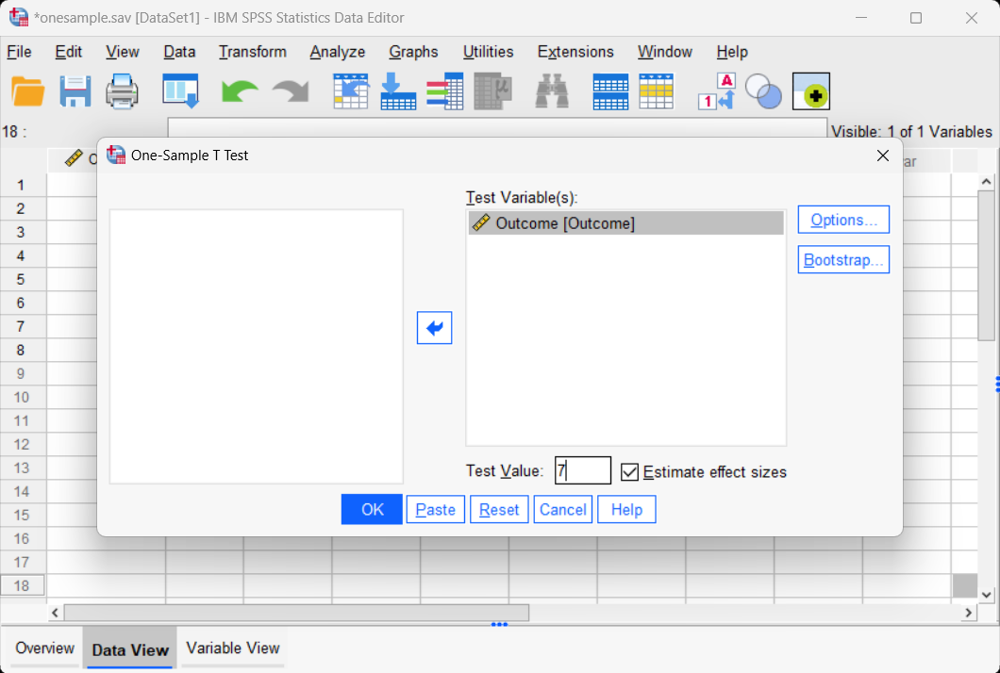
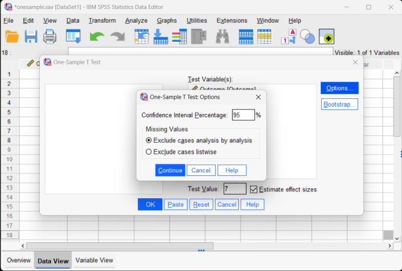

# [SPSS Articles](../index.md)

## Data Analysis | One Sample t Test

### Selecting the Analysis

 1. First, enter the data (described elsewhere). 

 2. After the data are entered, select the "Analyze → Compare Means → One-Sample T Test" option from the main menu.

{: .image}

### Obtaining Inferential Statistics 

3. A dialogue box will then appear for you to choose the variables of interest. 

4. Select the variables you wish to analyze by clicking on them and hitting the arrow to move them into the "Test Variables" box.

5. Be sure to enter a known or hypothesized mean into the "Test Value" field. If you do not enter a value here, SPSS will automatically use zero as the comparison mean. 

6. Check the "Estimates of effect size" to get Cohen's d.

7. If you do not wish to alter the default (95%) confidence level, click "OK." A separate window with the output will appear.

{: .image}

### Altering the Confidence Interval

8. If you wish to alter the  width of the confidence interval, select the "Options" button.

9. Another dialogue box will appear where you can change the confidence level. When you are done, click "Continue." This will return you to the original dialogue box. 

10. After clicking on "OK" in the original dialogue box, a separate window with the output will appear.

{: .image}

