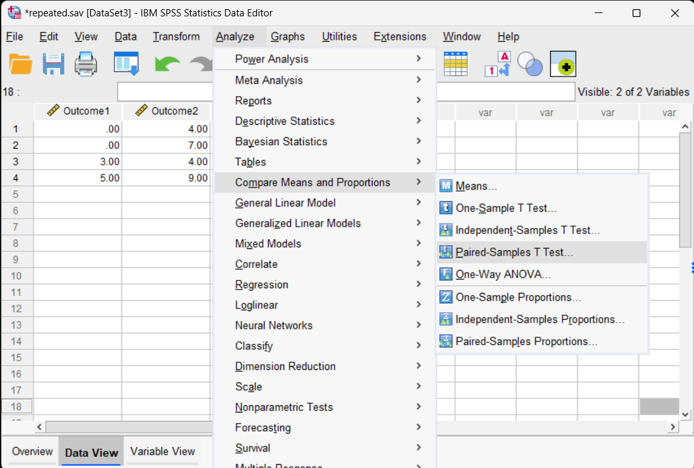
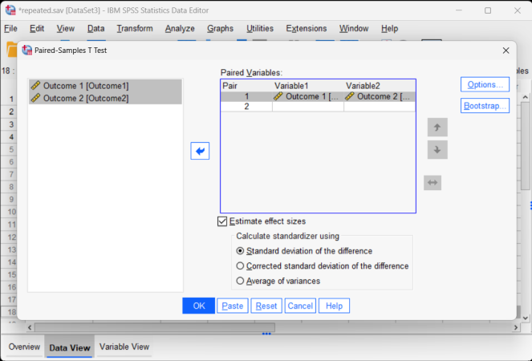
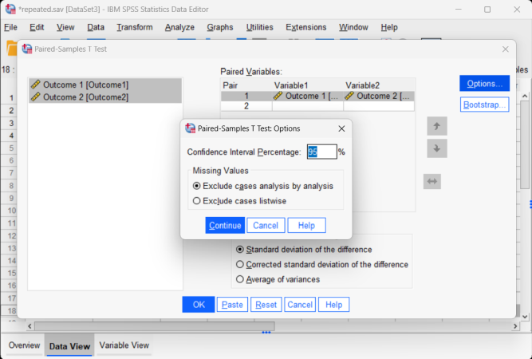

# SPSS Articles

## Data Analysis | Paired Samples t Test

### Selecting the Analysis

1. First, enter the data (described elsewhere). 

2. After the data are entered, select the "Analyze → Compare Means → Paired-Samples T Test" option from the main menu. 

<kbd></kbd>

### Obtaining Inferential Statistics 

3. A dialogue box will then appear for you to choose the variables of interest. 

4. Select the variables you wish to analyze by clicking on both of them while holding down the "CTRL" key. Then click on the arrow to move the pair of variables to the "Paired Variables" box.

5. Check the "Estimate effect size" box to get Cohen's d.

6. If you do not wish to alter the default (95%) confidence level, click "OK." A separate window with the output will appear.

<kbd></kbd>

### Altering the Confidence Interval 
 
7. If you wish to alter the width of the confidence interval, select the "Options" button.

8. Another dialogue box will appear where you can change the confidence level. When you are done, click "Continue." This will return you to the original dialogue box. 

9. After clicking on "OK" in the original dialogue box, a separate window with the output will appear.

<kbd></kbd>

