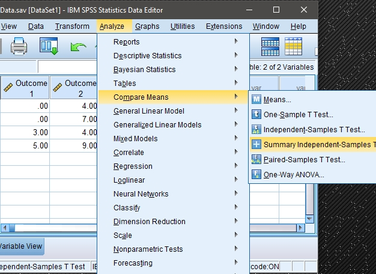
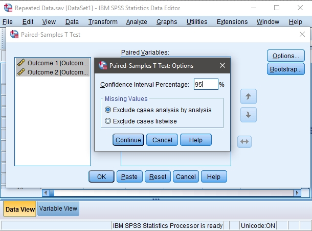

## SPSS: Data Analysis

### T Test (Paired Samples) 

#### Obtaining Paired-Sample Statistics

1. First, enter the data
 (described elsewhere). 

2. After the data are entered,
 select the "Analyze →
 Compare Means →
 Paired-Samples T Test" 
 option from the main menu. 

<kbd></kbd>

### Obtaining the Significance Test 

3. A dialogue box will then 
 appear for you to choose 
 the variables of interest. 

4. Select the variables you 
 wish to analyze by 
 clicking on both of them 
 while holding down the 
 "CTRL" key. Then click on
 the arrow to move the pair 
 of variables to the
 "Paired Variables" box.

4. If you do not wish to alter
 the default (95%)
 confidence level, click
 "OK." A separate window
 with the output will 
 appear.

<kbd></kbd>

#### Altering the Confidence Interval 
 
5. If you wish to alter the 
 width of the confidence
 interval, select the 
 "Options" button.

6. Another dialogue box will
 appear where you can 
 change the confidence
 level. When you are done,
 click "Continue." This 
 will return you to the 
 original dialogue box. 

7. After clicking on "OK" in
 the original dialogue box, 
 a separate window with the 
 output will appear.

<kbd></kbd>

