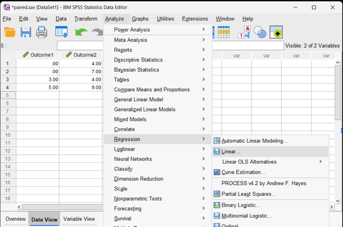
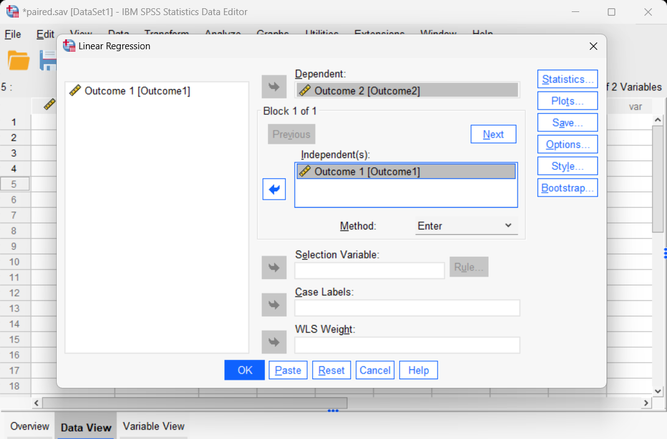
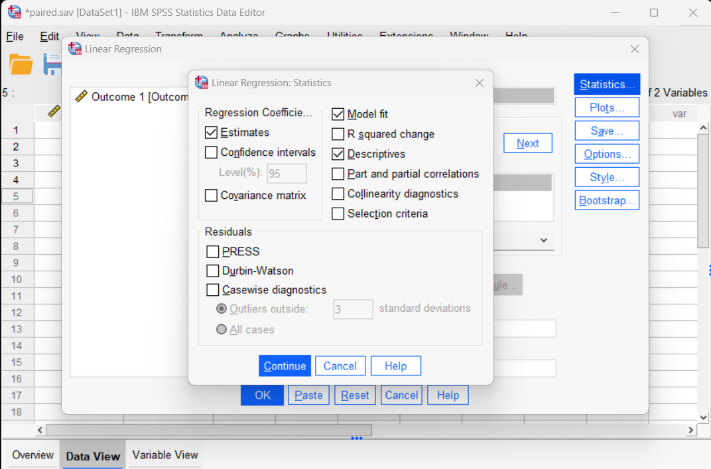

# [SPSS Articles](../index.md)

## Data Analysis | Regression

### Selecting the Analysis

1. First, enter data involving multiple variables (described elsewhere).

2. After the data are entered, select the “Analyze -> Regression -> Linear” option from the main menu.

{: .screenshot}

### Obtaining Inferential Statistics

3. A dialogue box will then appear for you to choose the variables of interest.

4. Select the variables you wish to analyze by clicking on them and clicking the arrow to move them into the “Variables” box. 

{: .screenshot}

### Obtaining Additional Statistics

5. To get the additional model statistics, select the “Statistics” button. 

6. Another dialogue box will appear where you can choose various statistics. Select “Estimates”, “Model Fit”, and “Descriptives”. 

7. When you are done, click “Continue.” This will return you to the original dialogue box.

8. Now click “OK” in the original dialogue box. A separate window with the output will appear. 

{: .screenshot}

