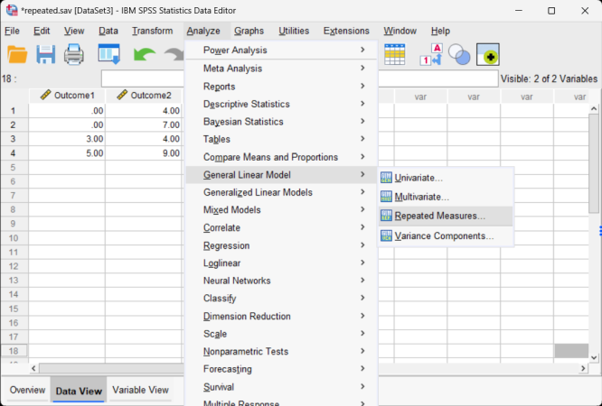

# SPSS Articles

## Data Analysis | Repeated Measures ANOVA

### Selecting the Analysis

1. First, enter the repeated measures data. This is described elsewhere. 

2. After the data are entered, select the "Analyze → General Linear Model → Repeated Measures" option from the main menu.

<kbd></kbd>

### Labeling the Within-Subjects Variable/Factor 

3. A dialogue box will then appear for you to create the repeated measures factor. This box is necessary because SPSS does not yet know which columns you wish to identify as repeated measurements of the same underlying factor. 

4. In the "Within-Subject Factor Name" box, type in the name you wish to give to the repeated measures factor. In this example, since the measurements/columns reflect quizzes at two different times, "Time" is used as the name.

5. In the "Number of Levels" box, indicate the number of levels of the within-subjects factor. In  this example, the quiz was given twice, so there were 2 levels of the factor.

<kbd></kbd>

### Creating the Within-Subjects Factor

6. It is then important that you finalize the creation of the within-subjects factor by clicking on the "Add" button. This officially declares the new factor in SPSS.

7. Note that this factor only exists in the computer's memory. For examples, nowhere in the data set will you see a variable called "Time." 

8. When you have done this, click on "Define." This will take you to the next step in setting up the analysis.

<kbd></kbd>

### Obtaining Inferential Statistics

9. A dialogue box will then appear for you to define which columns/variables reflect the levels of the within-subjects factor.

10. Select the outcome variables you wish to analyze by clicking on them and clicking the arrow to move them into the "Within-Subjects Variable" box. In this example, "Outcome1" reflects the first level of the factor and "Outcome2" reflects the second level of the factor.

11. If all you wish is are ANOVA source tables (with no descriptive statistics or comparisons), click "OK." A separate window with the  output will appear.

<kbd></kbd>

### Obtaining Descriptive Statistics

 12. If you wish to get the means, standard deviations, standard errors, and 95% confidence  intervals for each group, select the "Options" button.

 13. Another dialogue box will appear where you can choose various statistics. For means and standard deviations, select "Descriptive." Check “Estimates of effect size” to get eta-squared. When you are done, click "Continue." This will return you to the original dialogue box.

 14. After clicking on "OK" in the original dialogue box, a separate window with the output will appear.

<kbd></kbd>

### Obtaining Confidence Intervals

 15. If you wish to get the confidence intervals for each mean, select the "EM Means" button. 

 16. Another dialogue box will appear where you can specify the Factor. Move the relevant term to the "Display Means" box. 

 17. When you are done, click "Continue." This will return you to the original dialogue box.

 18. After clicking on "OK" in the original dialogue box, a separate window with the  output will appear.

<kbd></kbd>

