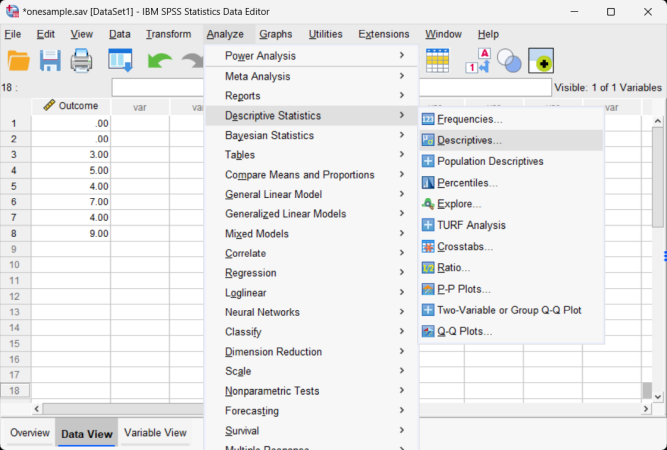

# SPSS | Data Analysis

## Descriptives (Standardized Scores and Transformations) 

### Obtaining Descriptive-Related Statistics 

1. First, enter the data (described elsewhere). 

2. After the data are entered, select the "Analyze → Descriptive Statistics → Descriptives" option from the main menu. 

<kbd></kbd>

### Obtaining Standardized (z) Scores 

3. A dialogue box will then appear for you to choose the variables of interest. 

4. Select the variables you wish to analyze by clicking on them and hitting the arrow to move them into the "variables" box. 

5. Be sure that "Save standardized values as variables" is checked. Without this checked, you will not get the standardized scores. 

6. If all you wish are the standardized scores (with descriptive summary statistics), click "OK." A separate window with the output will appear.

<kbd></kbd>

### Obtaining Summary Statistics

7. To obtain summary statistics, select "Options." Another dialogue box will appear.

8. In this box, you can request that SPSS calculate the mean, variance, and standard deviation (and other statistics). 

9. Once you have selected the desired statistics, click "Continue." This will return you to the original dialogue box.

<kbd></kbd>

### Viewing the Standardized Scores  

10. After clicking on "OK" in the original dialogue box, a separate window with the output will appear.

11. Finally, note that the standardized variables are not included in the output. Rather, they are saved as new variables in the data view window. These variables can be used in subsequent analyses.

<kbd></kbd>

### Obtaining the Compute Menu

12. In addition to (or instead of) calculating standardized scores, you can perform other data transformations. First, enter the data (described elsewhere).

13. After the data are entered, select the "Transform → Compute Variable" option from the main menu.

<kbd></kbd>

### Calculating Other Transformations 

 14. A dialogue box will then appear for you to choose the variables of interest to transform.

 15. Under "Target Variables," type the name of the new variable that you are creating. Here "trOutcome" is the name of the new variable.

 16. In the "Numeric Expression" box, type the formula that will be used in the transformation. In this example, the "trOutcome" is calculated by taking the original score and adding one.

 17. After clicking on "OK" in the original dialogue box, the transformed variables will appear in the data view window. These variables can be used in subsequent analyses. 

<kbd></kbd>

