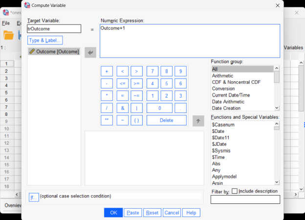
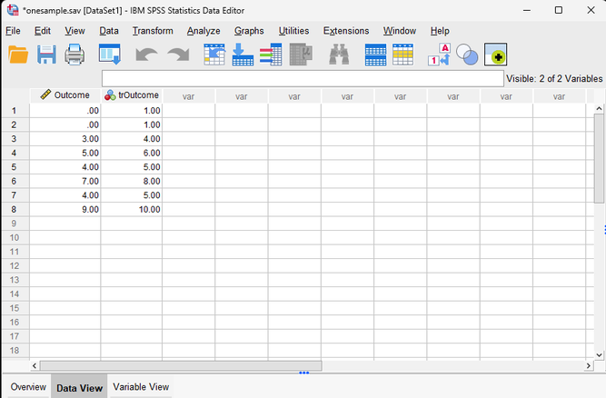
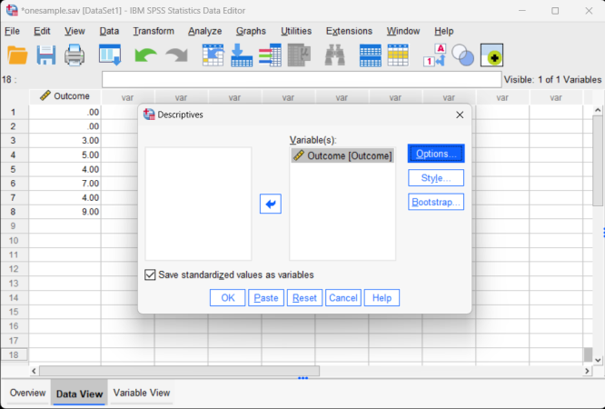

# [SPSS Articles](../index.md)

## Data Analysis | Transformations and Standardized Scores 

### Selecting the Analysis 

1. First, enter the data (described elsewhere). 

2. After the data are entered, select the "Transform → Compute Variable" option from the main menu.

<kbd></kbd>

### Computing Transformations 

3. A dialogue box will then appear for you to choose the variables of interest to transform.

4. Under "Target Variables," type the name of the new variable that you are creating. Here "trOutcome" is the name of the new variable.

5. In the "Numeric Expression" box, type the formula that will be used in the transformation. In this example, the "trOutcome" is calculated by taking the original score and adding one.

6. After clicking on "OK" in the original dialogue box, the transformed variables will appear in the data view window. 

<kbd></kbd>

### Viewing Transformed Scores  

7. Note that transformed variables are not included in the output. Rather, they are saved as new variables in the data view window. 

8. These variables can be used in subsequent analyses. You can follow the previous tutorials to get descriptive statistics for these variables.

<kbd></kbd>

### Obtaining Standardized Scores

9. In addition, you can obtain standardized scores. First, enter the data (described elsewhere).

10. After the data are entered, select the "Analyze → Descriptive Statistics → Descriptives" option from the main menu. 

<kbd></kbd>

### Computing Standardized Scores 

11. A dialogue box will then appear for you to choose the variables of interest. 

12. Select the variables you wish to analyze by clicking on them and hitting the arrow to move them into the "variables" box. 

13. Be sure that "Save standardized values as variables" is checked. Without this checked, you will not get the standardized scores. 

14. If all you wish are the standardized scores (with descriptive summary statistics), click "OK." A separate window with the output will appear.

<kbd></kbd>

### Viewing Standardized Scores  

10. After clicking on "OK" in the original dialogue box, a separate window with the output will appear.

11. Note that the standardized variables are not included in the output. Rather, they are saved as new variables in the data view window. These variables can be used in subsequent analyses.

<kbd></kbd>

