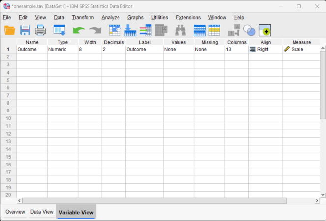
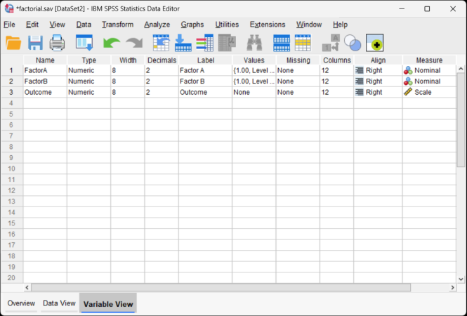
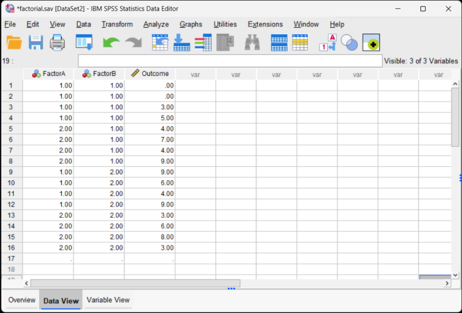

# SPSS | Data Entry

## One Sample Data 

### Defining All Variables

 1. First, click on the "Variable View" tab on the bottom left-hand corner of the screen. Generally speaking, this is where you will define all of the variables in the data set. 

 2. Type in the "Name" of the variable in the first cell. You may wish to enter a "Label" (or longer name) for the variable.

<kbd></kbd>

### Entering Data

3. Click on the "Data View" tab on the bottom left-hand corner. In this view, you will be able to enter the data.

4. Enter the data in the individual cells of the column for the variable. Note that each cell should contain a single score for an individual person. There will be as many rows as people. 

<kbd></kbd>

## Repeated Measures Data 

### Defining All Variables 

1. First, click on the "Variable View" tab on the bottom left-hand corner of the screen. Generally speaking, this is where you will define all of the variables in the data set. 

2. Type in a "Name" for each of the variables in the first column. You may wish to enter a "Label" (or longer name) for each variable in your data set. 

<kbd></kbd>

### Entering Data

3. Click on the "Data View" tab on the bottom left-hand corner. In this view, you will be able to enter the data.

4. Enter the data in the individual cells of the column for the variable. Note that each cell should contain a single score for an individual person. There will be as many rows as people.

5. Notice that each individual (i.e., the rows) has values for each instance of the within-subjects variable (i.e., the columns). 

<kbd></kbd>

## Multiple Sample Data 

### Defining All Variables 

1. First, click on the "Variable View" tab on the bottom left-hand corner of the screen. Generally speaking, this is where you will define all of the variables in the data set. 

2. Type in the "Name" of the variables in the first column. You may wish to enter a "Label" (or longer name) for each variable in your data set. 

3. One variable will represent the Factor (Independent Variable) and the other will represent the Outcome (Dependent) Variable.

<kbd></kbd>

### Providing Labels for All Values

4. For categorical variables, you should also provide labels for the different categories. Do this by clicking on the "values" cell for the variable of interest. A button will appear and clicking on this button will make another dialog box appear. 

5. You will use numbers to represent the two categories (or "levels") of the variable. Do this by entering the number representing the value in the "value" box and the actual value in the "label" box. Click "Add" after entering the information for each value. If your data set includes more than two groups, simply specify values and labels for each of the groups. 

6. When you have labeled all the values, click "OK" to return to the "Variable View." 

<kbd></kbd>

### Entering Data

 7. Click on the "Data View" tab on the bottom left-hand corner. In this view, you will be able to enter the data.

 8. Enter the data for all the participants. Notice that each participant has scores on both the Factor and Outcome Variables. There will be as many rows as people. 

 9. On the categorical Factor, use the values that you indicated when defining the variables earlier. 

 10. If your data set has more than two groups, simply be sure to add a group indicator (a value on the "Factor" variable) and an "Outcome" for each additional person. 

<kbd></kbd>

## Factorial Data 

### Defining All Variables 

1. First, click on the "Variable View" tab on the bottom left-hand corner of the screen. Generally speaking, this is where you will define all of the variables in the data set. 

2. Type in a "Name" for each of the variables in the first column. You may wish to enter a "Label" (or longer name) for each variable in your data set. 

3. Two variables will represent the Factors (Independent Variables) and the other will represent the Outcome (Dependent) Variable.

<kbd></kbd>

### Providing Labels for All Values

4. For categorical variables, you should also provide labels for the different categories. Do this by clicking on the "values" cell for the variable of interest. A button will appear and clicking on this button will make another dialog box appear. 

5. You will use numbers to represent the two categories (or "levels") of the variable. Do this by entering the number representing the value in the "value" box and the actual value in the "label" box. Click "Add" after entering the information for each value. If your data set includes more than two groups, simply specify values and labels for each of the groups. 

6. When you have labeled all the values, click "OK" to return to the "Variable View." 

<kbd></kbd>

### Entering Data

 7. Click on the "Data View" tab on the bottom left-hand corner. In this view, you will be able to enter the data.

 8. Enter the data for all of the participants. Notice that each participant has scores on both of the Factors and on the Outcome Variable. There will be as many rows as people. 

 9. On the categorical Factors, use the values that you indicated when defining the variables earlier. Note that the combination of values in the Factors will define the multiple groups of the factorial design.

 10. If your data set has more than two levels for either (or both) of the Factors, simply be sure to add an indicator and an outcome value for each additional person.

<kbd></kbd>

