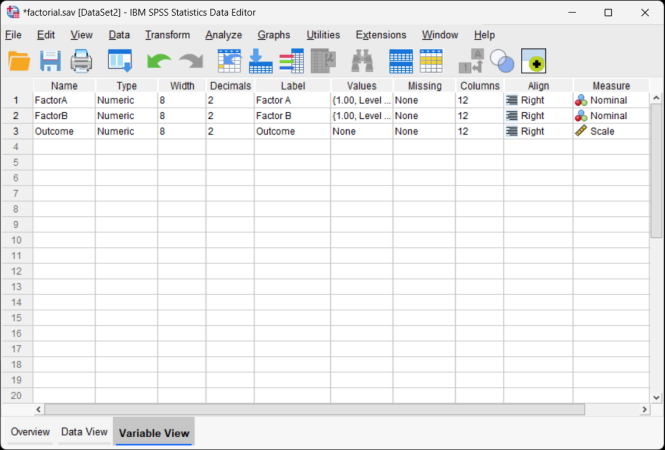
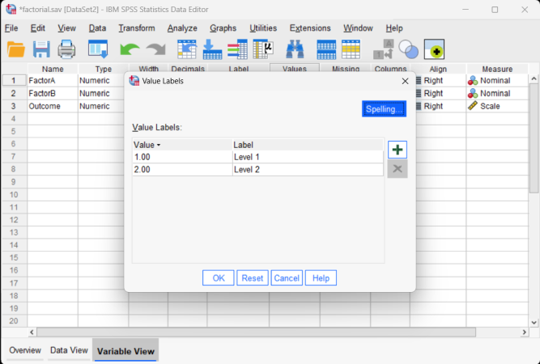
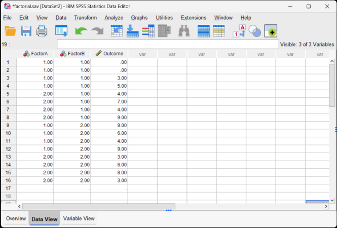

# SPSS | Data Entry

## Factorial Data 

### Defining Variables 

1. First, click on the "Variable View" tab on the bottom left-hand corner of the screen. Generally speaking, this is where you will define all of the variables in the data set. 

2. Type in a "Name" for each of the variables in the first column. You may wish to enter a "Label" (or longer name) for each variable in your data set. 

3. Two variables will represent the Factors (Independent Variables) and the other will represent the Outcome (Dependent) Variable.

<kbd></kbd>

### Providing Value Labels

4. For categorical variables, you should also provide labels for the different categories. Do this by clicking on the "values" cell for the variable of interest. A button will appear and clicking on this button will make another dialog box appear. 

5. You will use numbers to represent the categories (or “levels”) of the variable. Do this by clicking the “+” button, then entering the number representing the value in the “value” box and the actual value in the “label” box. Repeated this process for each of the groups that you have. 

6. When you have labeled all the values for both factors, click "OK" to return to the "Variable View." 

<kbd></kbd>

### Entering Data

 7. Click on the "Data View" tab on the bottom left-hand corner. In this view, you will be able to enter the data.

 8. Enter the data for all of the participants. Notice that each participant has scores on both of the Factors and on the Outcome Variable. There will be as many rows as people. 

 9. On the categorical Factors, use the values that you indicated when defining the variables earlier. Note that the combination of values in the Factors will define the multiple groups of the factorial design.

 10. If your data set has more than two levels for either (or both) of the Factors, simply be sure to add an indicator and an outcome value for each additional person.

<kbd></kbd>

