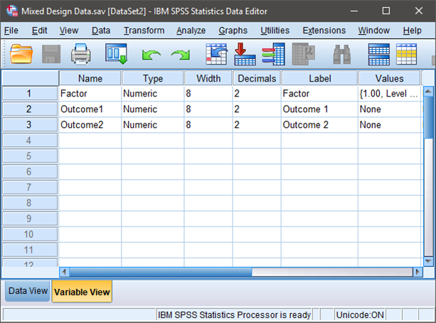
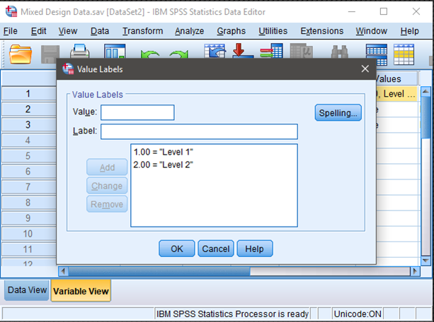
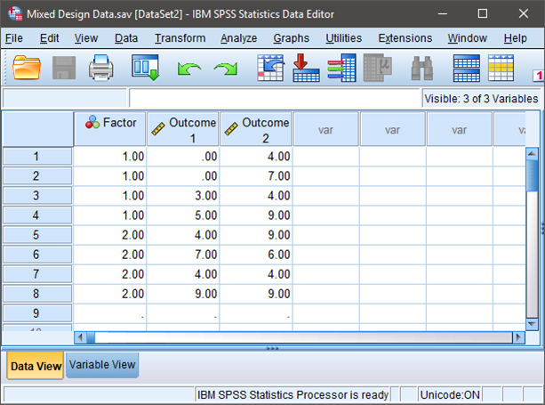

# [SPSS Articles](../index.md)

## Data Entry | Mixed Data 

### Defining Variables 

1.	First, click on the “Variable View” tab on the bottom left-hand corner of the screen. Generally speaking, this is where you will define all of the variables in the data set.

2.	Type in a “Name” for each of the variables in the first column. You may wish to enter a “Label” (or longer name) for each variable in your data set.  

3.	One variable will represent the Factor (Independent Variable) and the other two will represent the separate instances of the within-subjects variable.

{: .screenshot}

### Providing Value Labels

4.	For categorical variables, you should also provide labels for the different categories. Do this by clicking on the “values” cell for the variable of interest. A button will appear and clicking on this button will make another dialog box appear.

5.	You will use numbers to represent the two categories (or “levels”) of the variable. Do this by entering the number representing the value in the “value” box and the actual value in the “label” box. Click “Add” after entering the information for each value. If your data set includes more than two groups, simply specify values and labels for each of the groups.

6.	When you have labeled all of the values, click “OK” to return to the “Variable View.”

{: .screenshot}

### Entering Data

7.	Click on the “Data View” tab on the bottom left-hand corner. In this view, you will be able to enter the data.

8.	Enter the data for all the participants. Notice that each participant has scores on the Factor and on both instances of the Outcome Variable. There will be as many rows as people.

9.	On the categorical Factor, use the values that you indicated when defining the variables earlier. 

10.	If your data set has more than two levels of the Factor, simply be sure to add an indicator and the outcome values for each additional person.

{: .screenshot}

