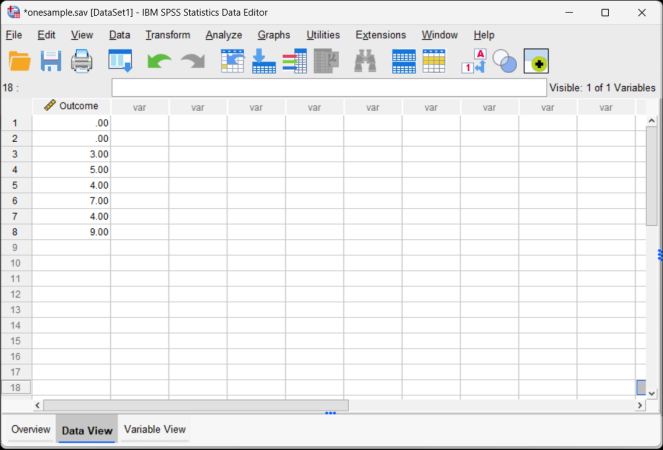

## SPSS: One Sample Data 

### Defining All Variables

 1. First, click on the "Variable View" tab on the bottom left-hand corner of the screen. Generally speaking, this is where you will define all of the variables in the data set. 

 2. Type in the "Name" of the variable in the first cell. You may wish to enter a "Label" (or longer name) for the variable.

<kbd></kbd>

### Entering Data

3. Click on the "Data View" tab on the bottom left-hand corner. In this view, you will be able to enter the data.

4. Enter the data in the individual cells of the column for the variable. Note that each cell should contain a single score for an individual person. There will be as many rows as people. 

<kbd></kbd>

