# Statistics for Social Science

### SPSS: Using the Software

---

### Abstract

This chapter provides step-by-step instructions on how to obtain basic statistical output using SPSS, both visually with screenshots and via written instructions. Simple examples for most undergraduate-level between-subjects and within-subjects research designs are provided.

### Table of Contents

- [Entering One Sample Data](#entering-one-sample-data)
- [Entering Repeated Measures Data](#entering-repeated-measures-data)
- [Entering Multiple Sample Data](#entering-multiple-sample-data)
- [Entering Factorial Data](#entering-factorial-data)
- [Frequencies (Frequencies and Descriptives)](#frequencies-frequencies-and-descriptives)
- [Descriptives (Standardized Scores and Transformations)](#descriptives-standardized-scores-and-transformations)
- [Explore (Descriptives and Confidence Intervals)](#explore-descriptives-and-confidence-intervals)
- [Correlations (Bivariate)](#correlations-bivariate)
- [T Test (One Sample)](#t-test-one-sample)
- [T Test (Paired Samples)](#t-test-paired-samples)
- [T Test (Independent Samples)](#t-test-independent-samples)
- [One-Way (OneWay ANOVA)](#one-way-oneway-anova)
- [Post Hoc Tests (OneWay ANOVA)](#post-hoc-tests-oneway-anova)
- [General Linear Model (Repeated Measures ANOVA)](#general-linear-model-repeated-measures-anova)
- [Univariate Analysis of Variance (Factorial ANOVA)](#univariate-analysis-of-variance-factorial-anova)

---

## Entering One Sample Data 

### Steps for Defining All Variables

 1. First, click on the
 "Variable View" tab on the 
 bottom left-hand corner of 
 the screen. Generally
 speaking, this is where
 you will define all of the 
 variables in the data set. 

 2. Type in the "Name" of the
 variable in the first
 cell. You may wish to
 enter a "Label" (or longer 
 name) for the variable.

<kbd>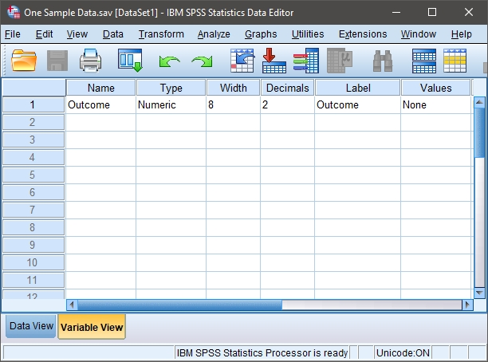</kbd>

---

## Steps for Entering Data

3. Click on the "Data View" tab 
 on the bottom left-hand
 corner. In this view, you
 will be able to enter the
 data.

4. Enter the data in the
 individual cells of the
 column for the variable. 
 Note that each cell should 
 contain a single score for 
 an individual person.
 There will be as many rows 
 as people. 

<kbd></kbd>

---

## Entering Repeated Measures Data 

### Steps for Defining All Variables 

1. First, click on the
 "Variable View" tab on the 
 bottom left-hand corner of 
 the screen. Generally
 speaking, this is where you
 will define all of the 
 variables in the data set. 

2. Type in a "Name" for each of 
 the variables in the first 
 column. You may wish to
 enter a "Label" (or longer 
 name) for each variable in 
 your data set. 

<kbd>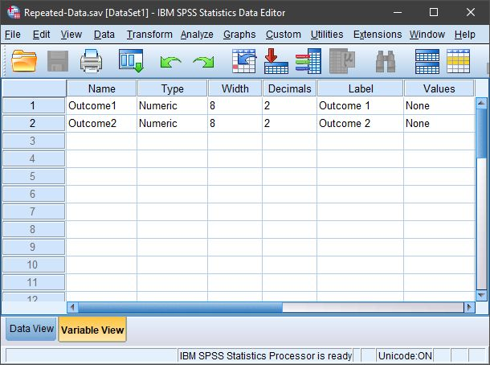</kbd>

### Steps for Entering Data

3. Click on the "Data View" tab 
 on the bottom left-hand
 corner. In this view, you
 will be able to enter the
 data.

4. Enter the data in the
 individual cells of the
 column for the variable. 
 Note that each cell should 
 contain a single score for 
 an individual person. There
 will be as many rows as
 people.

5. Notice that each individual
 (i.e., the rows) has values
 for each instance of the 
 within-subjects variable 
 (i.e., the columns). 

<kbd>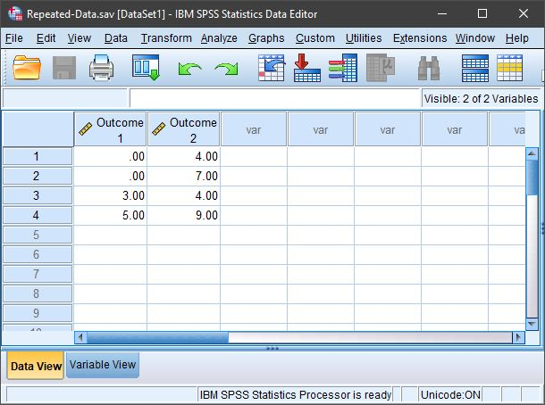</kbd>

---

## Entering Multiple Sample Data 

### Steps for Defining All Variables 

1. First, click on the
 "Variable View" tab on the 
 bottom left-hand corner of 
 the screen. Generally
 speaking, this is where
 you will define all of the 
 variables in the data set. 

2. Type in the "Name" of the
 variables in the first 
 column. You may wish to
 enter a "Label" (or longer 
 name) for each variable in 
 your data set. 

3. One variable will represent
 the Factor (Independent
 Variable) and the other
 will represent the Outcome 
 (Dependent) Variable.

<kbd>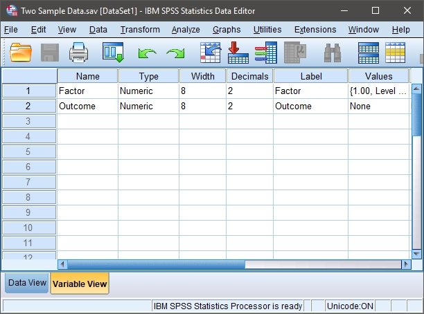</kbd>

### Steps for Providing Labels for All Values

4. For categorical variables, 
 you should also provide
 labels for the different 
 categories. Do this by 
 clicking on the "values" 
 cell for the variable of 
 interest. A button will
 appear and clicking on 
 this button will make
 another dialog box appear. 

5. You will use numbers to
 represent the two
 categories (or "levels") 
 of the variable. Do this 
 by entering the number 
 representing the value in
 the "value" box and the
 actual value in the
 "label" box. Click "Add" 
 after entering the 
 information for each 
 value. If your data set
 includes more than two 
 groups, simply specify 
 values and labels for each 
 of the groups. 

6. When you have labeled all
 the values, click "OK" to
 return to the "Variable
 View." 

<kbd>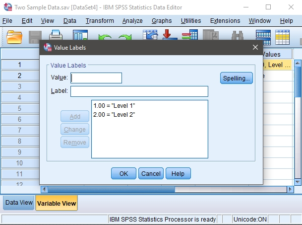</kbd>

### Steps for Entering Data

 7. Click on the "Data View" tab 
 on the bottom left-hand
 corner. In this view, you
 will be able to enter the
 data.

 8. Enter the data for all the 
 participants. Notice that
 each participant has 
 scores on both the Factor
 and Outcome Variables. 
 There will be as many rows 
 as people. 

 9. On the categorical Factor, 
 use the values that you
 indicated when defining
 the variables earlier. 

 10. If your data set has more
 than two groups, simply be 
 sure to add a group
 indicator (a value on the
 "Factor" variable) and an
 "Outcome" for each 
 additional person. 

<kbd>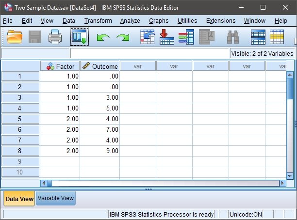</kbd>

---

## Entering Factorial Data 

### Steps for Defining All Variables 

1. First, click on the
 "Variable View" tab on the 
 bottom left-hand corner of 
 the screen. Generally
 speaking, this is where
 you will define all of the 
 variables in the data set. 

2. Type in a "Name" for each of 
 the variables in the first 
 column. You may wish to
 enter a "Label" (or longer 
 name) for each variable in 
 your data set. 

3. Two variables will represent 
 the Factors (Independent 
 Variables) and the other 
 will represent the Outcome 
 (Dependent) Variable.

<kbd>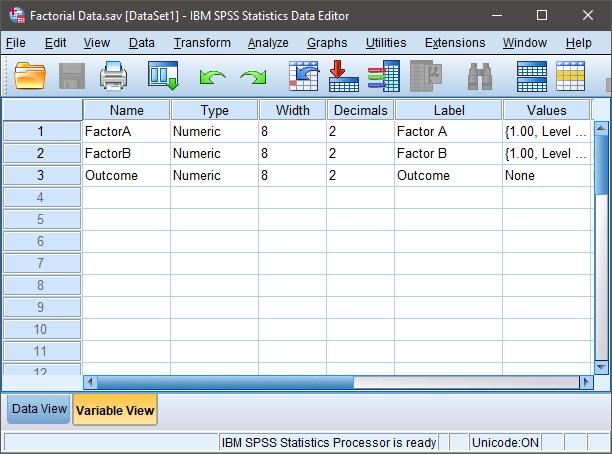</kbd>

### Steps for Providing Labels for All Values

4. For categorical variables, 
 you should also provide
 labels for the different 
 categories. Do this by 
 clicking on the "values" 
 cell for the variable of 
 interest. A button will
 appear and clicking on 
 this button will make
 another dialog box appear. 

5. You will use numbers to
 represent the two
 categories (or "levels") 
 of the variable. Do this 
 by entering the number 
 representing the value in
 the "value" box and the
 actual value in the
 "label" box. Click "Add" 
 after entering the 
 information for each 
 value. If your data set
 includes more than two 
 groups, simply specify 
 values and labels for each 
 of the groups. 

6. When you have labeled all
 the values, click "OK" to
 return to the "Variable
 View." 

<kbd>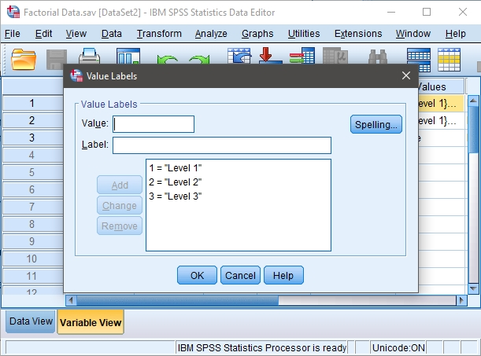</kbd>

### Steps for Entering Data

 7. Click on the "Data View" tab 
 on the bottom left-hand
 corner. In this view, you
 will be able to enter the
 data.

 8. Enter the data for all of
 the participants. Notice 
 that each participant has
 scores on both of the
 Factors and on the Outcome 
 Variable. There will be as 
 many rows as people. 

 9. On the categorical Factors,
 use the values that you
 indicated when defining
 the variables earlier. 
 Note that the combination
 of values in the Factors 
 will define the multiple 
 groups of the factorial
 design.

 10. If your data set has more
 than two levels for either 
 (or both) of the Factors,
 simply be sure to add an 
 indicator and an outcome 
 value for each additional
 person.

<kbd>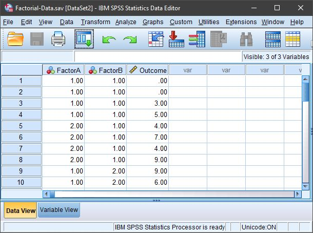</kbd>

---

## Frequencies (Frequencies and Descriptives) 

### Steps for Obtaining Frequency-Related Statistics

1. First, enter the data
 (described elsewhere). 

2. After the data are entered,
 select the "Analyze →
 Descriptive Statistics → 
 Frequencies" option from 
 the main menu. 

<kbd></kbd>

### Steps for Obtaining a Frequency Distribution

3. A dialogue box will then 
 appear for you to choose 
 the variables of interest. 

4. Select the variables you 
 wish to analyze by 
 clicking on them and then
 the arrow to move them 
 into the "variables" box.

5. Be sure that "Display
 frequency tables" is 
 checked. Without this
 checked, you will not get
 a frequency distribution.

6. If all you wish is a 
 frequency table (with no 
 histogram or summary 
 statistics), click "OK." A 
 separate window with the 
 output will appear.

<kbd>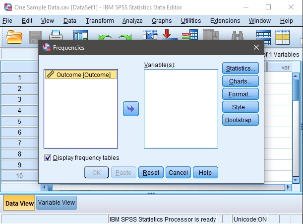</kbd>

### Steps for Obtaining Summary Statistics 
 
7. To obtain summary
 statistics, select 
 "Statistics." Another
 dialogue box will appear.

8. In this box, you can request 
 that SPSS calculate the
 mean, variance, and
 standard deviation (or 
 median and quartiles). 

9. Once you have selected the 
 desired statistics, click
 "Continue." This will
 return you to the original 
 dialogue box.

<kbd>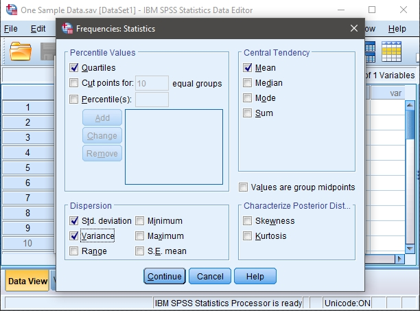</kbd>

### Steps for Obtaining a Histogram 

10. To obtain a histogram, click 
 on the "Charts" button.
 Another dialogue box will
 appear.

11. In this box, select
 "Histogram." 

12. Click "Continue." This will
 return you to the original 
 dialogue box.

13. After clicking on "OK" in
 the original dialogue box, 
 a separate window with the 
 output will appear.

<kbd>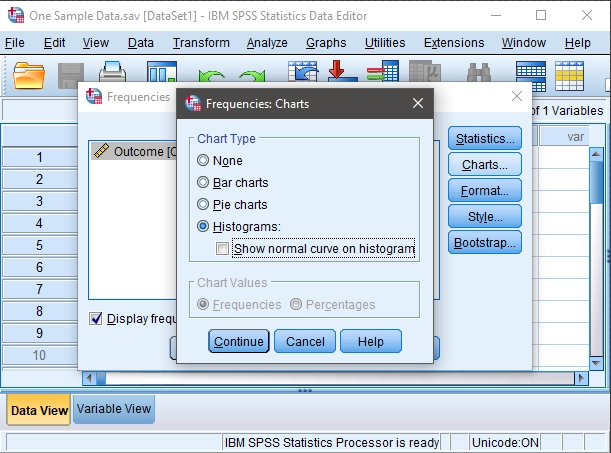</kbd>

---

## Descriptives (Standardized Scores and Transformations) 

### Steps for Obtaining Descriptive-Related Statistics 

1. First, enter the data
 (described elsewhere). 

2. After the data are entered,
 select the "Analyze →
 Descriptive Statistics → 
 Descriptives" option from
 the main menu. 

<kbd>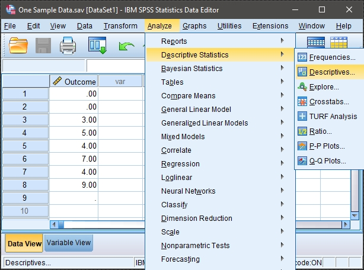</kbd>

### Steps for Obtaining Standardized (z) Scores 

3. A dialogue box will then 
 appear for you to choose 
 the variables of interest. 

4. Select the variables you 
 wish to analyze by 
 clicking on them and 
 hitting the arrow to move
 them into the "variables"
 box. 

5. Be sure that "Save 
 standardized values as 
 variables" is checked. 
 Without this checked, you
 will not get the 
 standardized scores. 

6. If all you wish are the
 standardized scores (with
 descriptive summary
 statistics), click "OK." A 
 separate window with the 
 output will appear.

<kbd>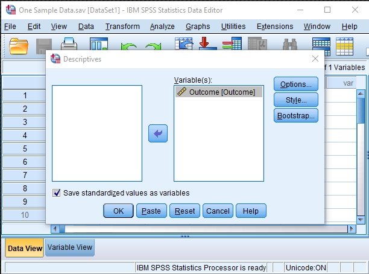</kbd>

### Steps for Obtaining Summary Statistics

7. To obtain summary
 statistics, select 
 "Options." Another 
 dialogue box will appear.

8. In this box, you can request 
 that SPSS calculate the
 mean, variance, and
 standard deviation (and
 other statistics). 

9. Once you have selected the 
 desired statistics, click
 "Continue." This will
 return you to the original 
 dialogue box.

<kbd>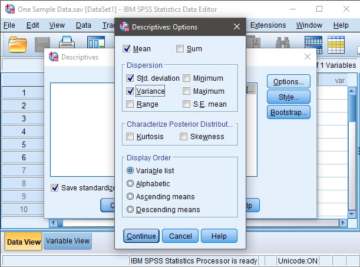</kbd>

### Steps for Viewing the Standardized Scores  

10. After clicking on "OK" in
 the original dialogue box, 
 a separate window with the 
 output will appear.

11. Finally, note that the 
 standardized variables are 
 not included in the
 output. Rather, they are 
 saved as new variables in
 the data view window.
 These variables can be 
 used in subsequent 
 analyses.

<kbd>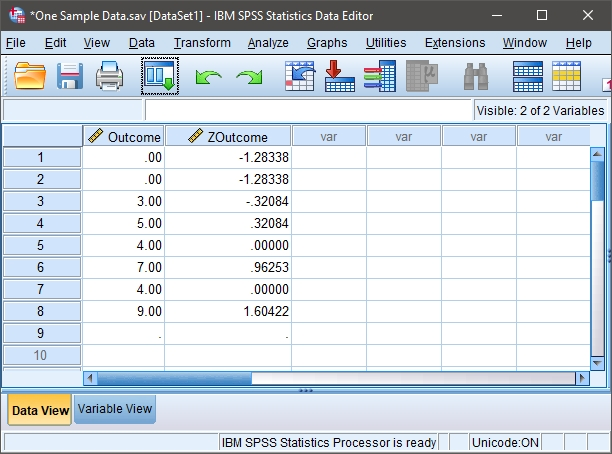</kbd>

## Steps for Obtaining the Compute Menu

12. In addition to (or instead 
 of) calculating
 standardized scores, you 
 can perform other data 
 transformations. First,
 enter the data (described
 elsewhere).

13. After the data are entered,
 select the "Transform →
 Compute Variable" option 
 from the main menu.

<kbd>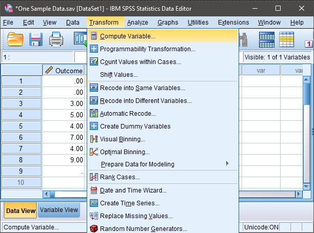</kbd>

## Steps for Calculating Other Transformations 

 14. A dialogue box will then 
 appear for you to choose 
 the variables of interest
 to transform.

 15. Under "Target Variables,"
 type the name of the new 
 variable that you are
 creating. Here "trOutcome" 
 is the name of the new 
 variable.

 16. In the "Numeric Expression"
 box, type the formula that 
 will be used in the
 transformation. In this
 example, the "trOutcome" 
 is calculated by taking
 the original score and 
 adding one.

 17. After clicking on "OK" in
 the original dialogue box, 
 the transformed variables
 will appear in the data
 view window. These 
 variables can be used in 
 subsequent analyses. 

<kbd>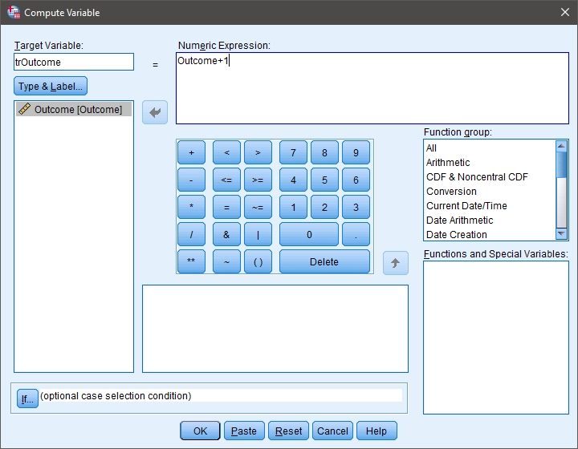</kbd>

---

## Explore (Descriptives and Confidence Intervals) 

### Steps for Obtaining Exploratory-Related Statistics 

 1. First, enter the data
 (described elsewhere). 

 2. After the data are entered,
 select the "Analyze →
 Descriptive Statistics → 
 Explore" option from the 
 main menu. 

<kbd>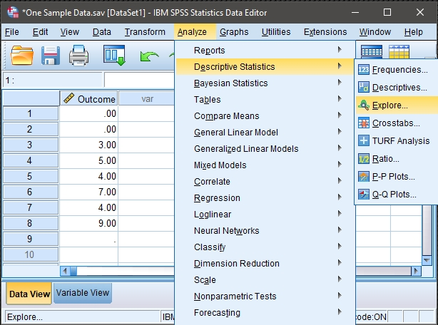</kbd>

## Steps for Obtaining the Exploratory Statistics

3. A dialogue box will then 
 appear for you to choose the 
 variables of interest. 

4. Select the variables you 
 wish to analyze by clicking
 on them and hitting the
 arrow to move them into the
 "Dependent List" box.

5. Be sure that "Statistics" is 
 checked. This will limit 
 your output to basic 
 descriptive statistics and 
 confidence intervals.

6. If you do not wish to alter
 the default (95%) confidence 
 level, click "OK." A 
 separate window with the 
 output will appear.

<kbd>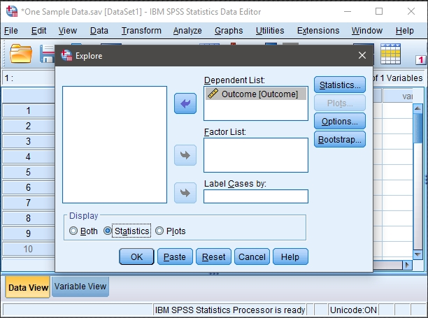</kbd>

### Steps for Altering the Confidence Interval

7. If you wish to alter the 
 width of the confidence
 interval, select the 
 "Statistics" button. 

8. Another dialogue box will
 appear where you can change
 the confidence level. When 
 you are done, click
 "Continue." This will return 
 you to the original dialogue 
 box. 

9. After clicking on "OK" in
 the original dialogue box, a 
 separate window with the 
 output will appear.

<kbd>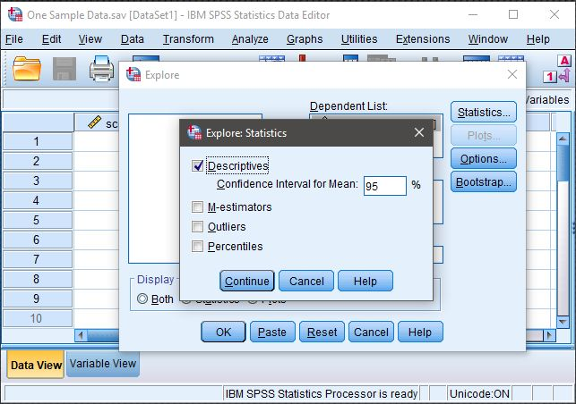</kbd>

### Steps for Obtaining a Graph of the Confidence Intervals 

10 .First, enter the data
 (described elsewhere). 

11. To obtain a graph, select
 the "Graphs → Legacy Dialogs 
 → Error Bar" option from the 
 main menu. 

<kbd>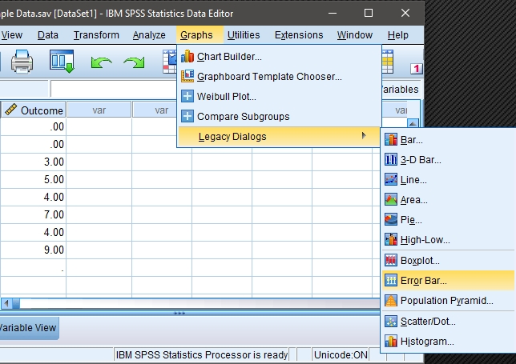</kbd>

### Steps for Choosing the Graph Layout

 12. A dialogue box will then 
 appear for you to choose the 
 general graph layout of
 interest.

 13. Click on the box labeled 
 "Simple" (it should then be
 highlighted).

 14. Then click on the option 
 that states that you want
 "Summaries of separate 
 variables."

 15. Click "Define."

<kbd>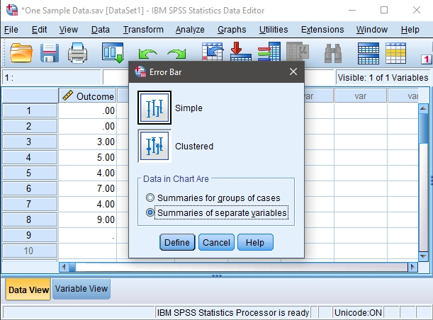</kbd>

### Steps for Obtaining the Confidence Interval Graph

 16. A dialogue box will then 
 appear for you to choose 
 the variables of interest
 to graph.

 17. Under "Error Bars," move the 
 name(s) of the variable(s) 
 you want to include in the 
 graph. 

 18. If you want to change the
 width of the confidence
 intervals, type the
 appropriate percentage in
 the "Level" box. 

 19. After clicking on "OK", a
 separate window with the 
 output will appear.

<kbd>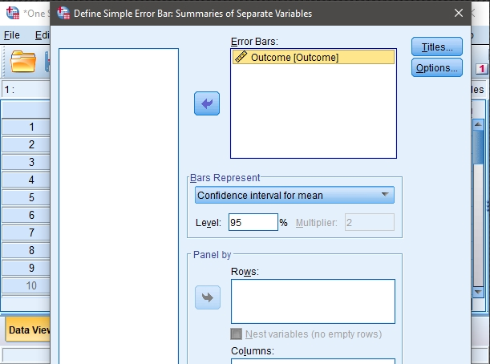</kbd>

---

## Correlations (Bivariate) 

### Steps for Obtaining Correlational Statistics

1. First, enter data involving
 multiple variables. This 
 is described elsewhere.

2. After the data are entered,
 select the "Analyze →
 Correlate → Bivariate" 
 option from the main menu. 

<kbd>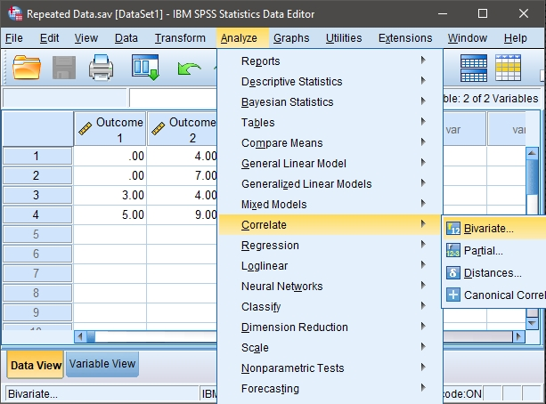</kbd>

### Steps for Obtaining the Correlations (and Significance Tests

3. A dialogue box will then 
 appear for you to choose 
 the variables of interest. 

4. Select the variables you 
 wish to analyze by 
 clicking on them and 
 hitting the arrow to move
 them into the "Variables"
 box. 

5. By default, SPSS will have 
 the "Pearson" box checked. 
 This provides the
 correlation coefficient we 
 discussed. Similarly,
 having "two-tailed" and
 "flag significant
 correlations" will create
 and display the
 significance tests 
 (discussed later in the
 class).

6. If all you wish is a table 
 of correlations (with no 
 descriptive statistics), 
 click "OK." A separate 
 window with the output 
 will appear. 

<kbd>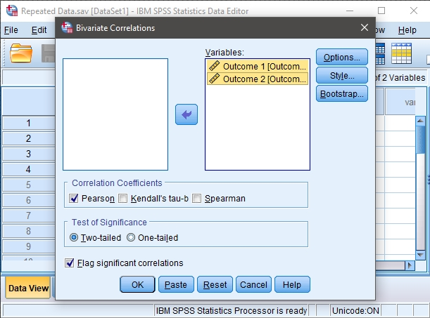</kbd>

### Steps for Obtaining Descriptive Statistics

7. If you wish to get the 
 descriptive statistics as
 well, select the "Options" 
 button.

8. Another dialogue box will
 appear where you can 
 choose various statistics. 
 Select "Means and standard 
 deviations" and
 "cross-product deviations
 and covariances."

9. When you are done, click 
 "Continue." This will
 return you to the original 
 dialogue box.

10. Now click "OK" in the
 original dialogue box. A 
 separate window with the 
 output will appear.

<kbd>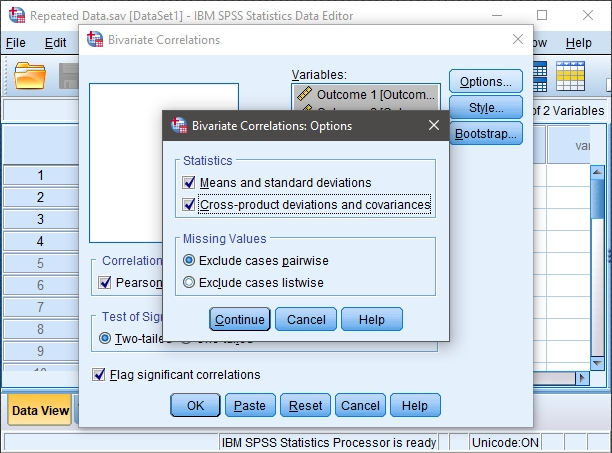</kbd>

---

## T Test (One Sample) 

### Steps for Obtaining One-Sample Inferential Statistics

 1. First, enter the data
 (described elsewhere). 

 2. After the data are entered,
 select the "Analyze →
 Compare Means → One-Sample T 
 Test" option from the main 
 menu.

<kbd>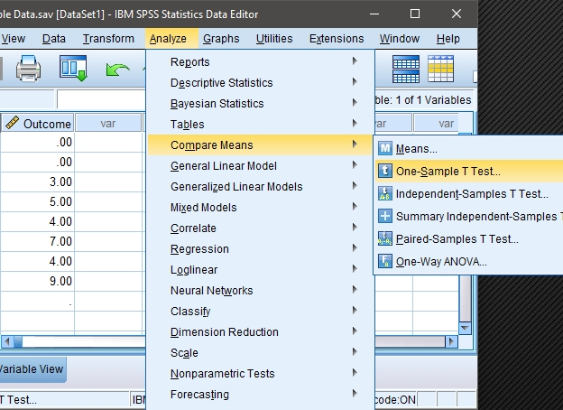</kbd>

## Steps for Obtaining the Significance Test 

3. A dialogue box will then 
 appear for you to choose the 
 variables of interest. 

4. Select the variables you 
 wish to analyze by clicking
 on them and hitting the
 arrow to move them into the
 "Test Variables" box.

5. Be sure to enter a known or
 hypothesized mean into the 
 "Test Value" field. If you 
 do not enter a value here, 
 SPSS will automatically use
 zero as the comparison mean. 

6. If you do not wish to alter
 the default (95%) confidence 
 level, click "OK." A 
 separate window with the 
 output will appear.

<kbd>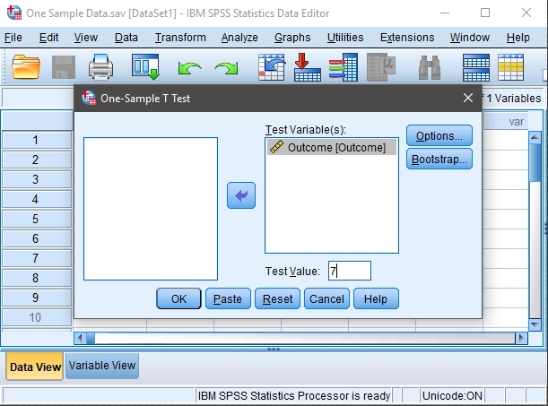</kbd>

## Steps for Altering the Confidence Interval

7. If you wish to alter the 
 width of the confidence
 interval, select the 
 "Options" button.

8. Another dialogue box will
 appear where you can change
 the confidence level. When 
 you are done, click
 "Continue." This will return 
 you to the original dialogue 
 box. 

9. After clicking on "OK" in
 the original dialogue box, a 
 separate window with the 
 output will appear.

<kbd>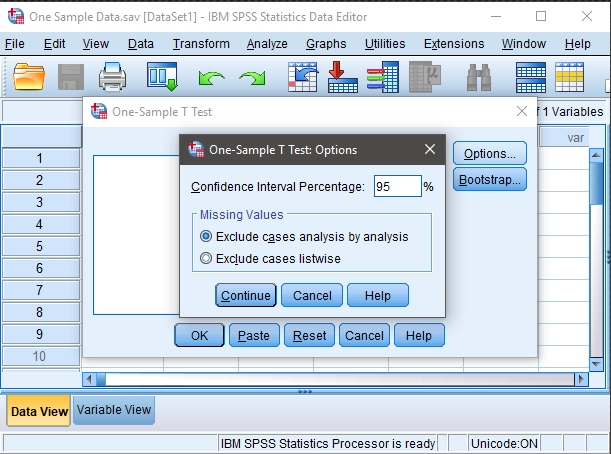</kbd>

---

## T Test (Paired Samples) 

### Steps for Obtaining Paired-Sample Statistics

1. First, enter the data
 (described elsewhere). 

2. After the data are entered,
 select the "Analyze →
 Compare Means →
 Paired-Samples T Test" 
 option from the main menu. 

<kbd>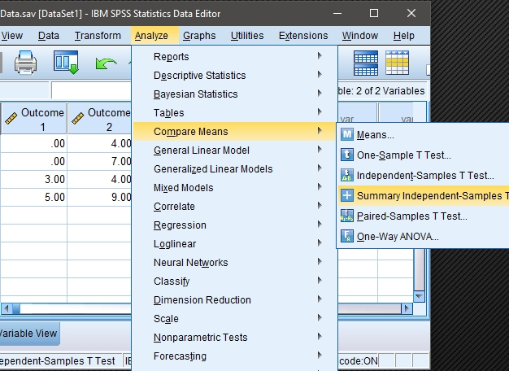</kbd>

## Steps for Obtaining the Significance Test 

3. A dialogue box will then 
 appear for you to choose 
 the variables of interest. 

4. Select the variables you 
 wish to analyze by 
 clicking on both of them 
 while holding down the 
 "CTRL" key. Then click on
 the arrow to move the pair 
 of variables to the
 "Paired Variables" box.

4. If you do not wish to alter
 the default (95%)
 confidence level, click
 "OK." A separate window
 with the output will 
 appear.

<kbd>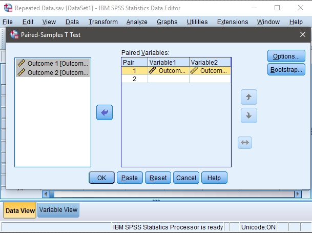</kbd>

### Steps for Altering the Confidence Interval 
 
5. If you wish to alter the 
 width of the confidence
 interval, select the 
 "Options" button.

6. Another dialogue box will
 appear where you can 
 change the confidence
 level. When you are done,
 click "Continue." This 
 will return you to the 
 original dialogue box. 

7. After clicking on "OK" in
 the original dialogue box, 
 a separate window with the 
 output will appear.

<kbd>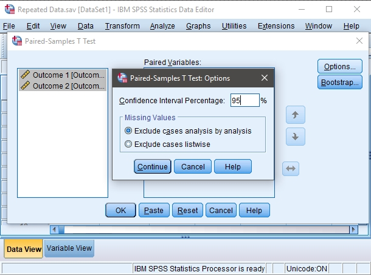</kbd>

---

## T Test (Independent Samples) 

### Steps for Obtaining Two-Sample Inferential Statistics

1. First, enter the data
 (described elsewhere). 

2. After the data are entered,
 select the "Analyze →
 Compare Means →
 Independent-Samples T
 Test" option from the main 
 menu.

<kbd></kbd>

### Steps for Obtaining the Significance Test 

3. A dialogue box will then 
 appear for you to choose 
 the variables of interest. 

4. Select the outcome variables 
 you wish to analyze by 
 clicking on them and 
 hitting the arrow to move
 them into the "Test
 Variables" box.

5. Move the variable that 
 defines the different
 groups to the "Grouping
 Variable" box. Note that 
 question marks will appear 
 here and that you will 
 need to follow the next
 set of steps in order to 
 run the analyses.

<kbd>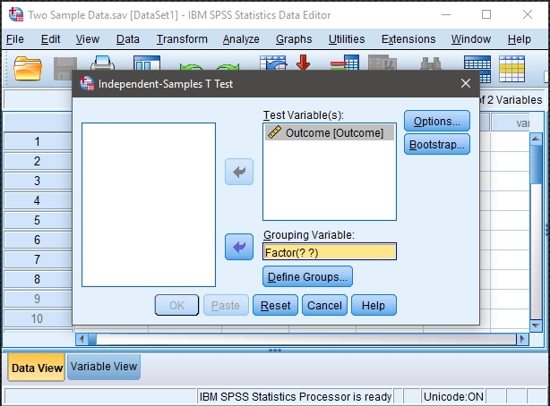</kbd>

### Steps for Defining the Groups to be Analyzed

6. In order to tell SPSS which
 two groups you wish to 
 compare, click on the
 "Define Groups" box. 

7. A new dialog box will
 appear. Here you will need 
 to indicate the numeric
 values you used in setting 
 up the data file to refer
 to the groups. In this 
 example, a value of 1 for
 the variable "group" 
 referred to Group 1 and a
 value of 2 for the 
 variable "group" referred
 to Group 2.

8. When you are done, click 
 "Continue." This will
 return you to the original 
 dialogue box.

9. If you do not wish to alter
 the default (95%)
 confidence level, click
 "OK." A separate window
 with the output will 
 appear.

<kbd>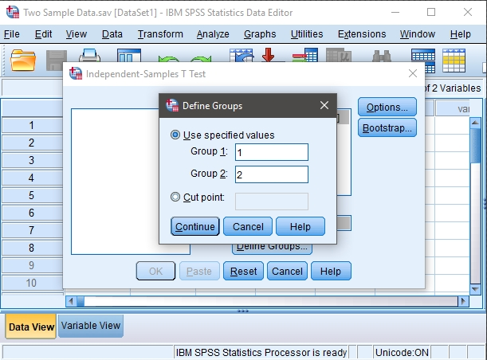</kbd>

### Steps for Altering the Confidence Interval

10. If you wish to alter the 
 width of the confidence
 interval, select the 
 "Options" button.

11. Another dialogue box will
 appear where you can 
 change the confidence
 level. When you are done,
 click "Continue." This 
 will return you to the 
 original dialogue box. 

12. After clicking on "OK" in
 the original dialogue box, 
 a separate window with the 
 output will appear.

<kbd>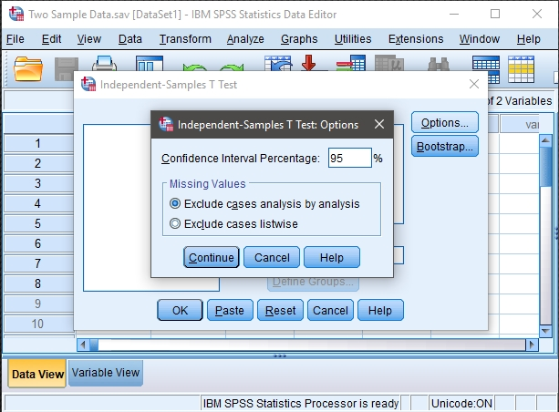</kbd>

---

## One-Way (OneWay ANOVA) 

### Steps for Obtaining Multiple-Sample Inferential Statistics

1. First, enter the data. This
 is done in the same manner 
 as entering two sample 
 data (described elsewhere) 
 but with additional
 groups.

2. After the data are entered,
 select the "Analyze →
 Compare Means → One-Way
 ANOVA" option from the 
 main menu. 

<kbd>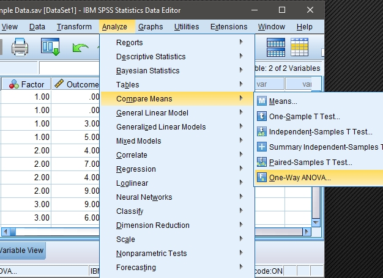</kbd>

### Steps for Obtaining the Significance Test

3. A dialogue box will then 
 appear for you to choose 
 the variables of interest. 

4. Select the outcome variables 
 you wish to analyze by 
 clicking on them and 
 hitting the arrow to move
 them into the "Dependent 
 List" box. 

5. Move the variable that 
 defines the different
 groups to the "Factor" 
 box. SPSS will not ask you 
 to define the groups you 
 wish to compare; it simply 
 will compare all groups
 defined by the factor. 

6. If all you wish is an ANOVA
 source table (with no
 descriptive statistics or
 post hoc tests), click 
 "OK." A separate window
 with the output will 
 appear.

<kbd>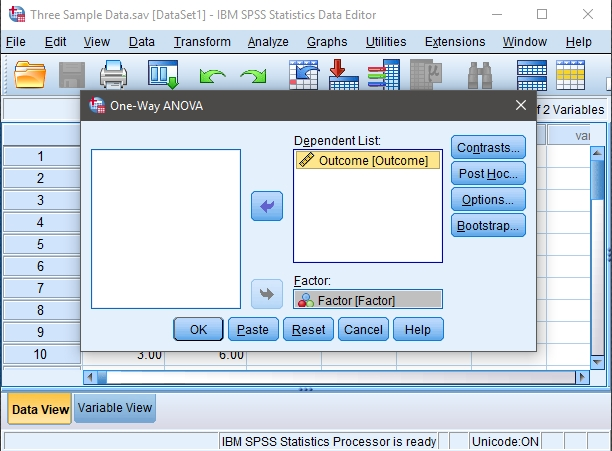</kbd>

### Steps for Obtaining Descriptive Statistics

 7. If you wish to get the 
 means, standard
 deviations, standard 
 errors, and 95% confidence 
 intervals for each group,
 select the "Options" 
 button.

 8. Another dialogue box will
 appear where you can 
 choose various statistics. 
 Select "Descriptive." When 
 you are done, click
 "Continue." This will
 return you to the original 
 dialogue box.

 9. If all you wish is an ANOVA
 with the descriptive 
 statistics (and no post
 hoc tests), click "OK." A
 separate window with the 
 output will appear.

<kbd>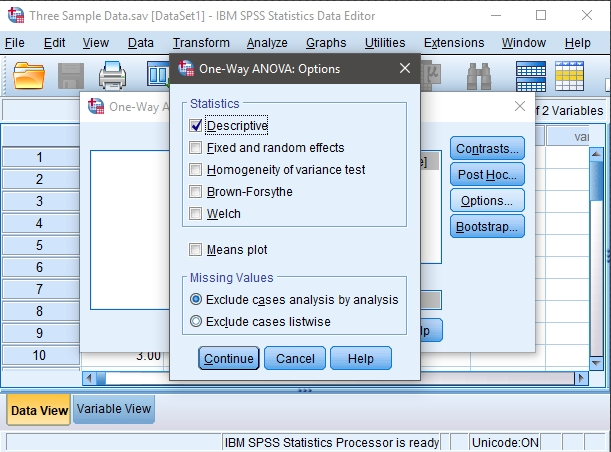</kbd>

---

## Post Hoc Tests (OneWay ANOVA) 

### Steps for Obtaining Multiple-Sample Inferential Statistics

1. First, enter the data. This
 is done in the same manner 
 as entering two sample data
 (described elsewhere) but
 with additional groups.

2. After the data are entered,
 select the "Analyze →
 Compare Means → One-Way
 ANOVA" option from the main
 menu.

<kbd></kbd>

### Steps for Obtaining the Significance Test 
 
3. A dialogue box will then 
 appear for you to choose the 
 variables of interest. 

4. Select the outcome variables 
 you wish to analyze by 
 clicking on them and hitting 
 the arrow to move them into
 the "Dependent List" box.

5. Move the variable that 
 defines the different groups 
 to the "Factor" box. SPSS
 will not ask you to define 
 the groups you wish to 
 compare; it simply will
 compare all groups defined 
 by the factor. 

6. If all you wish is an ANOVA
 source table (with no
 descriptive statistics or
 post hoc tests), click "OK." 
 A separate window with the 
 output will appear.

<kbd></kbd>

### Steps for Obtaining Descriptive Statistics

7. If you wish to get the 
 means, standard deviations,
 standard errors, and 95% 
 confidence intervals for 
 each group, select the 
 "Options" button.

 8. Another dialogue box will
 appear where you can choose
 various statistics. Select 
 "Descriptive." When you are
 done, click "Continue." This 
 will return you to the 
 original dialogue box. 

 9. If all you wish is an ANOVA
 with the descriptive 
 statistics (and no post hoc
 tests), click "OK." A
 separate window with the 
 output will appear.

<kbd></kbd>

### Steps for Obtaining Post Hoc Tests

10. If you wish to obtain post 
 hoc tests for the purpose of 
 making comparisons between 
 groups, click the "Post Hoc" 
 button.

11. Another dialogue box will
 appear where you can choose
 which post hoc tests you 
 wish. Select "Tukey" to get
 Tukey HSD post hoc tests.
 When you are done, click 
 "Continue."

12. After clicking on "OK" in
 the original dialogue box, a 
 separate window with the 
 output will appear.

<kbd>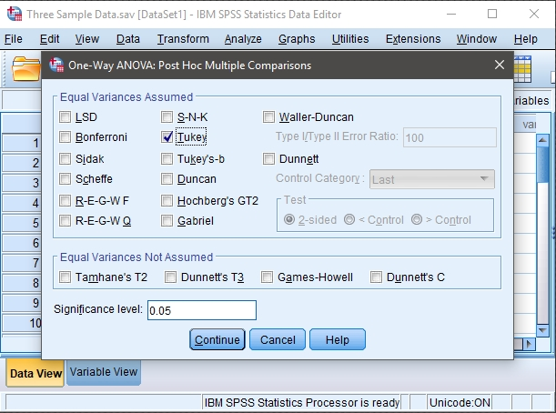</kbd>

---

## General Linear Model (Repeated Measures ANOVA) 

### Steps for Obtaining Repeated Measures Inferential Statistics

1. First, enter the repeated
 measures data. This is 
 described elsewhere. 

2. After the data are entered,
 select the "Analyze →
 General Linear Model → 
 Repeated Measures" option
 from the main menu.

<kbd>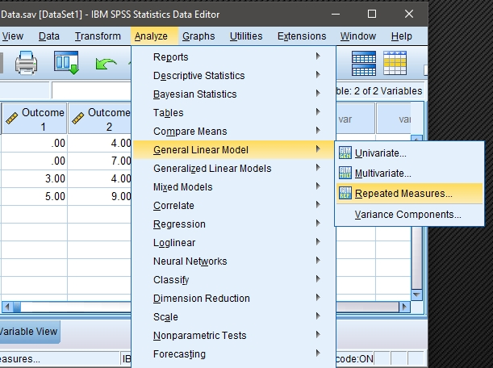</kbd>

### Steps for Labeling the Within-Subjects Variable/Factor 

3. A dialogue box will then 
 appear for you to create 
 the repeated measures
 factor. This box is
 necessary because SPSS 
 does not yet know which
 columns you wish to
 identify as repeated 
 measurements of the same 
 underlying factor. 

4. In the "Within-Subject 
 Factor Name" box, type in
 the name you wish to give
 to the repeated measures 
 factor. In this example, 
 since the
 measurements/columns 
 reflect quizzes at two 
 different times, "Time" is 
 used as the name.

5. In the "Number of Levels"
 box, indicate the number 
 of levels of the 
 within-subjects factor. In 
 this example, the quiz was 
 given twice, so there were 
 2 levels of the factor.

<kbd>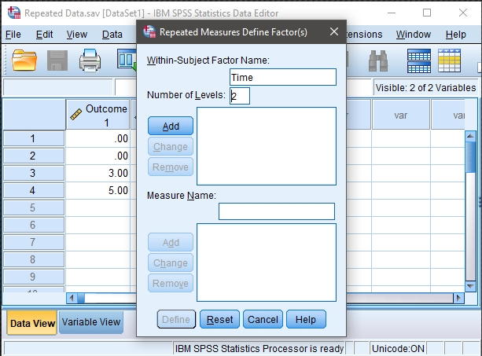</kbd>

### Steps for Creating the Within-Subjects Factor

6. It is then important that
 you finalize the creation
 of the within-subjects 
 factor by clicking on the
 "Add" button. This 
 officially declares the
 new factor in SPSS.

7. Note that this factor only 
 exists in the computer's 
 memory. For examples,
 nowhere in the data set
 will you see a variable
 called "Time." 

8. When you have done this, 
 click on "Define." This
 will take you to the next
 step in setting up the 
 analysis.

<kbd>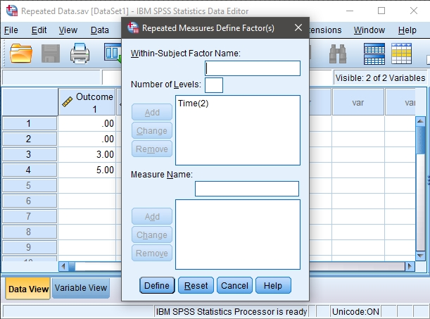</kbd>

### Steps for Obtaining the Significance Test

9. A dialogue box will then 
 appear for you to define 
 which columns/variables
 reflect the levels of the
 within-subjects factor.

10. Select the outcome variables 
 you wish to analyze by 
 clicking on them and 
 hitting the arrow to move
 them into the
 "Within-Subjects Variable" 
 box. In this example,
 "Outcome1" reflects the
 first level of the factor
 and "Outcome2" reflects
 the second level of the
 factor.

11. If all you wish is are ANOVA 
 source tables (with no 
 descriptive statistics or
 comparisons), click "OK."
 A separate window with the 
 output will appear.

<kbd>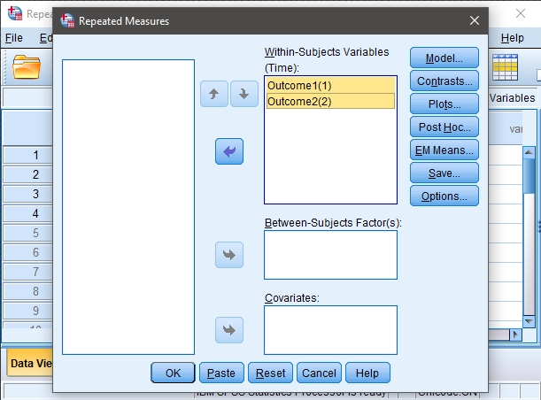</kbd>

### Steps for Obtaining Descriptive Statistics

 12. If you wish to get the 
 means, standard
 deviations, standard 
 errors, and 95% confidence 
 intervals for each group,
 select the "Options" 
 button.

 13. Another dialogue box will
 appear where you can 
 choose various statistics. 
 For means and standard 
 deviations, select 
 "Descriptive." When you
 are done, click
 "Continue." This will
 return you to the original 
 dialogue box.

 14. After clicking on "OK" in
 the original dialogue box, 
 a separate window with the 
 output will appear.

<kbd>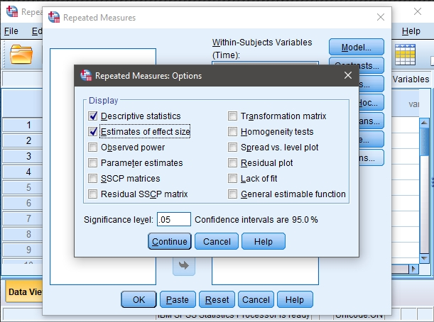</kbd>

## Steps for Obtaining Confidence Intervals

 15. If you wish to get the 
 confidence intervals for 
 each mean, select the "EM
 Means" button. 

 16. Another dialogue box will
 appear where you can 
 specify the Factor. Move 
 the relevant term to the 
 "Display Means" box. 

 17. When you are done, click 
 "Continue." This will
 return you to the original 
 dialogue box.

 18. After clicking on "OK" in
 the original dialogue box, 
 a separate window with the 
 output will appear.

<kbd>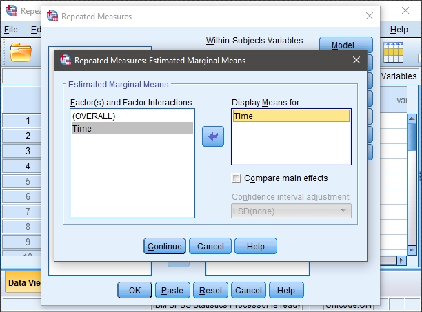</kbd>

---

## Univariate Analysis of Variance (Factorial ANOVA) 

### Steps for Obtaining Factorial Inferential Statistics

1. First, enter the data
 (described elsewhere). 

2. After the data are entered,
 select the "Analyze →
 General Linear Model → 
 Univariate" option from
 the main menu. 

<kbd>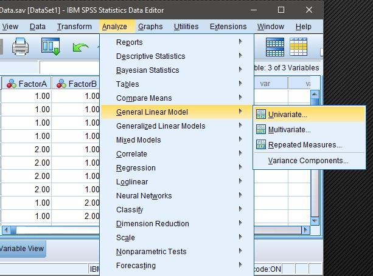</kbd>

### Steps for Obtaining the Significance Test 

3. A dialogue box will then 
 appear for you to choose 
 the variables of interest. 

4. Select the outcome variable
 you wish to analyze by 
 clicking on it and hitting 
 the arrow to move them 
 into the "Dependent
 Variable" box. 

5. Move the variable(s) that
 defines the different
 groups to the "Fixed 
 Factor(s)" box. Note that
 SPSS will not require you
 to enter anything for the
 interaction if there are 
 multiple factors; it will
 automatically create the 
 interactions defined by
 the factor(s). 

6. If all you wish is an ANOVA
 source table (with no
 descriptive statistics), 
 click "OK." A separate 
 window with the output 
 will appear. 

<kbd>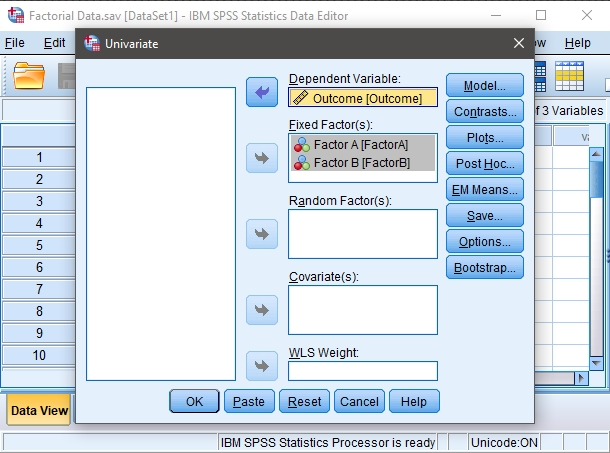</kbd>

### Steps for Obtaining Descriptive Statistics

7. If you wish to get the means 
 and standard deviations
 for each group, select the 
 "Options" button.

8. Another dialogue box will
 appear where you can 
 choose various statistics. 
 Select "Descriptive
 statistics." 

9. If you wish to get 
 eta-squared measures for 
 each factor (and the 
 interaction), click on 
 "Estimates of effect 
 size." 

 10. When you are done, click 
 "Continue." This will
 return you to the original 
 dialogue box.

 11. After clicking on "OK" in
 the original dialogue box, 
 a separate window with the 
 output will appear.

<kbd>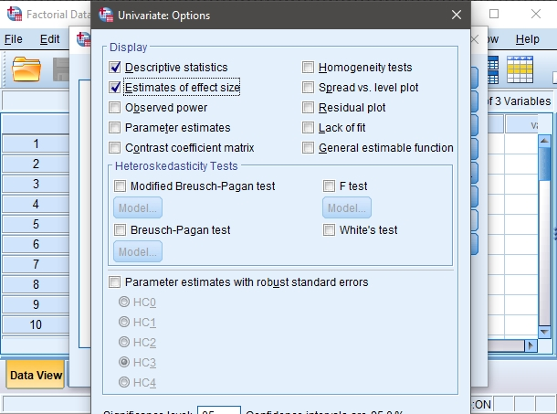</kbd>

### Steps for Obtaining Confidence Intervals

12.If you wish to get the 
 confidence intervals for 
 each mean, select the "EM
 Means" button. 

13. Another dialogue box will
 appear where you can 
 specify which effects
 (main effects and
 interactions) to analyze.
 Move the relevant terms to 
 the "Display Means" box. 

14. When you are done, click 
 "Continue." This will
 return you to the original 
 dialogue box.

15. After clicking on "OK" in
 the original dialogue box, 
 a separate window with the 
 output will appear.

<kbd>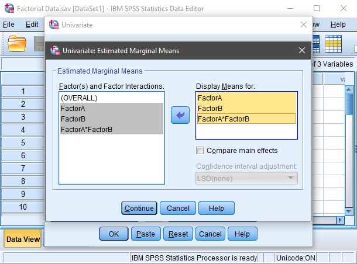</kbd>

