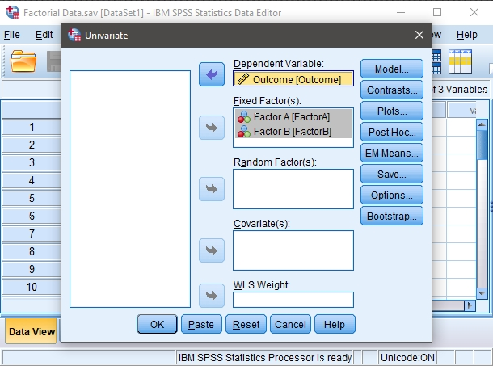
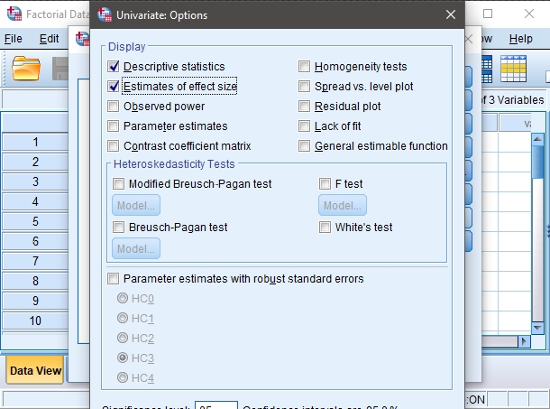
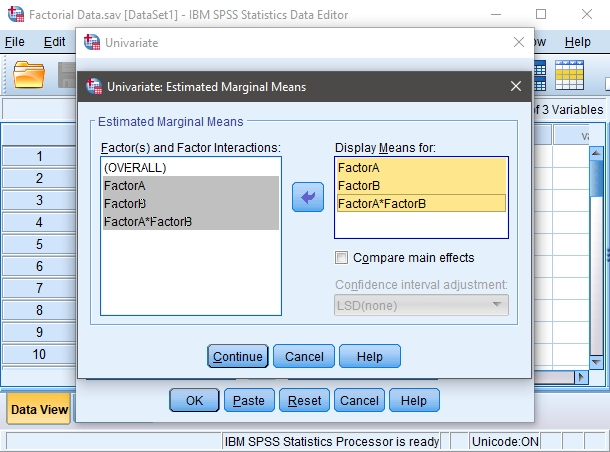

## SPSS: Using the Software

### Univariate Analysis of Variance (Factorial ANOVA) 

#### Steps for Obtaining Factorial Inferential Statistics

1. First, enter the data
 (described elsewhere). 

2. After the data are entered,
 select the "Analyze →
 General Linear Model → 
 Univariate" option from
 the main menu. 

<kbd></kbd>

#### Steps for Obtaining the Significance Test 

3. A dialogue box will then 
 appear for you to choose 
 the variables of interest. 

4. Select the outcome variable
 you wish to analyze by 
 clicking on it and hitting 
 the arrow to move them 
 into the "Dependent
 Variable" box. 

5. Move the variable(s) that
 defines the different
 groups to the "Fixed 
 Factor(s)" box. Note that
 SPSS will not require you
 to enter anything for the
 interaction if there are 
 multiple factors; it will
 automatically create the 
 interactions defined by
 the factor(s). 

6. If all you wish is an ANOVA
 source table (with no
 descriptive statistics), 
 click "OK." A separate 
 window with the output 
 will appear. 

<kbd></kbd>

#### Steps for Obtaining Descriptive Statistics

7. If you wish to get the means 
 and standard deviations
 for each group, select the 
 "Options" button.

8. Another dialogue box will
 appear where you can 
 choose various statistics. 
 Select "Descriptive
 statistics." 

9. If you wish to get 
 eta-squared measures for 
 each factor (and the 
 interaction), click on 
 "Estimates of effect 
 size." 

 10. When you are done, click 
 "Continue." This will
 return you to the original 
 dialogue box.

 11. After clicking on "OK" in
 the original dialogue box, 
 a separate window with the 
 output will appear.

<kbd></kbd>

#### Steps for Obtaining Confidence Intervals

12.If you wish to get the 
 confidence intervals for 
 each mean, select the "EM
 Means" button. 

13. Another dialogue box will
 appear where you can 
 specify which effects
 (main effects and
 interactions) to analyze.
 Move the relevant terms to 
 the "Display Means" box. 

14. When you are done, click 
 "Continue." This will
 return you to the original 
 dialogue box.

15. After clicking on "OK" in
 the original dialogue box, 
 a separate window with the 
 output will appear.

<kbd></kbd>

