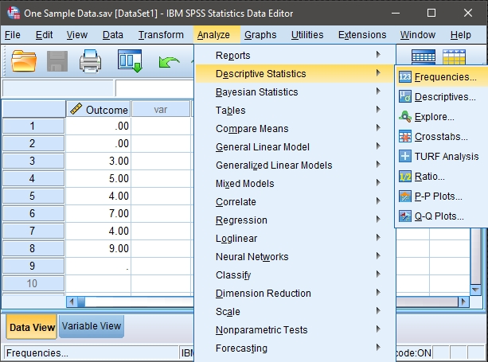

## SPSS: Using the Software

### Frequencies (Frequencies and Descriptives) 

#### Steps for Obtaining Frequency-Related Statistics

1. First, enter the data
 (described elsewhere). 

2. After the data are entered,
 select the "Analyze →
 Descriptive Statistics → 
 Frequencies" option from 
 the main menu. 

<kbd></kbd>

#### Steps for Obtaining a Frequency Distribution

3. A dialogue box will then 
 appear for you to choose 
 the variables of interest. 

4. Select the variables you 
 wish to analyze by 
 clicking on them and then
 the arrow to move them 
 into the "variables" box.

5. Be sure that "Display
 frequency tables" is 
 checked. Without this
 checked, you will not get
 a frequency distribution.

6. If all you wish is a 
 frequency table (with no 
 histogram or summary 
 statistics), click "OK." A 
 separate window with the 
 output will appear.

<kbd></kbd>

#### Steps for Obtaining Summary Statistics 
 
7. To obtain summary
 statistics, select 
 "Statistics." Another
 dialogue box will appear.

8. In this box, you can request 
 that SPSS calculate the
 mean, variance, and
 standard deviation (or 
 median and quartiles). 

9. Once you have selected the 
 desired statistics, click
 "Continue." This will
 return you to the original 
 dialogue box.

<kbd></kbd>

#### Steps for Obtaining a Histogram 

10. To obtain a histogram, click 
 on the "Charts" button.
 Another dialogue box will
 appear.

11. In this box, select
 "Histogram." 

12. Click "Continue." This will
 return you to the original 
 dialogue box.

13. After clicking on "OK" in
 the original dialogue box, 
 a separate window with the 
 output will appear.

<kbd></kbd>

