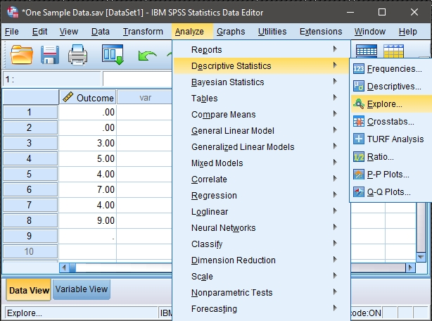
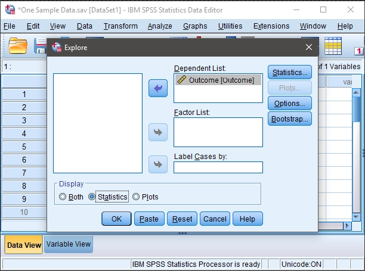
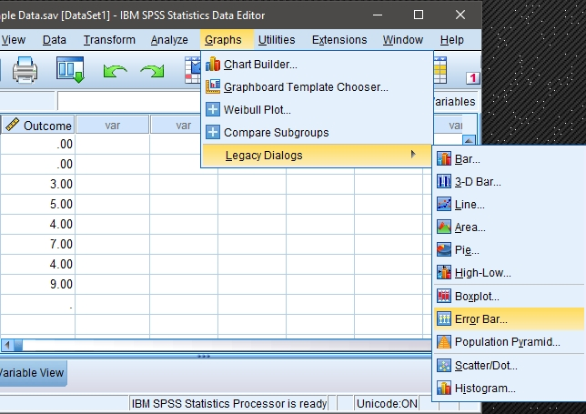
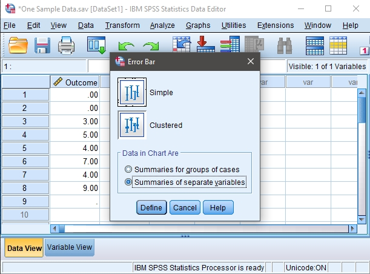
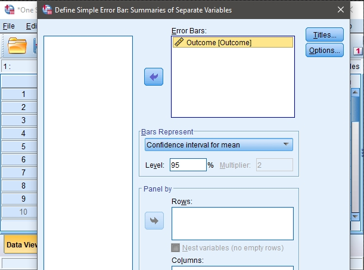

## SPSS: Using the Software

### Explore (Descriptives and Confidence Intervals) 

#### Obtaining Exploratory-Related Statistics 

 1. First, enter the data
 (described elsewhere). 

 2. After the data are entered,
 select the "Analyze →
 Descriptive Statistics → 
 Explore" option from the 
 main menu. 

<kbd></kbd>

### Obtaining the Exploratory Statistics

3. A dialogue box will then 
 appear for you to choose the 
 variables of interest. 

4. Select the variables you 
 wish to analyze by clicking
 on them and hitting the
 arrow to move them into the
 "Dependent List" box.

5. Be sure that "Statistics" is 
 checked. This will limit 
 your output to basic 
 descriptive statistics and 
 confidence intervals.

6. If you do not wish to alter
 the default (95%) confidence 
 level, click "OK." A 
 separate window with the 
 output will appear.

<kbd></kbd>

#### Altering the Confidence Interval

7. If you wish to alter the 
 width of the confidence
 interval, select the 
 "Statistics" button. 

8. Another dialogue box will
 appear where you can change
 the confidence level. When 
 you are done, click
 "Continue." This will return 
 you to the original dialogue 
 box. 

9. After clicking on "OK" in
 the original dialogue box, a 
 separate window with the 
 output will appear.

<kbd></kbd>

#### Obtaining a Graph of the Confidence Intervals 

10 .First, enter the data
 (described elsewhere). 

11. To obtain a graph, select
 the "Graphs → Legacy Dialogs 
 → Error Bar" option from the 
 main menu. 

<kbd></kbd>

#### Choosing the Graph Layout

 12. A dialogue box will then 
 appear for you to choose the 
 general graph layout of
 interest.

 13. Click on the box labeled 
 "Simple" (it should then be
 highlighted).

 14. Then click on the option 
 that states that you want
 "Summaries of separate 
 variables."

 15. Click "Define."

<kbd></kbd>

#### Obtaining the Confidence Interval Graph

 16. A dialogue box will then 
 appear for you to choose 
 the variables of interest
 to graph.

 17. Under "Error Bars," move the 
 name(s) of the variable(s) 
 you want to include in the 
 graph. 

 18. If you want to change the
 width of the confidence
 intervals, type the
 appropriate percentage in
 the "Level" box. 

 19. After clicking on "OK", a
 separate window with the 
 output will appear.

<kbd></kbd>

