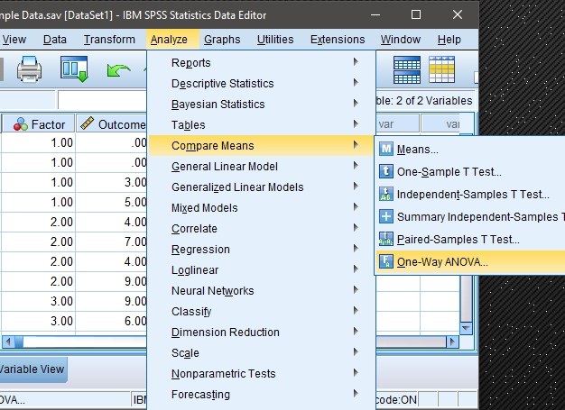
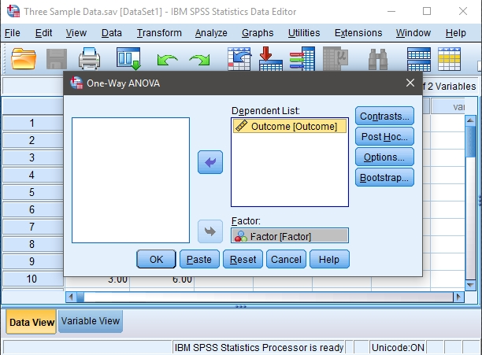
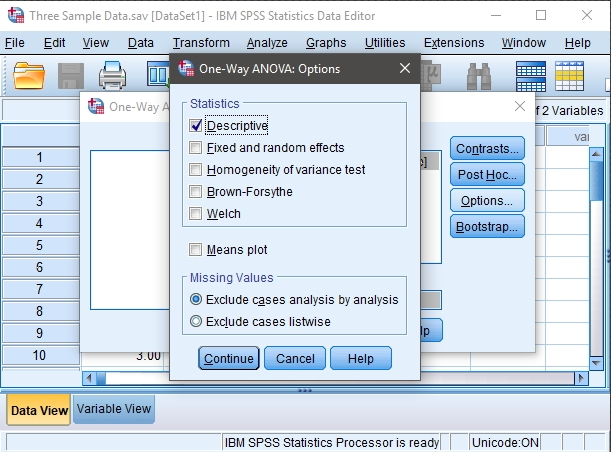
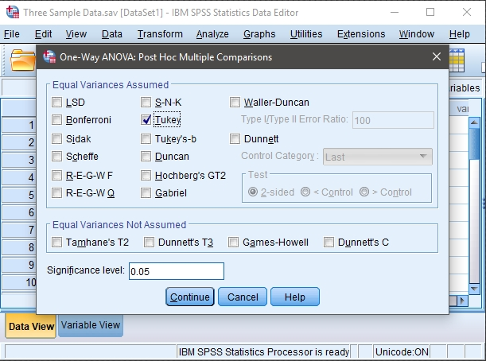

## SPSS: Using the Software

### Post Hoc Tests (OneWay ANOVA) 

#### Obtaining Multiple-Sample Inferential Statistics

1. First, enter the data. This
 is done in the same manner 
 as entering two sample data
 (described elsewhere) but
 with additional groups.

2. After the data are entered,
 select the "Analyze →
 Compare Means → One-Way
 ANOVA" option from the main
 menu.

<kbd></kbd>

#### Obtaining the Significance Test 
 
3. A dialogue box will then 
 appear for you to choose the 
 variables of interest. 

4. Select the outcome variables 
 you wish to analyze by 
 clicking on them and hitting 
 the arrow to move them into
 the "Dependent List" box.

5. Move the variable that 
 defines the different groups 
 to the "Factor" box. SPSS
 will not ask you to define 
 the groups you wish to 
 compare; it simply will
 compare all groups defined 
 by the factor. 

6. If all you wish is an ANOVA
 source table (with no
 descriptive statistics or
 post hoc tests), click "OK." 
 A separate window with the 
 output will appear.

<kbd></kbd>

#### Obtaining Descriptive Statistics

7. If you wish to get the 
 means, standard deviations,
 standard errors, and 95% 
 confidence intervals for 
 each group, select the 
 "Options" button.

 8. Another dialogue box will
 appear where you can choose
 various statistics. Select 
 "Descriptive." When you are
 done, click "Continue." This 
 will return you to the 
 original dialogue box. 

 9. If all you wish is an ANOVA
 with the descriptive 
 statistics (and no post hoc
 tests), click "OK." A
 separate window with the 
 output will appear.

<kbd></kbd>

#### Obtaining Post Hoc Tests

10. If you wish to obtain post 
 hoc tests for the purpose of 
 making comparisons between 
 groups, click the "Post Hoc" 
 button.

11. Another dialogue box will
 appear where you can choose
 which post hoc tests you 
 wish. Select "Tukey" to get
 Tukey HSD post hoc tests.
 When you are done, click 
 "Continue."

12. After clicking on "OK" in
 the original dialogue box, a 
 separate window with the 
 output will appear.

<kbd></kbd>

