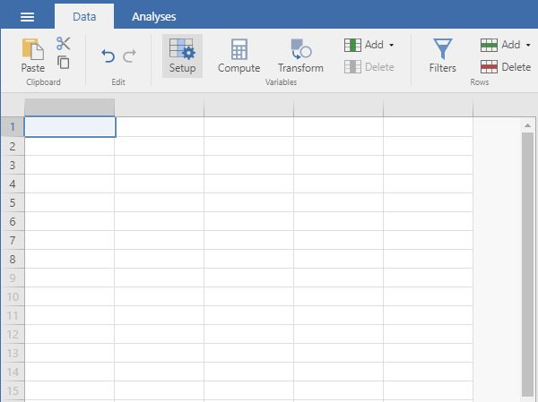

# Statistics for Social Science

## Volume: jamovi  

**Original:** July 2017  
**Section Updated:** July 2020

> This portion of the sourcebook uses the jamovi software:
> <https://www.jamovi.org>

---

## Using the Software

[**Using the Software:**](./using-software/) This section provides step-by-step instructions on how to obtain basic statistical output using jamovi, both visually with screenshots and via written instructions. Simple examples for most undergraduate level between-subjects and within-subjects research designs are provided.

<kbd></kbd>

## Annotated Output

[**Annotated Output:**](./annotated-output/) This section provides stepbystep instructions on how to obtain basic statistical output using jamovi, both visually with screenshots and via written instructions. Simple examples for most undergraduatelevel betweensubjects and withinsubjects research designs are provided.

<kbd></kbd>

## Blank Output

[**Blank Output:**](./blank-output/) This section provides stepbystep instructions on how to obtain basic statistical output using jamovi, both visually with screenshots and via written instructions. Simple examples for most undergraduatelevel betweensubjects and withinsubjects research designs are provided.

<kbd></kbd>

---

**Abstract:** This section provides stepbystep instructions on how to obtain basic statistical output using jamovi, both visually with screenshots and via written instructions. Simple examples for most undergraduatelevel betweensubjects and withinsubjects research designs are provided.

**Keywords:** jamovi, screenshots, directions for use  
**Original:** July 2017  
**Section Updated:** July 2020

This document is part of an online statistics sourcebook.

> A browser-friendly viewing platform for the sourcebook is available:
> <https://cwendorf.github.io/Sourcebook>

> All data, syntax, and output files are available:
> <https://github.com/cwendorf/Sourcebook>