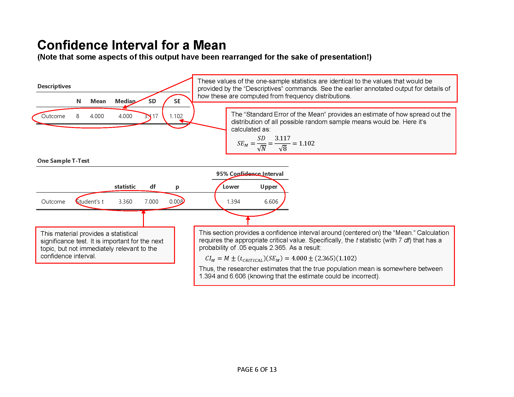
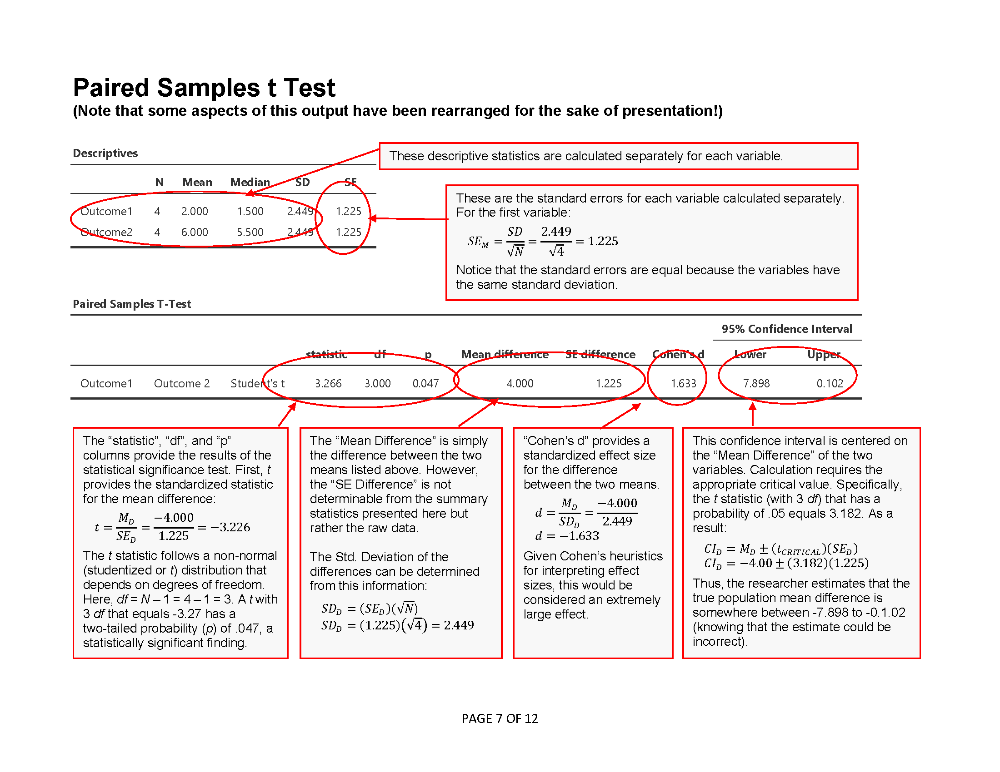
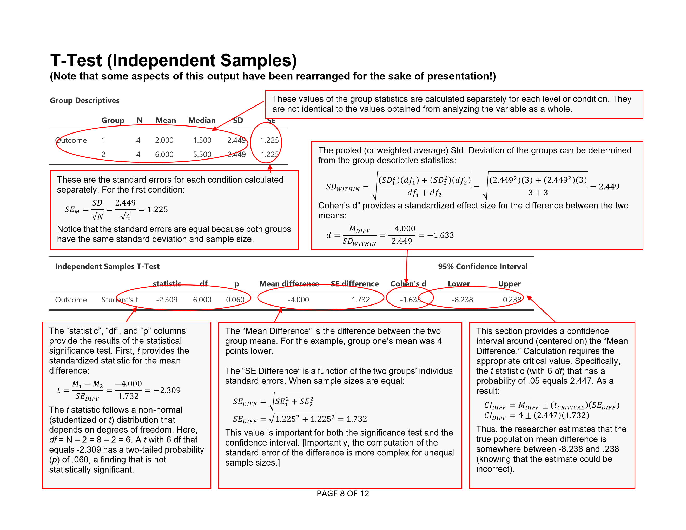
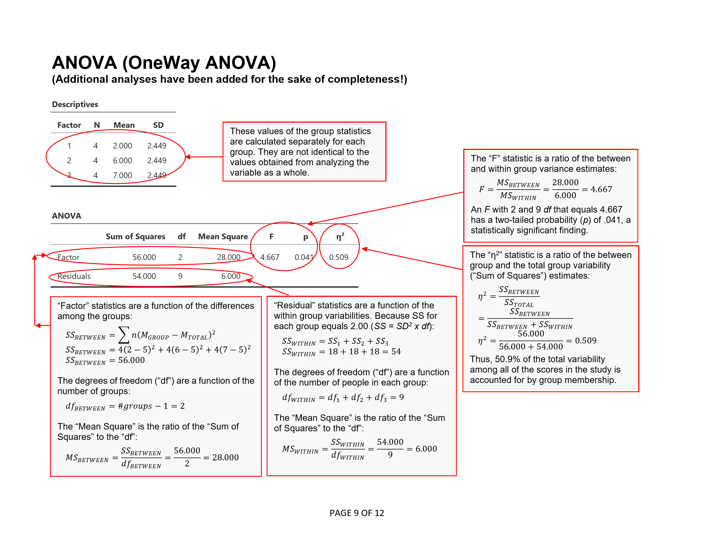
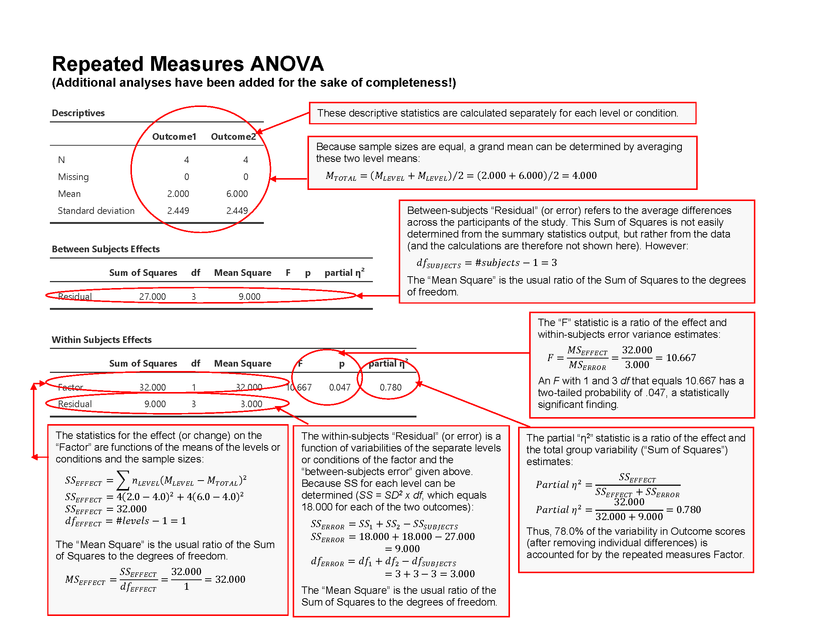
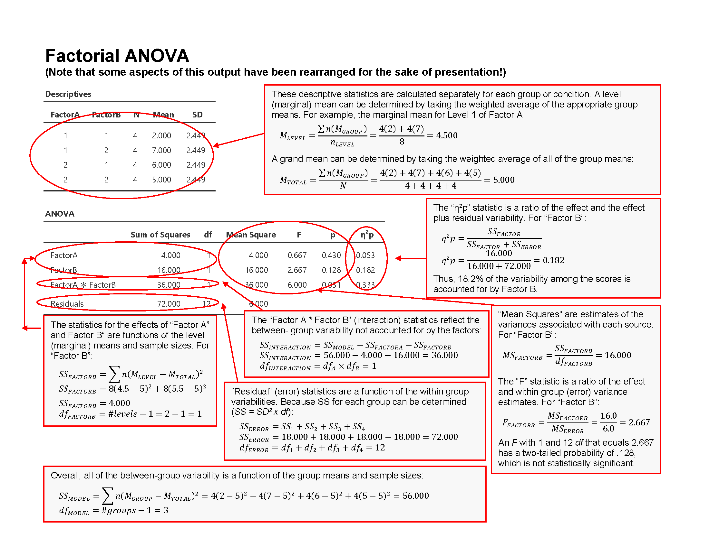

## jamovi: Annotated Ouput

This chapter is intended to facilitate the connection between standard introductory statistics concepts and their implementation in jamovi. It shows the output from various types of analyses, describes how to interpret the output, and shows the link between hand calculation formulas and jamovi output.

- [Descriptives (Frequencies and Descriptives)](#descriptives-frequencies-and-descriptives)
- [Correlations (Bivariate)](#correlations-bivariate)
- [T Test (Confidence Intervals)](#t-test-confidence-intervals)
- [T Test (One Sample)](#t-test-one-sample)
- [T Test (Paired Samples)](#t-test-paired-samples)
- [T Test (Independent Samples)](#t-test-independent-samples)
- [ANOVA (OneWay ANOVA)](#anova-oneway-anova)
- [Post Hoc Tests (OneWay ANOVA)](#post-hoc-tests-oneway-anova)
- [Repeated Measures ANOVA](#repeated-measures-anova)
- [ANOVA (Factorial ANOVA)](#anova-factorial-anova)

---

### Descriptives (Frequencies and Descriptives)

<kbd></kbd>

---

### Correlations (Bivariate)

<kbd></kbd>

---

### T Test (Confidence Intervals)

<kbd></kbd>

---

### T Test (One Sample)

<kbd></kbd>

---

### T Test (Paired Samples)

<kbd></kbd>

---

### T Test (Independent Samples)

<kbd></kbd>

---

### ANOVA (OneWay ANOVA)

<kbd></kbd>

---

### Post Hoc Tests (OneWay ANOVA)

<kbd></kbd>

---

### Repeated Measures ANOVA

<kbd></kbd>

---

### ANOVA (Factorial ANOVA)

<kbd></kbd>

