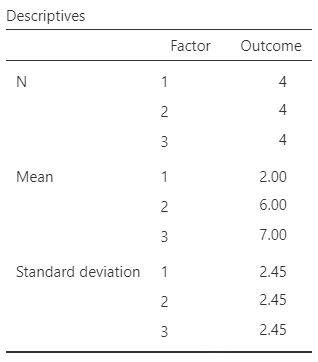
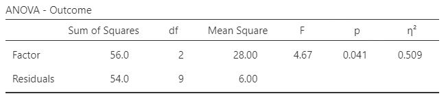
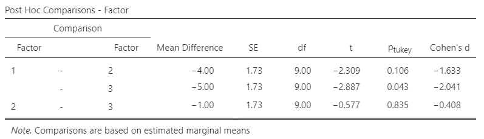

# [jamovi Articles](../index.md)

## Annotated Output | Post Hoc Comparisons

### Computer Output

The tables of statistics can be used to determine the inferential statistics.

{: .output}

{: .output}
 

The table of inferential statistics shows the key elements to be calculated.

{: .output}

### Calculations

Descriptive Statistics: The values of the group statistics are calculated separately for each group. They are not identical to the values obtained from analyzing the variable as a whole.

Mean Differences: Mean Differences (raw effects) are the differences between the means for all pairs of groups. Half of the possible pairwise comparisons are redundant and do not need to be calculated (though the mean differences will have the opposite signs because of subtraction order if they were calculated).

> $$ M_1 - M_2 = 2.000 − 6.000 =  −4.000 $$
>
> $$ M_1 - M_3 = 2.000 − 7.000 = −5.000 $$
>
> $$ M_2 - M_3 = 6.000 − 7.000 = −1.000 $$

Standard Error of the Difference: The standard errors are for the difference between the two group means in each comparison. The values are a function of the MSWITHIN (from the ANOVA) and the sample sizes. \[In this case, because all groups are of the same size, the standard error for each comparison is the same.\]

> $$ SE_{DIFF} = \sqrt{ \left( \frac{MS_{WITHIN}}{n_{GROUP}} \right) + \left( \frac{MS_{WITHIN}}{n_{GROUP}} \right) } = \sqrt{ \left( \frac{6.000}{4} \right) + \left( \frac{6.000}{4} \right) } = 1.732 $$

Statistical Significance: The *HSD* statistic is a ratio of the mean difference to the standard error of the difference. There is one statistic for each of the comparisons.

> Because the ANOVA has *dfBETWEEN* = 2 and *dfWITHIN* = 9, *HSDCRITICAL* = 2.792

> $$ HSD_{1vs2} = \frac{( M_1 - M_2 )}{SE_{DIFF}} = \frac{-4.000}{1.732} = -2.309 $$
>
> Because *HSD* < *HSDCRITICAL*, *p* > .05  
> This would not be considered a statistically significant finding.

> $$ HSD_{1vs3} = \frac{( M_1 - M_3 )}{SE_{DIFF}} = \frac{-5.000}{1.732} = -2.887 $$
>
> Because *HSD* > *HSDCRITICAL*, *p* < .05  
> This would be considered a statistically significant finding.

> $$ HSD_{2vs3} = \frac{( M_2 - M_3 )}{SE_{DIFF}} = \frac{-1.000}{1.732} = -0.577 $$
>
> Because *HSD* < *HSDCRITICAL*, *p* > .05  
> This would not be considered a statistically significant finding.

Confidence Intervals: For *HSD*, calculate the confidence intervals around (centered on) each mean difference separately.

> $$ CI_{1vs2} = ( M_1 - M_2 ) \pm (HSD_{CRITICAL}) ( SE_{DIFF}) = -4.000 \pm (2.792) (1.732) = [ −8.836, 0.836 ] $$
>
> $$ CI_{1vs3} = ( M_1 - M_3 ) \pm (HSD_{CRITICAL}) ( SE_{DIFF}) = -5.000 \pm (2.792) (1.732) = [ −9.836, −0.164 ] $$
>
> $$ CI_{2vs3} = ( M_2 - M_3 ) \pm (HSD_{CRITICAL}) ( SE_{DIFF}) = -1.000 \pm (2.792) (1.732) = [ −5.836, 3.836 ] $$
>
> For each comparison, the researcher estimates the true population mean difference (knowing that the estimates could be incorrect).

### APA Style

Post hoc tests build on the ANOVA results and provide a more focused comparison among the groups and usually follows a presentation of the ANOVA (which already includes the descriptive information). The first example focuses on statistical significance testing, whereas the second version includes and emphasizes interpretation of the confidence intervals (and can be presented on its own). 

> Tukey's HSD tests showed that the first group scored statistically significantly different than the third group, *t*(9) = -2.89, p = 043. However, the other comparisons were not statistically significant (*p*s > .05).

> A series of Tukey's HSD comparisons revealed that the first group (*n* = 3, *M* = 2.00, *SD* = 2.45) scored substantially lower Outcome scores than the third group (*n* = 3, *M* = 7.00, *SD* = 2.45), 95% CI [-9.84, -.16], *t*(9) = -2.89, p = 043. However, the other comparisons revealed effectively little to no difference between the other groups (*p*s > .05).

Alternatively, the means, standard deviations, and confidence intervals could be presented in a table or figure associated with this text.
