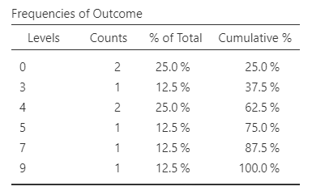
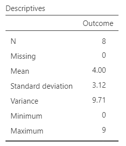

# [jamovi Articles](../index.md)

## Annotated Output | Standardized Scores

### Computer Output

The frequency distribution can be used to determine the descriptive statistics.

{: .output}

The table of descriptive statistics can be used to assist in calculating the standardized scores.

{: .output}

### Calculations

Descriptive Statistics: The values of the one-sample statistics are identical to the values that would be provided by the “Descriptives” procedure.

Standardized (z) Score: A standardized score is a deviation score divided by the standard deviation. This is repeated for each score in the distribution. In software programs, they would be calculated and presented back in the data set. For the first scores in the distribution:

> $$ z = \frac{(Y - M)}{SD} = \frac{(0 - 4.000)}{3.117} = -1.283 $$

Percentile Rank: The 50th percentile (the Median) and the 25th and 75th percentiles (collectively known as the Interquartile Range) are the most commonly calculated. Assuming a perfectly normal distribution:

> From the Standard Normal Distribution table: for PR = .250, z = -.680  
> From the Standard Normal Distribution table: for PR = .500, z = 0.000  
> From the Standard Normal Distribution table: for PR = .750, z = +.680

Percentile Point: Percentiles provide the scores associated with particular percentile ranks. They can be estimated using the z score formula and the descriptive information from the original variable:

> For PR = .250: -.680 = (Y - 4.000) / 3.117; Y = 1.880  
> For PR = .500: 0.000 = (Y - 4.000) / 3.117; Y = 4.000  
> For PR = .750: 0.000 = (Y - 4.000) / 3.117; Y = 6.120  
> Thus, we estimate the scores at the 25th, 50th, and 75th percentiles to be approximately 1.880, 4.000, and 6.120 respectively. They are accurate estimates only if the distribution is perfectly normal.

Mean (of the z Scores): The mean (or arithmetic average) is calculated as an unbiased estimate of the population mean. Here, the mean is determined as the average of the scores weighted by their frequencies:

> $$ M = \frac{\sum(fY)}{N} = \frac{(2 \times -1.283) + (1 \times -.321) + (2 \times 0) + (1 \times .321) + (1 \times .963) + (1 \times 1.604)}{8} = 0.000 $$

Sum of Squares (of the z Scores): The Sum of Squares is the basic measure of the variability of the scores. Formally, it is the sum of the weighted deviations of the scores about the mean.

> $$ SS = \sum f (Y - M) = 2 (-1.283 - 0)^2 + 1(-.321 - 0)^2 + 2(0.000 - 0)^2 + 1(.321 - 0)^2 + 1(.963 - 0)^2 + 1(1.604 - 0)^2 = 7.000 $$

Mean Squares (of the z scores): Mean Squares (also known as Variance) is a function of the Sum of Squares. It is calculated as an unbiased estimate of the population variance.

> $$ MS = \frac{SS}{(N - 1)} = \frac{7.000}{7} = 1.000 $$

Standard Deviation (of the z Scores): Standard Deviation is a function of Mean Squares. It is also calculated as an unbiased estimate of the population standard deviation.

> $$ SD = \sqrt{MS} = \sqrt{1.000} = 1.000 $$

### APA Style

Standardized scores are typically NOT presented in the summary of the data. Rather, they are often a first step in the calculations. As such, APA style is not presented here.
