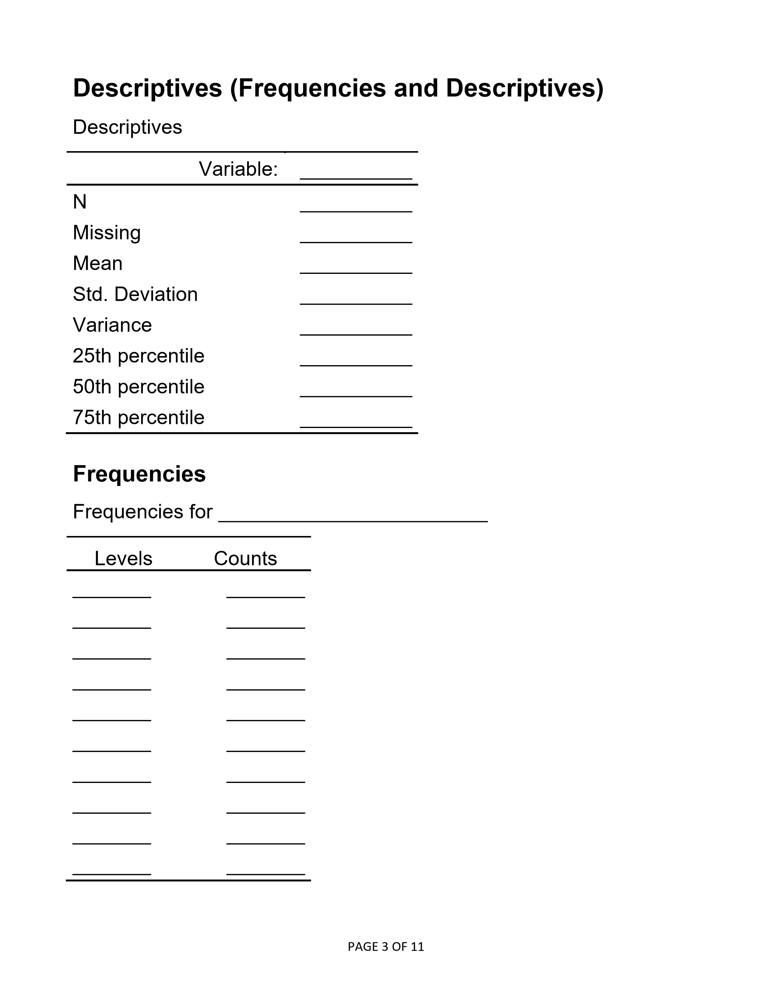
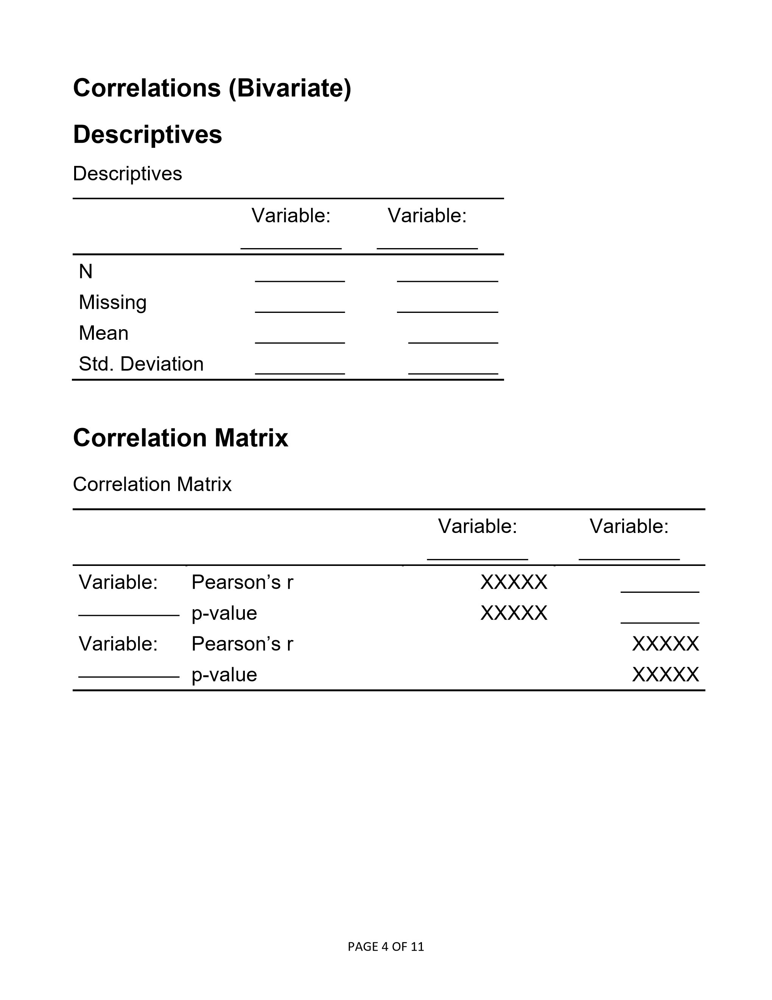
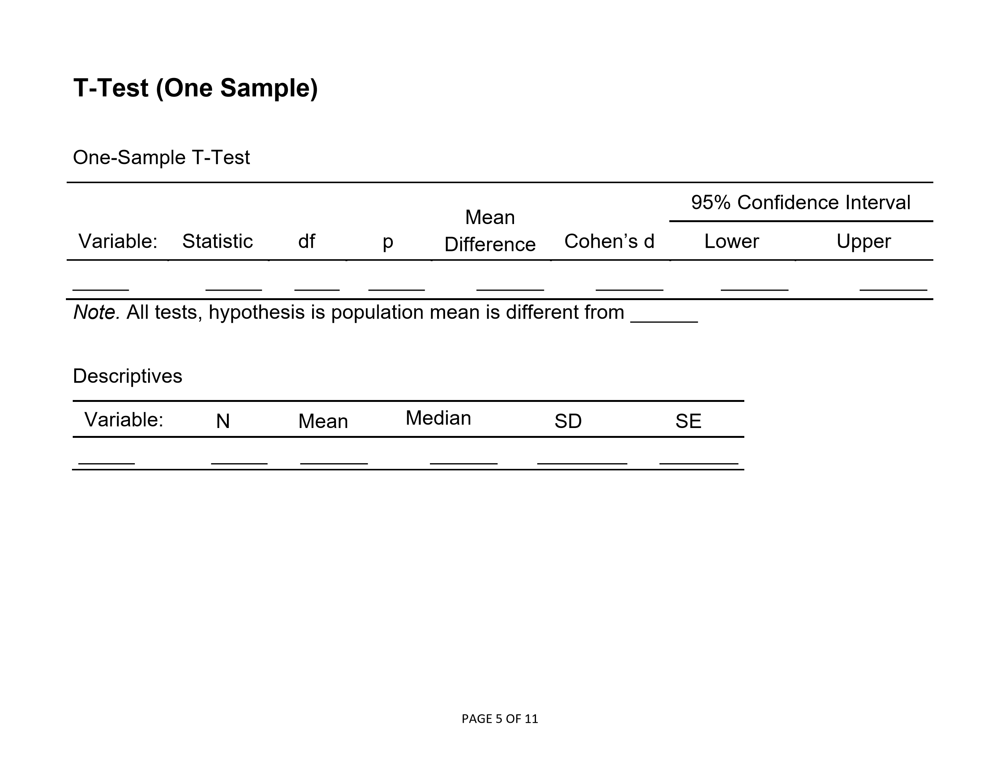
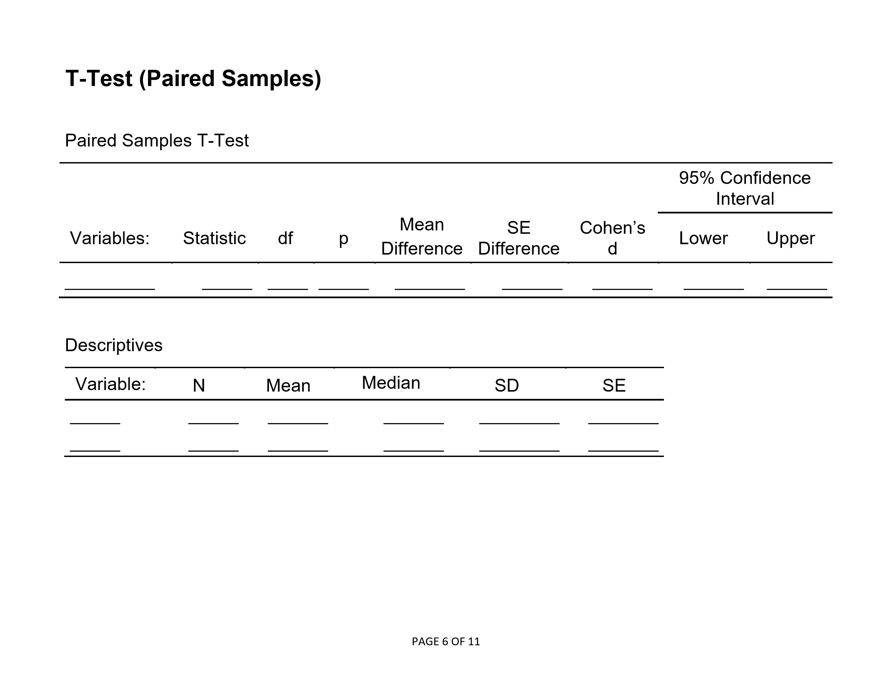
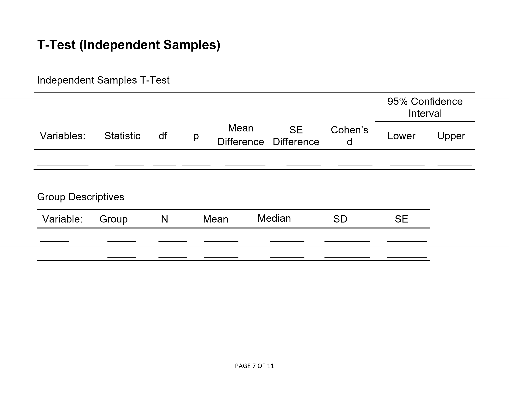
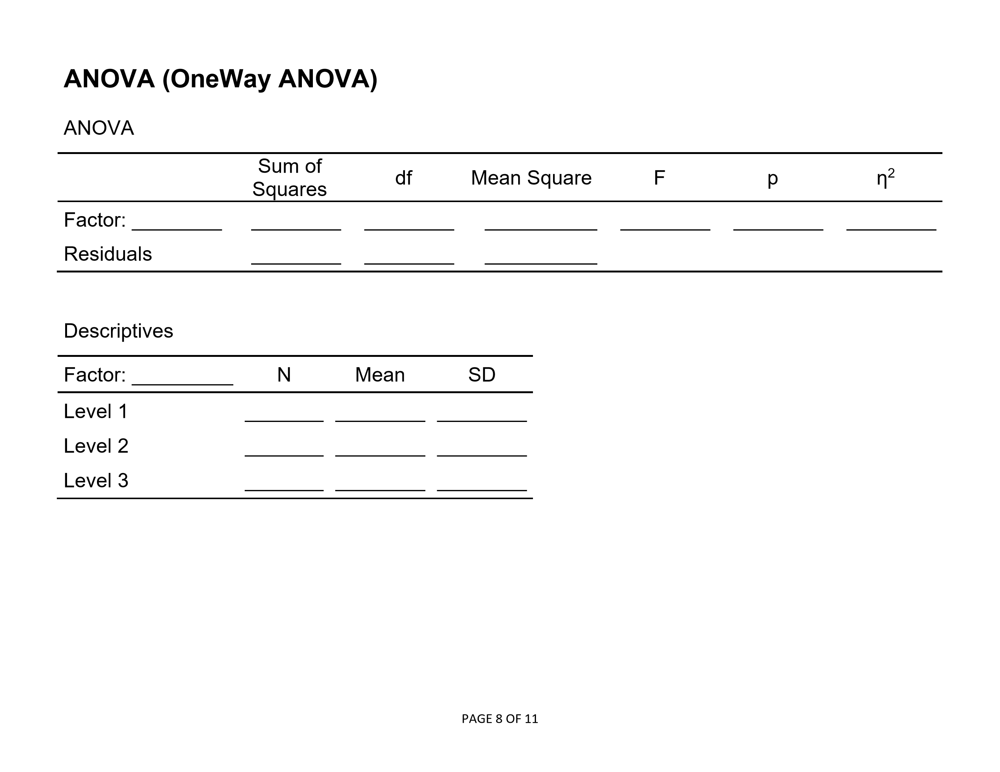
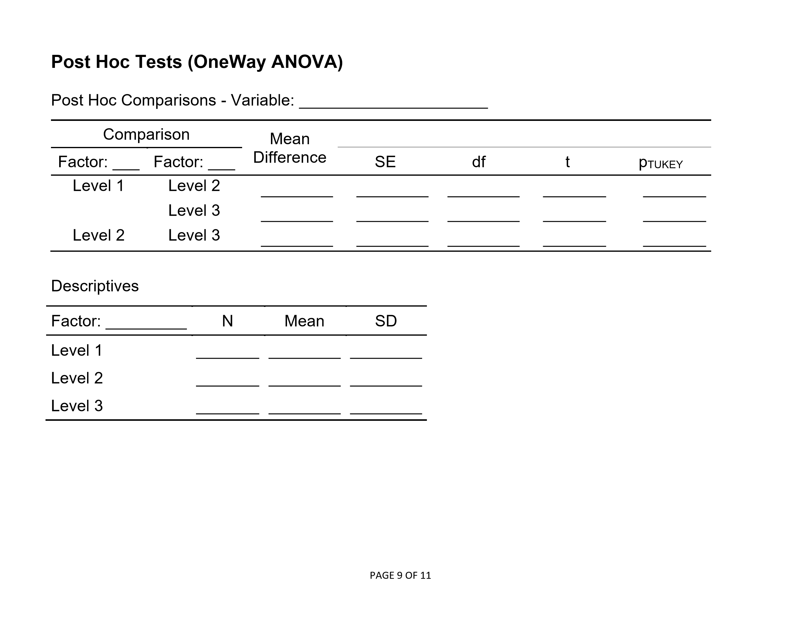
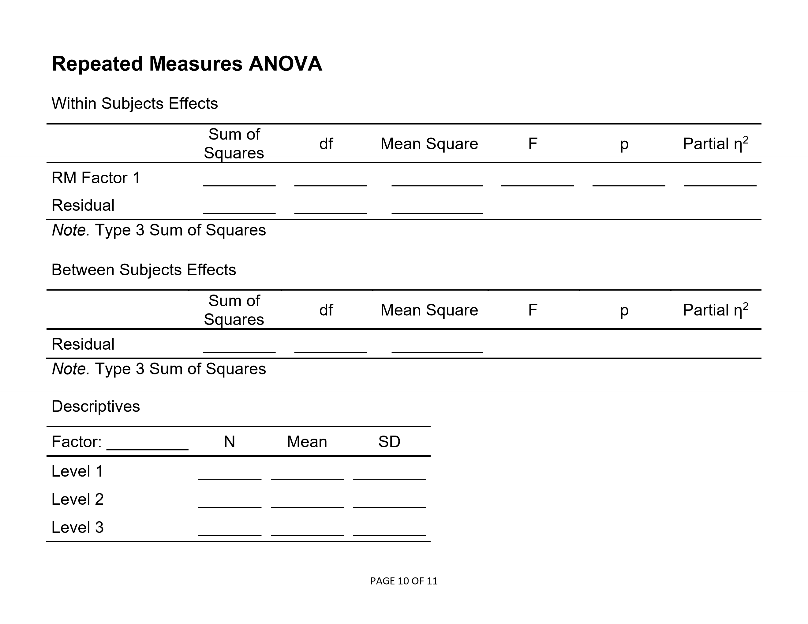
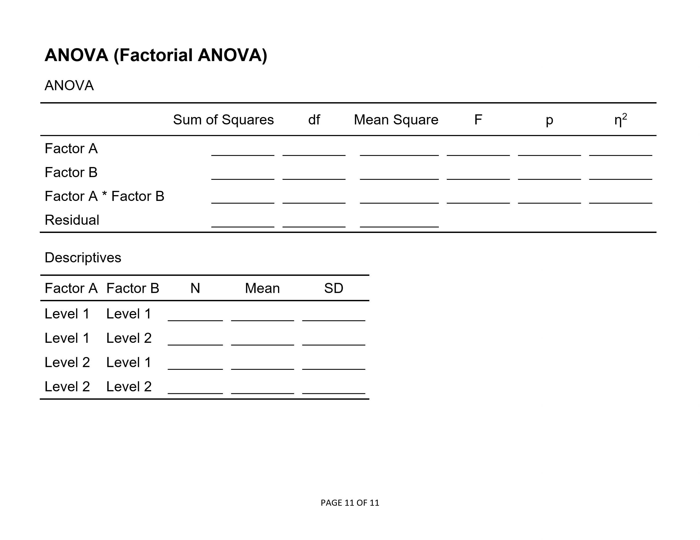

# Statistics for Social Science

## jamovi: Blank Ouput

### Abstract

This chapter is used as worksheets for class problems. Students fill in their answers on these sheets, thus making clear the links between non-computer (“hand”) calculations and the jamovi output.

### Table of Contents

- [Descriptives (Frequencies and Descriptives)](#descriptives-frequencies-and-descriptives)
- [Correlations (Bivariate)](#correlations-bivariate)
- [T Test (One Sample)](#t-test-one-sample)
- [T Test (Paired Samples)](#t-test-paired-samples)
- [T Test (Independent Samples)](#t-test-independent-samples)
- [ANOVA (OneWay ANOVA)](#anova-oneway-anova)
- [Post Hoc Tests (OneWay ANOVA)](#post-hoc-tests-oneway-anova)
- [Repeated Measures ANOVA](#repeated-measures-anova)
- [ANOVA (Factorial ANOVA)](#anova-factorial-anova)

---

### Descriptives (Frequencies and Descriptives)

<kbd></kbd>

### Correlations (Bivariate)

<kbd></kbd>

### T Test (One Sample)

<kbd></kbd>

### T Test (Paired Samples)

<kbd></kbd>

### T Test (Independent Samples)

<kbd></kbd>

### ANOVA (OneWay ANOVA)

<kbd></kbd>

### Post Hoc Tests (OneWay ANOVA)

<kbd></kbd>

### Repeated Measures ANOVA

<kbd></kbd>

### ANOVA (Factorial ANOVA)

<kbd></kbd>

