# jamovi | Data Analysis

## Descriptives (Frequencies and Descriptives) 

### Obtaining Frequency-Related Statistics

1. First, enter the data (described elsewhere). 

2. On the "Analyses" tab, select the "Exploration -> Descriptives" option.

<kbd></kbd>

### Obtaining a Frequency Distribution

3. A set of options will then appear for you to choose the variables and statistics of interest.

4. Select the variables you wish to analyze by clicking on them in the lefthand box and then the arrow to move them into the righthand box.

5. Be sure that "Frequency tables" is checked. Without this checked, you will not get a frequency distribution.

6. Output will automatically appear on the right side of the window. 

<kbd>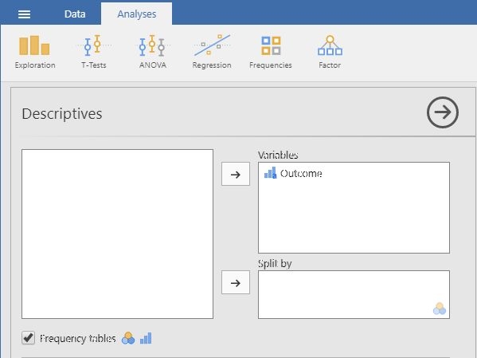</kbd>

### Obtaining Summary Statistics

7. Though some basic summary statistics are displayed by default, you can make changes by expanding the "Statistics" dropdown menu.

8. As you select the desired statistics, the output on the right side of the window will be automatically updated. 

9. Individual tables (or even the whole section of Output) can be copied using the dropdown arrow options in the output. These can be pasted into other word processing software for printing purposes.

<kbd></kbd>

## Correlations (Bivariate) 

### Obtaining Correlational Statistics 

1. First, enter data involving multiple variables (described elsewhere). 

2. On the "Analyses" tab, select the "Regression -> Correlation Matrix" option.

<kbd>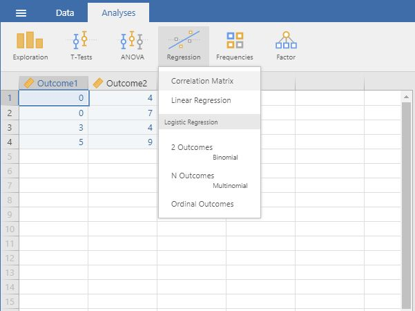</kbd>

### Obtaining Correlations (and Significance Tests)

3. A set of options will then appear for you to choose the variables and statistics of interest.

4. Select the variables you wish to analyze by clicking on them in the lefthand box and then the arrow to move them into the righthand box.

5. Output (with no descriptive statistics) will automatically appear on the right side of the window. Output can be copied and pasted into other software for printing.

6. If you wish descriptive statistics associated with each variable, follow the "Descriptives" p procedures described earlier in this manual.

<kbd></kbd>

## Compute (Transformations and Standardized Scores)

### Obtaining the Compute Menu

1. First, enter the data (described elsewhere).

2. After the data are entered, click on the column representing the data you wish to transform.

3. Select the “Compute” option from the menu. This will bring up a new set of options.

<kbd>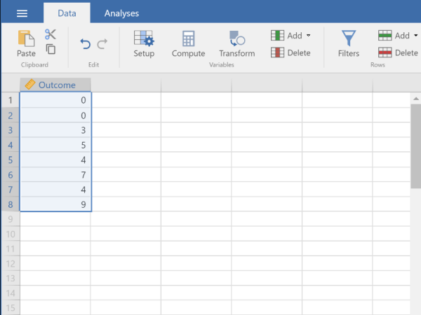</kbd>

### Computing Transformations

4. Type in the new you wish to give the new variable (here it is “trOutcome).

5. Click on the “fx” button to obtain the dropdown menu.  

6. Click on the variable you wish to transform (“Outcome”). This will place it in the formula editor. Then add, subtract, multiply, or divide as needed to get the transformation you want.

7. Hit “Enter” on your keyboard to perform the data transformation.

8. To hide the setup menu, click on the large UP arrow button to the right of the variable name.

<kbd>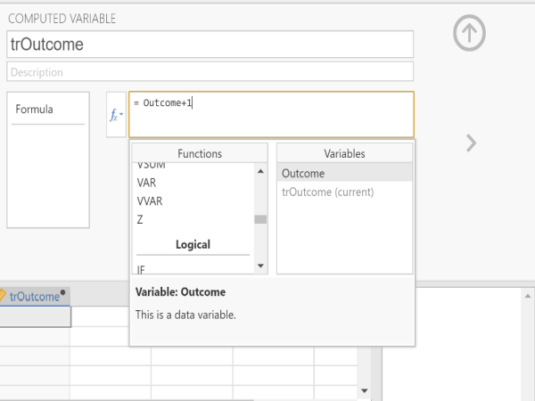</kbd>

### Viewing the Transformed Scores

9. Note that transformed variables are not included in the output. Rather, they are saved as new variables in the data view window. 

10.	These variables can be used in subsequent analyses. You can follow the previous tutorials to get descriptive statistics for these variables.

<kbd></kbd>

### Obtaining Standardized Scores

11.	In addition, you can obtain standardized scores. First, enter the data (described elsewhere).

12.	After the data are entered, click on the column representing the data you wish to transform.

13.	Select the “Compute” option from the menu. This will bring up a new set of options.

<kbd></kbd>

### Computing Standardized Scores

14.	Type in the new you wish to give the new variable (here it is “zOutcome).

15.	Click on the “fx” button to obtain the dropdown menu.  On the left side under functions, click on “z” to place it in the formula editor.

16.	Click on the variable you wish to transform (“Outcome”). This will place it in the formula editor. 

17.	Hit “Enter” on your keyboard to perform the data transformation.

18.	To hide the setup menu, click on the large UP arrow button to the right of the variable name.

<kbd>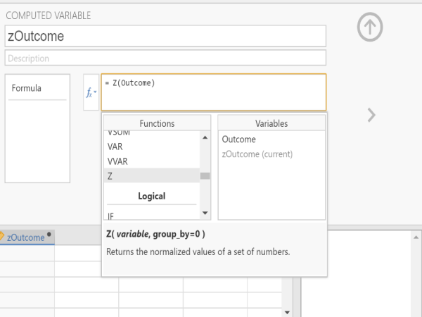</kbd>

### Viewing the Standardized Scores

19.	Note that transformed variables are not included in the output. Rather, they are saved as new variables in the data view window. 

20.	These variables can be used in subsequent analyses. You can follow the previous tutorials to get descriptive statistics for these variables.

<kbd></kbd>

## T Test (Confidence Intervals) 

### Obtaining One Sample Inferential Statistics

1. First, enter the data (described elsewhere). 

2. On the “Analysis” tab, select the “T-Tests -> One Sample T-Test” option. 

<kbd></kbd>

### Choosing the Variable

3. A set of options will then appear for you to choose the variables and statistics of interest.

4. Select the variable you wish to analyze by clicking on it in the left-hand box and then the arrow to move it into the right-hand box. 

5. Output will automatically appear on the right side of the window. Output can be copied and pasted into other documents for printing.

<kbd></kbd>

### Obtaining the Statistics

6. To get the confidence interval for the mean, make sure the “Test Value” is set to zero.

7. Check the “Confidence Interval” box (and alter the width of the interval if desired). 

8. Similarly, select other options that are important for you: “Descriptives” will offer a mean and standard deviation for the variable; and “Descriptives plots” will provide a graph of the confidence interval.

9. Updated output will automatically appear on the right side of the window. Output can be copied and pasted into other software for printing.

<kbd>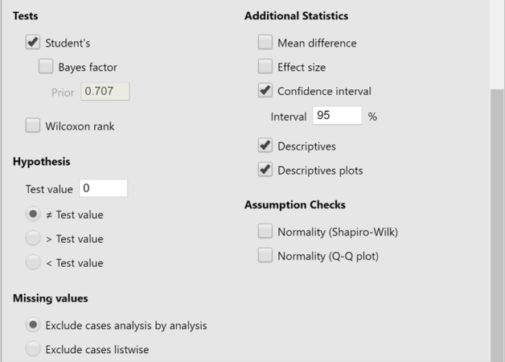</kbd>

## T Test (One Sample) 

### Obtaining One Sample Inferential Statistics

1. First, enter the data (described elsewhere). 

2. On the "Analysis" tab, select the "T-Tests → One Sample T-Test" option. 

<kbd></kbd>

### Obtaining Significance Tests

3. A set of options will then appear for you to choose the variables and statistics of interest.

4. Select the variable you wish to analyze by clicking on it in the lefthand box and then the arrow to move it into the righthand box. 

5. Output will automatically appear on the right side of the window. Output can be copied and pasted into other software for printing.

<kbd>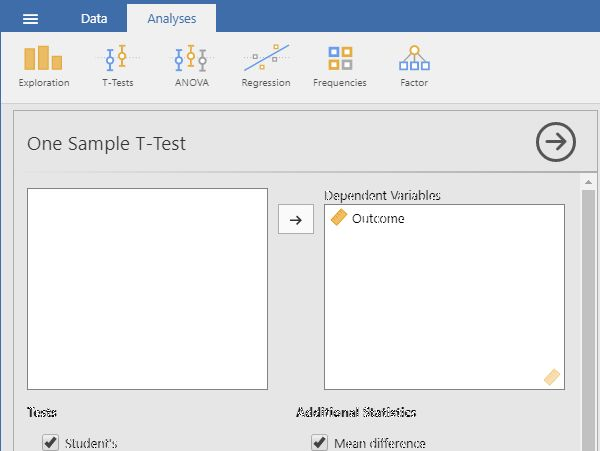</kbd>

### Obtaining Additional Statistics

6. Be sure to enter a known or hypothesized mean into the "Test Value" field. If you do not enter a value here, jamovi will automatically use zero as the comparison mean.

7. If you wish to view (and alter) the width of the confidence interval, check the "Confidence Interval" box. 

8. Similarly, select other options that are important for you: "Mean Difference" will display the size of the difference between the two means; "Effect size" will display Cohen's d; and "Descriptives" will offer a mean and standard deviation for the group. 

9. Updated output will automatically appear on the right side of the window. Output can be copied and pasted into other software for printing.

<kbd></kbd>

## T Test (Paired Samples) 

### Obtaining Paired Sample Inferential Statistics

1. First, enter paired samples or repeated measures data (described elsewhere). 

2. On the "Analysis" tab, Select the "T-Tests → Paired Samples T-Test" option.

<kbd>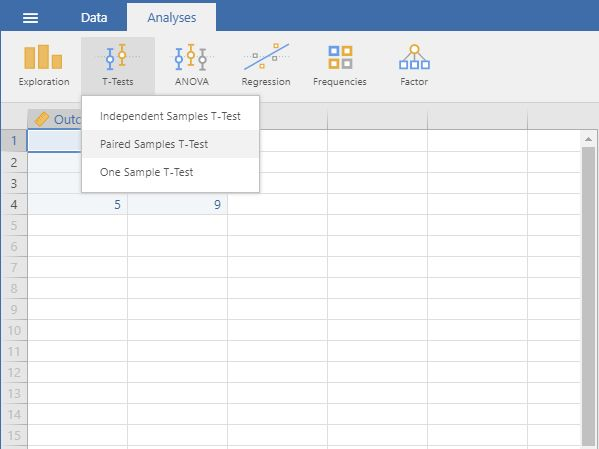</kbd>

### Obtaining the Significance Test

3. A set of options will then appear for you to choose the variables and statistics of interest.

4. Select the variables you wish to analyze by clicking on both of them while holding down the "CTRL" key. Then click on the arrow to move the pair of variables to the righthand box.

5. Output will automatically appear on the right side of the window. Output can be copied and pasted into other software for printing.

<kbd>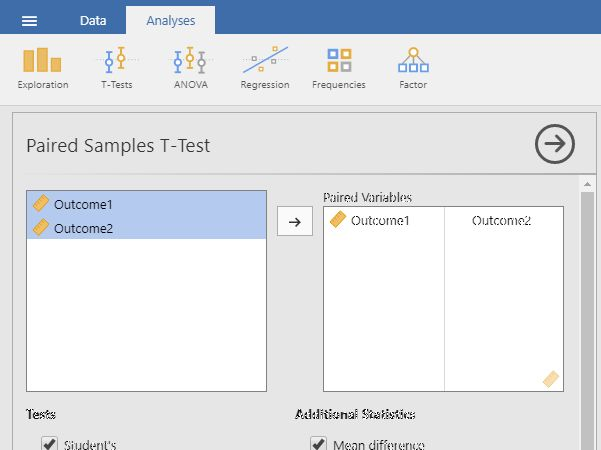</kbd>

### Obtaining Additional Statistics 

6. If you wish to view (and alter) the width of the confidence interval, check the "Confidence Interval" box. 

7. Similarly, select other options that are important for you: "Mean Difference" will display the size of the difference between the two means; "Effect size" will display Cohen's d; and "Descriptives" will offer means and standard deviations for each variable.

8. Updated output will automatically appear on the right side of the window. Output can be copied and pasted into other software for printing.

<kbd>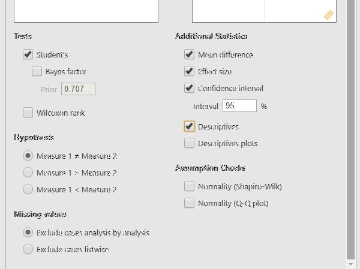</kbd>

## T Test (Independent Samples) 

### Obtaining Two Sample Inferential Statistics

1. First, enter two sample data (described elsewhere). 

2. On the "Analysis" tab, select the "T-Tests → Independent Samples T-Test" option.

<kbd></kbd>

### Obtaining the Significance Test

3. A set of options will then appear for you to choose the variables and statistics of interest.

4. Select the outcome variable and click the arrow to move it into the "Dependent Variables" box.

5. Move the Independent Variable to the "Grouping Variable" box. 

6. Output will automatically appear on the right side of the window. Output can be copied and pasted into other software for printing.

<kbd>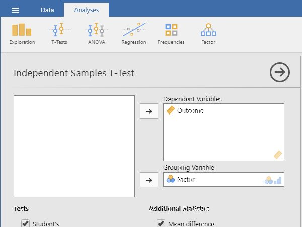</kbd>

### Obtaining Additional Statistics

7. If you wish to view (and alter) the width of the confidence interval, check the "Confidence Interval" box. 

8. Similarly, select other options that are important for you: "Mean Difference" will display the size of the difference between the two group's means; "Effect size" will display Cohen's d; and "Descriptives" will offer means and standard deviations for each group. 

9. Updated output will automatically appear on the right side of the window. Output can be copied and pasted into other software for printing.

<kbd>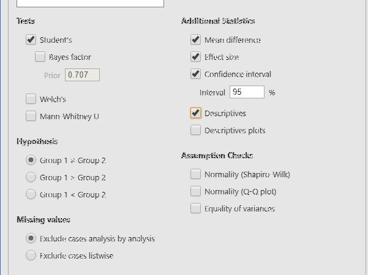</kbd>

## ANOVA (OneWay ANOVA)

### Obtaining Multiple Sample Inferential Statistics

1. First, enter multiple group data (described elsewhere).

2. On the "Analysis" tab, select the "ANOVA → ANOVA" option.

<kbd>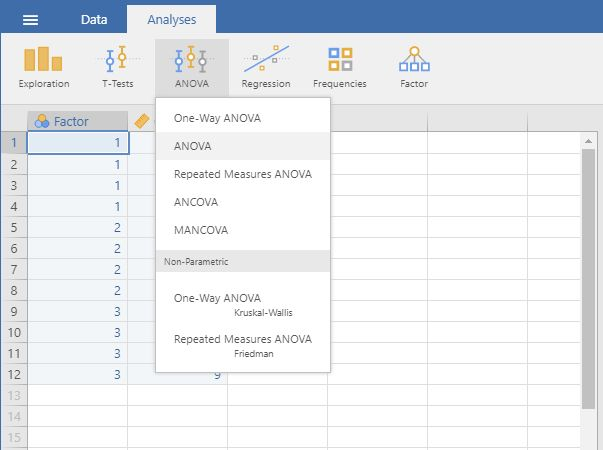</kbd>

### Obtaining the Significance Test

3. A set of options will then appear for you to choose the variables and statistics of interest.

4. Select the outcome variable and click the arrow to move it into the "Dependent Variable" box. 

5. Move the Factor (Independent Variable) to the "Fixed Factors" box.

6. Output will automatically appear on the right side of the window. Output can be copied and pasted into other software for printing.

<kbd></kbd>

### Obtaining Additional Statistics

7. Choose an effect size measure from the "Effect Size" list.

8. If you wish descriptive statistics for each group, use the "Descriptives" command described earlier in the sourcebook.

9. Updated output will automatically appear on the right side of the window. Output can be copied and pasted into other software for printing.

<kbd></kbd>

## Post Hoc Comparisons (OneWay ANOVA) 

### Obtaining Multiple Sample Inferential  Statistics

1. First, enter multiple group data (described elsewhere).

2. On the "Analysis" tab, select the "ANOVA → ANOVA" option.

<kbd></kbd>

### Obtaining the Significance Test

3. A set of options will then appear for you to choose the variables and statistics of interest.

4. Select the outcome variable and click the arrow to move it into the "Dependent Variable" box. 

5. Move the Factor (Independent Variable) to the "Fixed Factors" box.

6. Output will automatically appear on the right side of the window. Output can be copied and pasted into other software for printing.

<kbd></kbd>

 ### Obtaining Post Hoc Tests

7. If you wish to obtain post hoc tests for the purpose of making comparisons between groups, click the "Post Hoc Tests" dropdown button. 

8. Move the factor (Independent Variable) name from the lefthand box to the righthand box.

9. Select "Tukey" to get Tukey HSD post hoc tests (or  whatever option you prefer). 

10. Updated output will automatically appear on the right side of the window. Output can be copied and pasted into other software for printing.

<kbd></kbd>

## Repeated Measures ANOVA

### Obtaining Repeated Measures Inferential Statistics

1. First, enter repeated measures data (described elsewhere).

2. On the "Analysis" tab, select the "ANOVA → Repeated Measures ANOVA" option.

<kbd>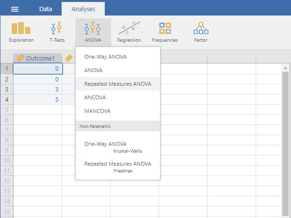</kbd>

### Labeling the Within Subjects Variable/Factor

3. A set of options will then appear for you to choose the variables and statistics of interest.

4. In the "Repeated Measures Factors" box, you will define the repeated measures factor. This box is necessary for labeling the repeated measurements of the same underlying factor.

5. Click on "RM Factor 1" and type in the name you wish to give to the repeated measures factor. In this example, "Factor" is used as the name.

6. Below that, click on "Level 1" to type the name of the individual level of the repeated measures factor. You may do the same for each level. In this example, there were only 2 levels of the factor.

<kbd>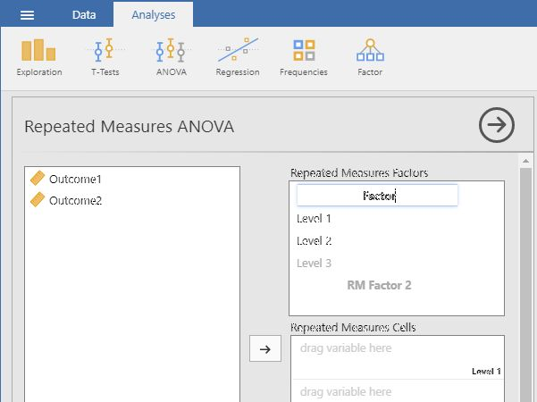</kbd>

### Obtaining the Significance Test

7. In the "Repeated Measures Cells" box, you will indicate which measurements/columns in the data set reflect the instances of the repeated measurements.

8. Select the instances you wish to associate with the factor by clicking on them and then arrow to move them. In this example, "Outcome1" reflects the first level of the factor and "Outcome2" reflects the second level of the factor.

9. Note that this factor only exists in the computer's memory. For examples, nowhere in the data set will you see a variable called "Time."

10. Output will automatically appear on the right side of the window. Output can be copied and pasted into other software for printing.

<kbd></kbd>

### Obtaining Additional Statistics

11. Choose an effect size measure from the "Effect Size" list.

12. If you wish descriptive statistics associated with each variable, follow the "Descriptives" procedures described earlier in this sourcebook.

13. Updated output will automatically appear on the right side of the window. Output can be copied and pasted into other software for printing.

<kbd></kbd>

## ANOVA (Factorial ANOVA)

### Obtaining Factorial Inferential Statistics

1. First, enter factorial data (described elsewhere). 

2. On the "Analysis" tab, select the "ANOVA → ANOVA" option.

<kbd></kbd>

### Obtaining the Significance Test 

3. A set of options will then appear for you to choose the variables and statistics of interest.

4. Select the outcome variable and click the arrow to move it into the "Dependent Variable" box. 

5. Move the multiple Factors (Independent Variables) to the "Fixed Factors" box. (The interaction term will be automatically generated in the output.)

6. Output will automatically appear on the right side of the window. Output can be copied and pasted into other software for printing.

<kbd></kbd>

### Obtaining Additional Statistics

7. Choose an effect size measure from the "Effect Size" list.

8. If you wish descriptive statistics associated with each variable, follow the "Descriptives" procedures described earlier in this sourcebook.

9. Updated output will automatically appear on the right side of the window. Output can be copied and pasted into other software for printing.

<kbd>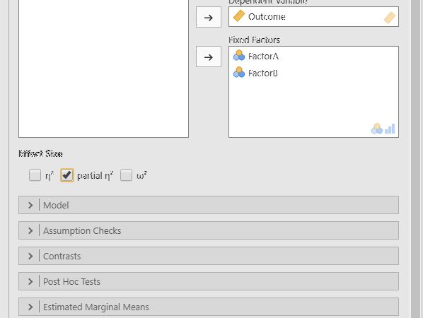</kbd>

