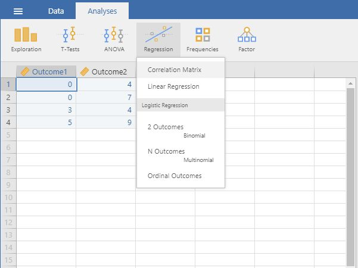
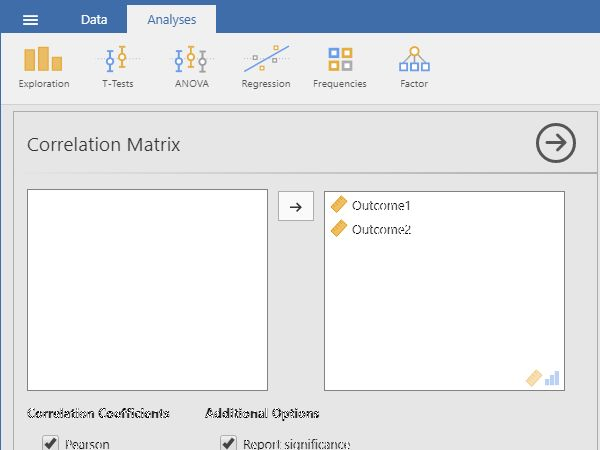

# jamovi Articles

## Data Analysis | Correlations

### Selecting the Analysis 

1. First, enter data involving multiple variables (described elsewhere). 

2. On the "Analyses" tab, select the "Regression -> Correlation Matrix" option.

<kbd></kbd>

### Obtaining Inferential Statistics

3. A set of options will then appear for you to choose the variables and statistics of interest.

4. Select the variables you wish to analyze by clicking on them in the lefthand box and then the arrow to move them into the righthand box.

5. Output (with no descriptive statistics) will automatically appear on the right side of the window. Output can be copied and pasted into other software for printing.

6. If you wish descriptive statistics associated with each variable, follow the "Descriptives" procedures described earlier in this manual.

<kbd></kbd>

