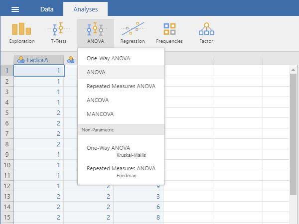
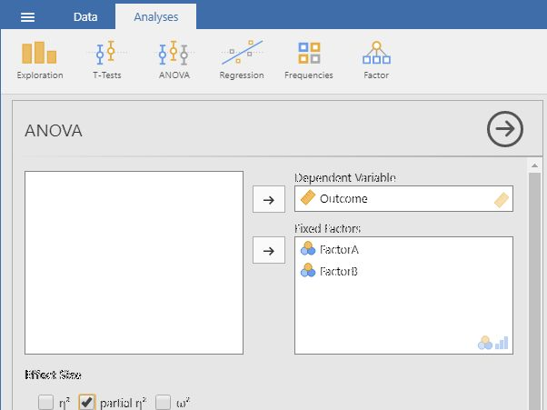
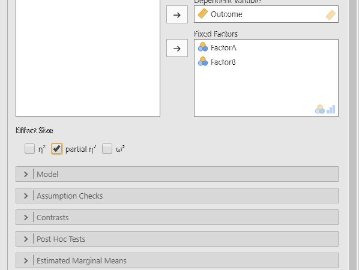

# [jamovi Articles](../index.md)

## Data Analysis | Factorial ANOVA

### Selecting the Analysis

1. First, enter factorial data (described elsewhere). 

2. On the "Analysis" tab, select the "ANOVA → ANOVA" option.

{: .screenshot}

### Obtaining the Significance Test 

3. A set of options will then appear for you to choose the variables and statistics of interest.

4. Select the outcome variable and click the arrow to move it into the "Dependent Variable" box. 

5. Move the multiple Factors (Independent Variables) to the "Fixed Factors" box. (The interaction term will be automatically generated in the output.)

6. Output will automatically appear on the right side of the window. 

{: .screenshot}

### Obtaining Additional Statistics

7. Choose an effect size measure from the "Effect Size" list.

8. If you wish descriptive statistics associated with each variable, follow the "Descriptives" procedures described earlier in this sourcebook.

9. Updated output will automatically appear on the right side of the window. 

{: .screenshot}

