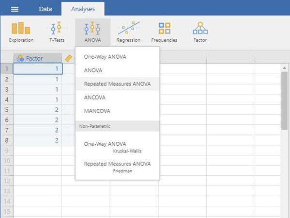
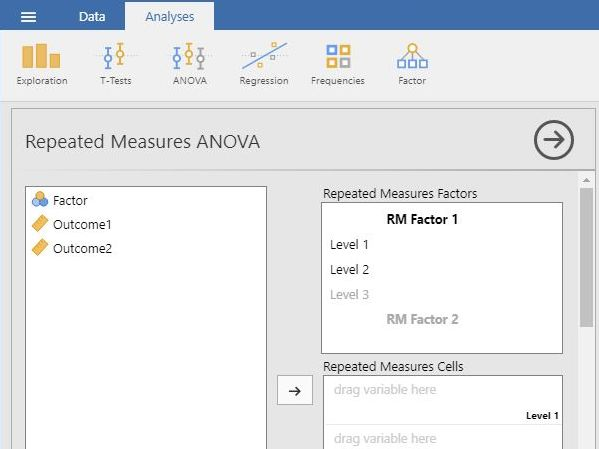
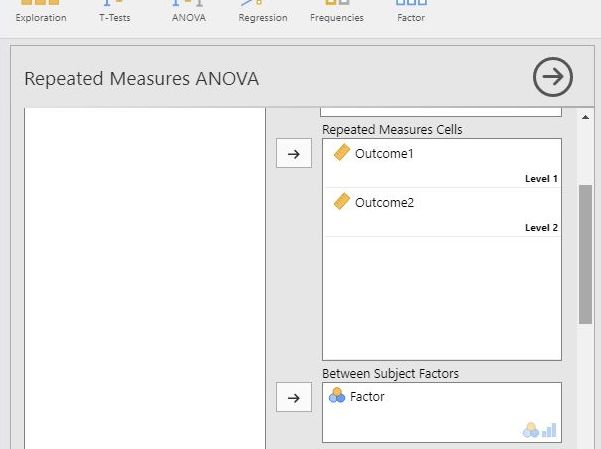
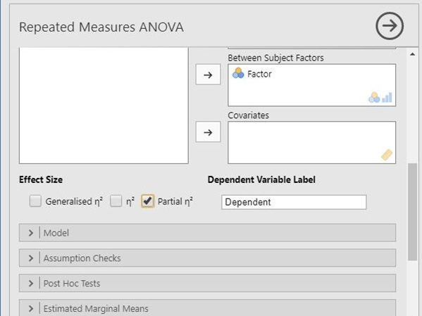

# [jamovi Articles](../index.md)

## Data Analysis | Mixed ANOVA

### Selecting the Analysis

1.	First, enter mixed design data (described elsewhere). 

2.	On the “Analysis” tab, select the “ANOVA  Repeated Measures ANOVA” option.

{: .screenshot}

### Labeling the Within-Subjects Variable/Factor 

3.	A set of options will then appear for you to choose the variables and statistics of interest.

4.	In the “Repeated Measures Factors” box, you will define the repeated measures factor. This box is necessary for labeling the repeated measurements of the same underlying factor.

5.	Click on “RM Factor 1” and type in the name you wish to give to the repeated measures factor. In this example, default is used as the name. 

6.	Below that, click on “Level 1” to type the name of the individual level of the repeated measures factor. You may do the same for each level. In this example, there were only 2 levels of the factor.

{: .screenshot}

### Obtaining Inferential Statistics

7.	In the “Repeated Measures Cells” box, you will indicate which measurements/columns in the data set reflect the instances of the repeated measurements.

8.	Select the instances you wish to associate with the factor by clicking on them and then arrow to move them. In this example, “Outcome1” reflects the first level of the factor and “Outcome23” reflects the second level of the factor.

9.	Click on the between-subjects variable on the left-hand side and then the arrow to move it into the “Between Subjects Factors” box on the right-hand side box.

10.	Output will automatically appear on the right side of the window. Output can be copied and pasted into other documents for printing.

{: .screenshot}

### Obtaining Additional Statistics

11.	Choose an effect size measure from the “Effect Size” list.

12.	Updated output will automatically appear on the right side of the window. Output can be copied and pasted into other documents for printing.

13.	If you wish descriptive statistics associated with each variable and each group, follow the “Descriptives” procedures described earlier in this sourcebook.

{: .screenshot}

