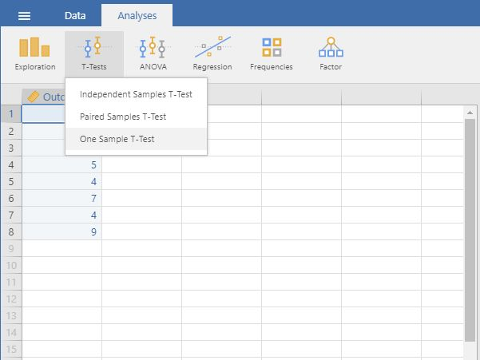
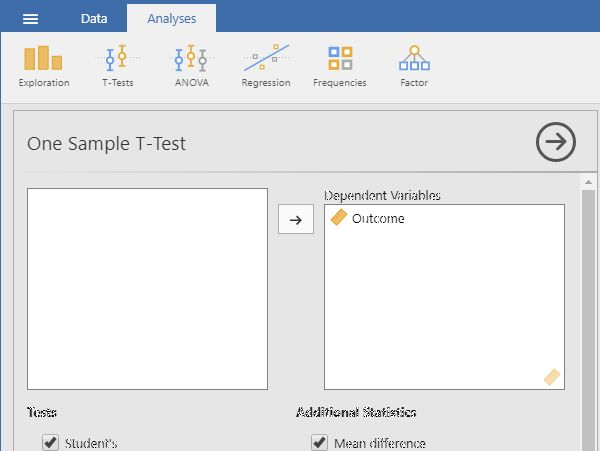
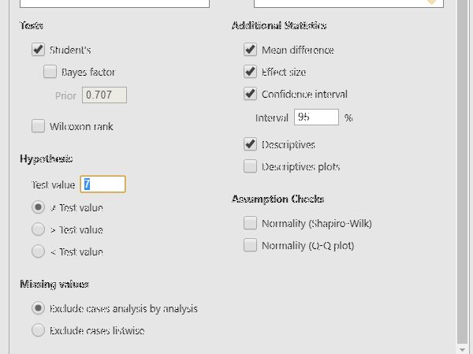

# jamovi | Data Analysis

## T Test (One Sample) 

### Obtaining One Sample Inferential Statistics

1. First, enter the data (described elsewhere). 

2. On the "Analysis" tab, select the "T-Tests → One Sample T-Test" option. 

<kbd></kbd>

### Obtaining Significance Tests

3. A set of options will then appear for you to choose the variables and statistics of interest.

4. Select the variable you wish to analyze by clicking on it in the lefthand box and then the arrow to move it into the righthand box. 

5. Output will automatically appear on the right side of the window. Output can be copied and pasted into other software for printing.

<kbd></kbd>

### Obtaining Additional Statistics

6. Be sure to enter a known or hypothesized mean into the "Test Value" field. If you do not enter a value here, jamovi will automatically use zero as the comparison mean.

7. If you wish to view (and alter) the width of the confidence interval, check the "Confidence Interval" box. 

8. Similarly, select other options that are important for you: "Mean Difference" will display the size of the difference between the two means; "Effect size" will display Cohen's d; and "Descriptives" will offer a mean and standard deviation for the group. 

9. Updated output will automatically appear on the right side of the window. Output can be copied and pasted into other software for printing.

<kbd></kbd>

