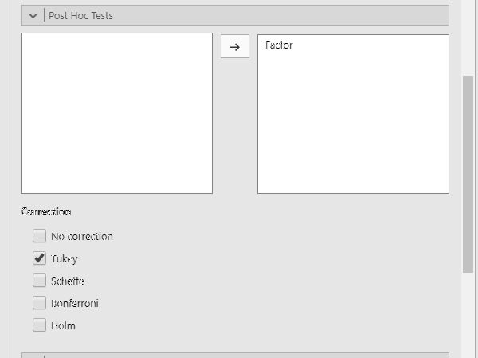

# [jamovi Articles](../index.md)

## Data Analysis | Post Hoc Comparisons

### Selecting the Analysis

1. First, enter multiple group data (described elsewhere).

2. On the "Analysis" tab, select the "ANOVA → ANOVA" option.

<kbd></kbd>

### Obtaining Inferential Statistics

3. A set of options will then appear for you to choose the variables and statistics of interest.

4. Select the outcome variable and click the arrow to move it into the "Dependent Variable" box. 

5. Move the Factor (Independent Variable) to the "Fixed Factors" box.

6. Output will automatically appear on the right side of the window. 

<kbd></kbd>

### Obtaining Additional Statistics

7. Choose an effect size measure from the "Effect Size" list.

8. If you wish descriptive statistics for each group, use the "Descriptives" command described earlier in the sourcebook.

9. Updated output will automatically appear on the right side of the window. 

<kbd></kbd>

### Obtaining Post Hoc Tests

10. If you wish to obtain post hoc tests for the purpose of making comparisons between groups, click the "Post Hoc Tests" dropdown button. 

11. Move the factor (Independent Variable) name from the lefthand box to the righthand box.

12. Select "Tukey" to get Tukey HSD post hoc tests (or  whatever option you prefer). 

13. Updated output will automatically appear on the right side of the window. 

<kbd></kbd>

