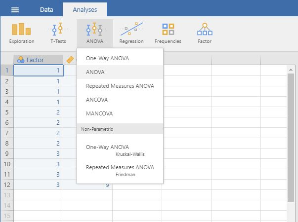
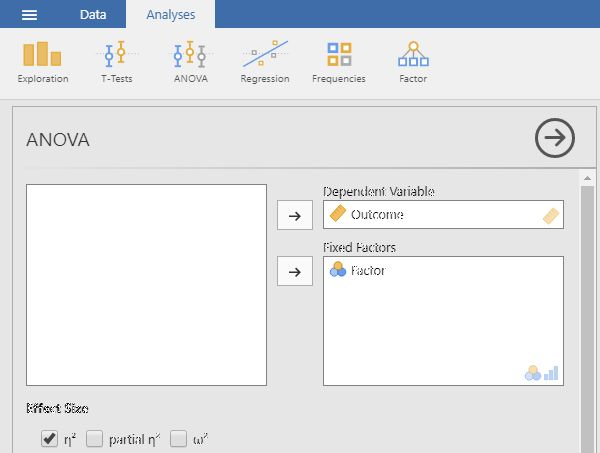

## jamovi: Data Analysis

### Post Hoc Tests (OneWay ANOVA) 

#### Obtaining Multiple Sample Inferential  Statistics

1. First, enter multiple group data (described elsewhere).

2. On the "Analysis" tab, select the "ANOVA → ANOVA" option.

<kbd></kbd>

#### Obtaining the Significance Test

3. A set of options will then appear for you to choose the variables and statistics of interest.

4. Select the outcome variable and click the arrow to move it into the "Dependent Variable" box. 

5. Move the Factor (Independent Variable) to the "Fixed Factors" box.

6. Output will automatically appear on the right side of the window. Output can be copied and pasted into other software for printing.

<kbd></kbd>

 #### Obtaining Post Hoc Tests

7. If you wish to obtain post hoc tests for the purpose of making comparisons between groups, click the "Post Hoc Tests" dropdown button. 

8. Move the factor (Independent Variable) name from the lefthand box to the righthand box.

9. Select "Tukey" to get Tukey HSD post hoc tests (or  whatever option you prefer). 

10. Updated output will automatically appear on the right side of the window. Output can be copied and pasted into other software for printing.

<kbd></kbd>

