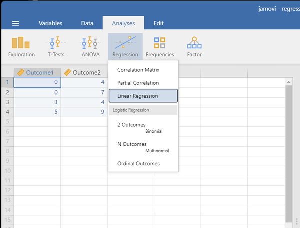
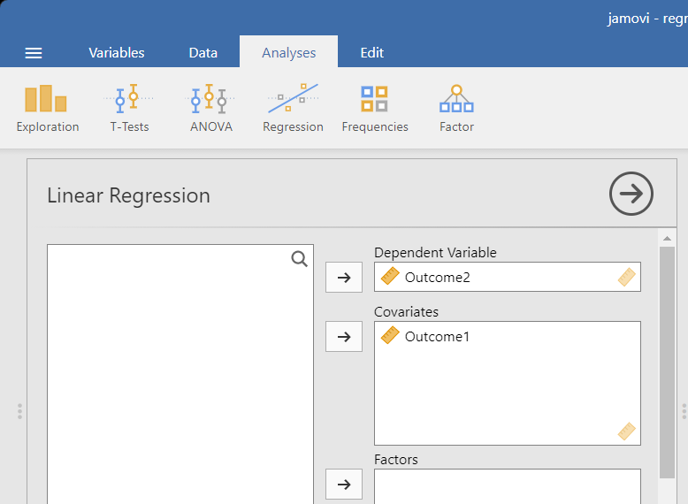
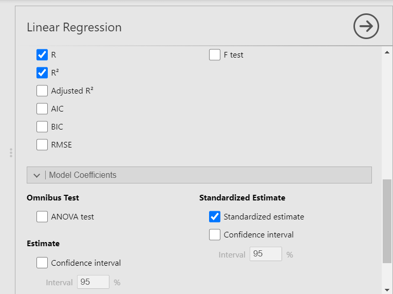

# [jamovi Articles](../index.md)

## Data Analysis | Regression

### Selecting the Analysis 

1.	First, enter data involving multiple variables (described elsewhere). 

2.	On the “Analyses” tab, select the “Regression -> Linear Regression” option.

{: .screenshot}

### Obtaining Inferential Statistics

3. A set of options will then appear for you to choose the variables and statistics of interest.

4. Select the variables you wish to analyze by clicking on them in the left-hand box and then the arrow to move them into the right-hand boxes. Your Predictor (here “Outcome1”) should go under “Covariates” and your Outcome (here “Outcome2”) should go in as the “Dependent Variable”. 

5. Output (with no descriptive statistics) will automatically appear on the right side of the window. 

{: .screenshot}

### Obtaining Additional Statistics

6. Scroll down to the section on “Model Fit” and check both “R” and “R2”.

7. In the section on “Model Coefficients”, check “Standardized Estimate”.

8. Updated output will automatically appear on the right side of the window.

9. If you wish descriptive statistics associated with each variable, follow the “Descriptives” procedures described earlier in this manual.

{: .screenshot}
