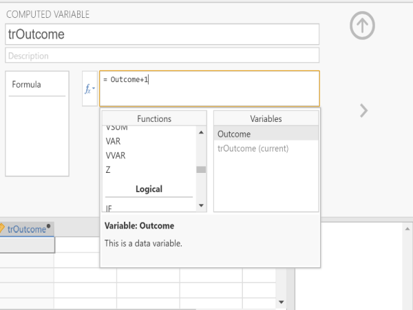
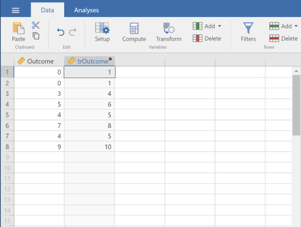
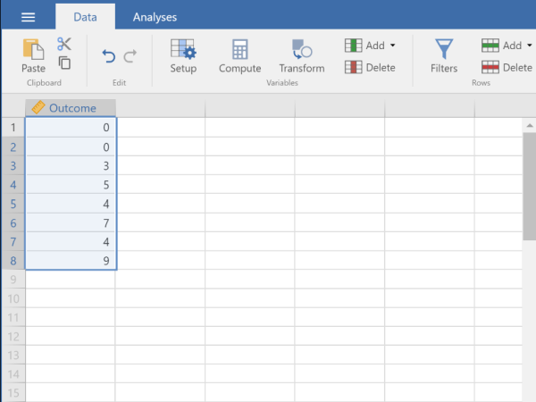
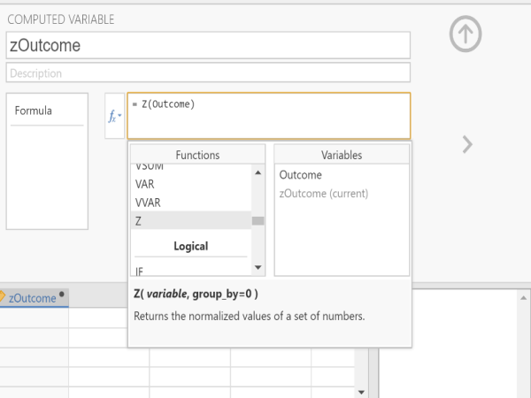
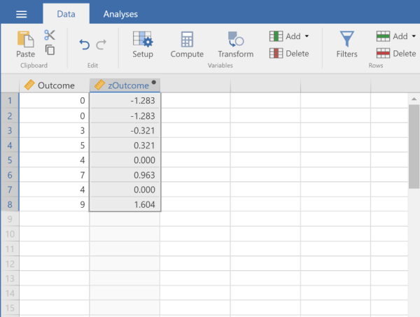

# [jamovi Articles](../index.md)

## Data Analysis | Transformations and Standardized Scores

### Selecting the Analysis

1. First, enter the data (described elsewhere).

2. After the data are entered, click on the column representing the data you wish to transform.

3. Select the “Compute” option from the menu. This will bring up a new set of options.

<kbd></kbd>

### Computing Transformations

4. Type in the new you wish to give the new variable (here it is “trOutcome).

5. Click on the “fx” button to obtain the dropdown menu.  

6. Click on the variable you wish to transform (“Outcome”). This will place it in the formula editor. Then add, subtract, multiply, or divide as needed to get the transformation you want.

7. Hit “Enter” on your keyboard to perform the data transformation.

8. To hide the setup menu, click on the large UP arrow button to the right of the variable name.

<kbd></kbd>

### Viewing Transformed Scores

9. Note that transformed variables are not included in the output. Rather, they are saved as new variables in the data view window. 

10.	These variables can be used in subsequent analyses. You can follow the previous tutorials to get descriptive statistics for these variables.

<kbd></kbd>

### Obtaining Standardized Scores

11.	In addition, you can obtain standardized scores. First, enter the data (described elsewhere).

12.	After the data are entered, click on the column representing the data you wish to transform.

13.	Select the “Compute” option from the menu. This will bring up a new set of options.

<kbd></kbd>

### Computing Standardized Scores

14.	Type in the new you wish to give the new variable (here it is “zOutcome).

15.	Click on the “fx” button to obtain the dropdown menu.  On the left side under functions, click on “z” to place it in the formula editor.

16.	Click on the variable you wish to transform (“Outcome”). This will place it in the formula editor. 

17.	Hit “Enter” on your keyboard to perform the data transformation.

18.	To hide the setup menu, click on the large UP arrow button to the right of the variable name.

<kbd></kbd>

### Viewing Standardized Scores

19.	Note that the standardized variables are not included in the output. Rather, they are saved as new variables in the data view window. 

20.	These variables can be used in subsequent analyses. You can follow the previous tutorials to get descriptive statistics for these variables.

<kbd></kbd>

