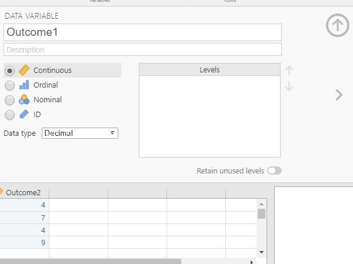
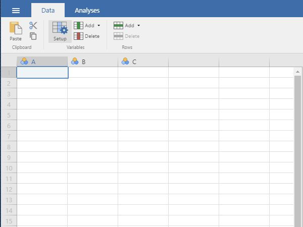
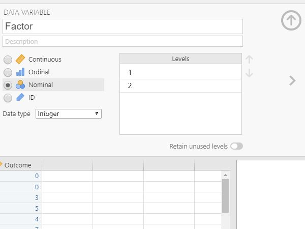

# jamovi | Data Entry

## One Sample Data

### Defining Variables

1. First, click on the "Data" tab on the top of the window. Generally speaking, this is where you will enter the data for all of the variables in the data set. 

2. Click on a cell in the column (i.e., variable) that you wish to define. Click on "Setup" from the menu. This will bring up a new set of options.

<kbd></kbd>

### Setting Variable Properties

3. Type in the name of the variable in the top box (previously labeled "A").

4. Define the level of measurement for the variables by choosing the appropriate option. In this example, "Outcome" (an outcome variable) is continuous.

5. To hide the setup menu, click on the large UP arrow button to the right of the variable name.

<kbd></kbd>

### Entering Data

6. Enter the data in the individual cells of the column for the variable. Note that each cell should contain a single score for an individual person. There will be as many rows as people. 

<kbd></kbd>

## Repeated Measures Data

### Defining Variables 

1. First, click on the "Data" tab on the top of the window. Generally speaking, this is where you will enter the data for all of the variables in the data set. 

2. Click on a cell in the column (i.e., variable) that you wish to define. Click on "Setup" from the menu. This will bring up a new set of options. 

<kbd></kbd>

### Setting Variable Properties

3. Type in the name of the variable in the top box (previously labeled "A").

4. Define the level of measurement for the variables by choosing the appropriate option. In this example, "Outcome1" (an instance of the outcome variable) is continuous. 

5. To hide the setup menu, click on the large UP arrow button to the right of the variable name. 

<kbd></kbd>

### Entering Data

6. Enter the data in the individual cells of the column for the variable. Note that each cell should contain a single score for an individual person. There will be as many rows as people.

7. Notice that each individual (i.e., the rows) have values for each instance of the within-subjects variable (i.e., the columns). 

<kbd></kbd>

## Multiple Sample Data 

### Defining Variables

1. First, click on the "Data" tab on the top of the window. Generally speaking, this is where you will enter the data for all of the variables in the data set. 

2. Click on a cell in the column (i.e., variable) that you wish to define. Click on "Setup" from the menu. This will bring up a new set of options. 

<kbd></kbd>

### Setting Variable Properties

3. You will need to define multiple variables. One variable will represent the Factor (Independent Variable) and the other will represent the Outcome (Dependent) Variable.

4. Provide a name and define the level of measurement for the variables by choosing the appropriate options. In this example, "Factor" (Independent Variable) is nominal. The "Outcome" (Dependent) variable is continuous.

5. To hide the setup menu, click on the large UP arrow button next to the variable name.

<kbd></kbd>

### Entering Data

6. Enter the data for all of the participants. Notice that each participant has scores on both the Factor and Outcome Variables. There will be as many rows as people.

7. On the categorical "Factor", you will use numbers to represent the two categories (or "levels") of the variable.

8. If your data set has more than two groups, simply be sure to add a group indicator (a value on the "Factor" variable) and a "Outcome" for each additional person. 

<kbd></kbd>

## Factorial Data 

### Defining Variables

1. First, click on the "Data" tab on the top of the window. Generally speaking, this is where you will enter the data for all of the variables in the data set. 

2. Click on a cell in the column (i.e., variable) that you wish to define. Click on "Setup" from the menu. This will bring up a new set of options. 

<kbd></kbd>

### Setting Variable Properties

3. You will need to define multiple variables. Two variables will represent the Factors (Independent Variables) and the other will represent the Outcome (Dependent) Variable.

4. Provide a name and define the level of measurement for the variables by choosing the appropriate options. In this example, "FactorA" and "FactorB" nominal. The "Outcome" (Dependent) variable is continuous.

5. To hide the setup menu, click on the large UP arrow button next to the variable name.

<kbd></kbd>

### Entering Data
 
6. Enter the data for all of the participants. Notice that each participant has scores on both of the Factors and on the Outcome Variable. There will be as many rows as people. 

7. On the categorical Factors, use the values that you indicated when defining the variables earlier. Note that the combination of values in the Factors will define the multiple groups of the factorial design.

8. If your data set has more than two levels for either (or both) of the Factors, simply be sure to add an indicator and an outcome value for each additional person.

<kbd></kbd>

