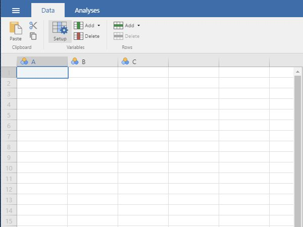
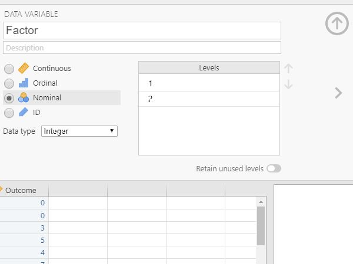

## jamovi: Data Entry

### Multiple Sample Data 

#### Defining Variables

1. First, click on the "Data" tab on the top of the window. Generally speaking, this is where you will enter the data for all of the variables in the data set. 

2. Click on a cell in the column (i.e., variable) that you wish to define. Click on "Setup" from the menu. This will bring up a new set of options. 

<kbd></kbd>

#### Setting Variable Properties

3. You will need to define multiple variables. One variable will represent the Factor (Independent Variable) and the other will represent the Outcome (Dependent) Variable.

4. Provide a name and define
the level of measurement for 
the variables by choosing
the appropriate options. In
this example, "Factor" 
(Independent Variable) is
nominal. The "Outcome" 
(Dependent) variable is
continuous.

5. To hide the setup menu,
click on the large UP arrow
button next to the variable
name.

<kbd></kbd>

#### Entering Data

6. Enter the data for all of
the participants. Notice 
that each participant has
scores on both the Factor
and Outcome Variables. There 
will be as many rows as
people.

7. On the categorical "Factor", 
you will use numbers to
represent the two categories 
(or "levels") of the 
variable.

8. If your data set has more
than two groups, simply be 
sure to add a group
indicator (a value on the
"Factor" variable) and a 
"Outcome" for each 
additional person. 

<kbd></kbd>

