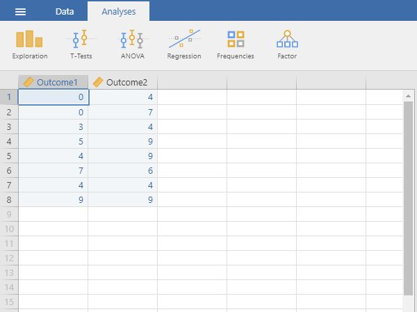

# [jamovi Articles](../index.md)

## Data Entry | Paired and Repeated Measures Data

### Defining Variables 

1. First, click on the "Data" tab on the top of the window. Generally speaking, this is where you will enter the data for all of the variables in the data set. 

2. Click on a cell in the column (i.e., variable) that you wish to define. Click on "Setup" from the menu. This will bring up a new set of options. 

{: .image}

### Setting Variable Properties

3. Type in the name of the variable in the top box (previously labeled "A").

4. Define the level of measurement for the variables by choosing the appropriate option. In this example, "Outcome1" (an instance of the outcome variable) is continuous. 

5. To hide the setup menu, click on the large UP arrow button to the right of the variable name. 

{: .image}

### Entering Data

6. Enter the data in the individual cells of the column for the variable. Note that each cell should contain a single score for an individual person. There will be as many rows as people.

7. Notice that each individual (i.e., the rows) have values for each instance of the within-subjects variable (i.e., the columns). 

{: .image}

