## jamovi: Using the Software

This chapter provides step-by-step instructions on how to obtain basic statistical output using jamovi, both visually with screenshots and via written instructions. Simple examples for most undergraduate level between-subjects and within-subjects research designs are provided.

- [Entering One Sample Data](#entering-one-sample-data)  
- [Entering Repeated Measures Data](#entering-repeated-measures-data)
- [Entering Multiple Sample Data](#entering-multiple-sample-data)
- [Entering Factorial Data](#entering-factorial-data)
- [Descriptives (Frequencies and Descriptives)](#descriptives-frequencies-and-descriptives)
- [Compute (Transformations and Standardized Scores)](#compute-transformations-and-standardized-scores)
- [Correlations (Bivariate)](#correlations-bivariate)
- [T Test (Confidence Intervals)](#t-test-confidence-intervals)
- [T Test (One Sample)](#t-test-one-sample)
- [T Test (Paired Samples)](#t-test-paired-samples)
- [T Test (Independent Samples)](#t-test-independent-samples)
- [ANOVA (OneWay ANOVA)](#anova-oneway-anova)
- [Post Hoc Tests (OneWay ANOVA)](#post-hoc-tests-oneway-anova)
- [Repeated Measures ANOVA](#repeated-measures-anova)
- [ANOVA (Factorial ANOVA)](#anova-factorial-anova)

---

### Entering One Sample Data

#### Steps for Defining Variables

1. First, click on the "Data" tab on the top of the window. Generally speaking, this is where you will enter the data for all of the variables in the data set. 

2. Click on a cell in the column (i.e., variable) that you wish to define. Click on "Setup" from the menu. This will bring up a new set of options.

<kbd></kbd>

#### Steps for Setting Variable Properties

3. Type in the name of the variable in the top box (previously labeled "A").

4. Define the level of measurement for the variables by choosing the appropriate option. In this example, "Outcome" (an outcome variable) is continuous.

5. To hide the setup menu, click on the large UP arrow button to the right of the variable name.

<kbd>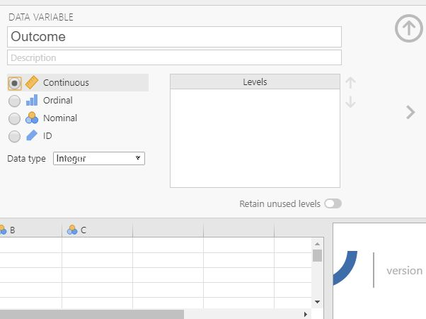</kbd>

#### Steps for Entering Data

6. Enter the data in the individual cells of the column for the variable. Note that each cell should contain a single score for an individual person. There will be as many rows as people. 

<kbd>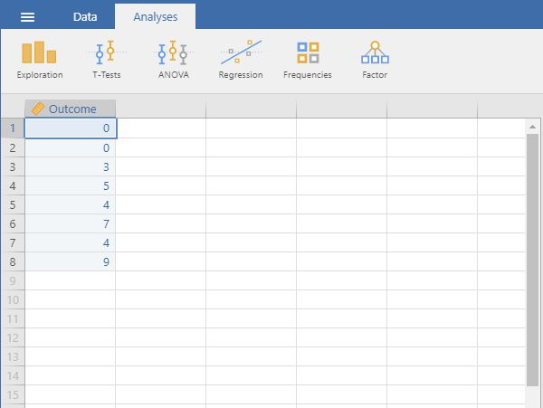</kbd>

---

### Entering Repeated Measures Data

#### Steps for Defining Variables 

1. First, click on the "Data" tab on the top of the window. Generally speaking, this is where you will enter the data for all of the variables in the data set. 

2. Click on a cell in the column (i.e., variable) that you wish to define. Click on "Setup" from the menu. This will bring up a new set of options. 

<kbd></kbd>

#### Steps for Setting Variable Properties

3. Type in the name of the variable in the top box (previously labeled "A").

4. Define the level of measurement for the variables by choosing the appropriate option. In this example, "Outcome1" (an instance of the outcome variable) is continuous. 

5. To hide the setup menu, click on the large UP arrow button to the right of the variable name. 

<kbd>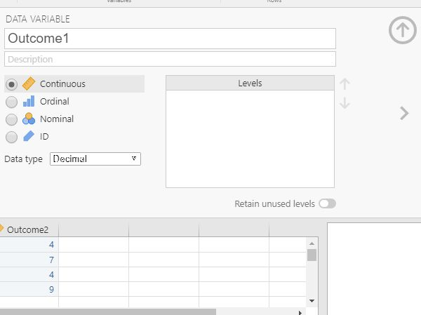</kbd>

#### Steps for Entering Data

6. Enter the data in the individual cells of the column for the variable. Note that each cell should contain a single score for an individual person. There will be as many rows as people.

7. Notice that each individual (i.e., the rows) have values for each instance of the within-subjects variable (i.e., the columns). 

<kbd>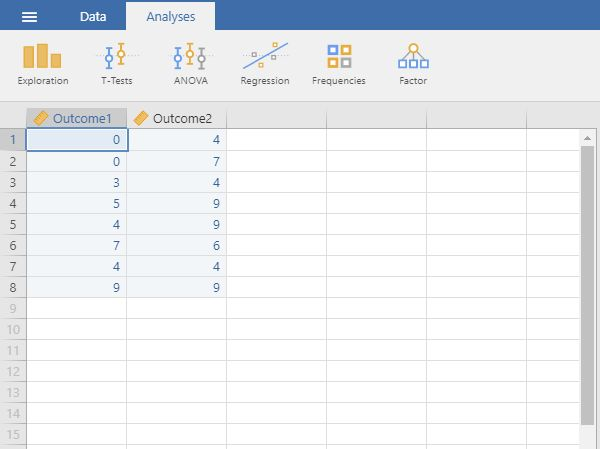</kbd>

---

### Entering Multiple Sample Data 

#### Steps for Defining Variables

1. First, click on the "Data" tab on the top of the window. Generally speaking, this is where you will enter the data for all of the variables in the data set. 

2. Click on a cell in the column (i.e., variable) that you wish to define. Click on "Setup" from the menu. This will bring up a new set of options. 

<kbd>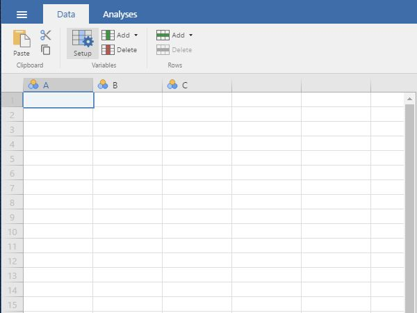</kbd>

#### Steps for Setting Variable Properties

3. You will need to define multiple variables. One variable will represent the Factor (Independent Variable) and the other will represent the Outcome (Dependent) Variable.

4. Provide a name and define
the level of measurement for 
the variables by choosing
the appropriate options. In
this example, "Factor" 
(Independent Variable) is
nominal. The "Outcome" 
(Dependent) variable is
continuous.

5. To hide the setup menu,
click on the large UP arrow
button next to the variable
name.

<kbd>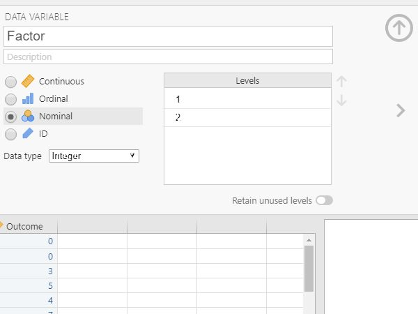</kbd>

#### Steps for Entering Data

6. Enter the data for all of
the participants. Notice 
that each participant has
scores on both the Factor
and Outcome Variables. There 
will be as many rows as
people.

7. On the categorical "Factor", 
you will use numbers to
represent the two categories 
(or "levels") of the 
variable.

8. If your data set has more
than two groups, simply be 
sure to add a group
indicator (a value on the
"Factor" variable) and a 
"Outcome" for each 
additional person. 

<kbd>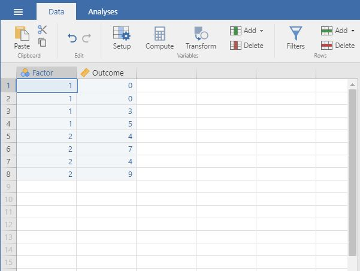</kbd>

---

### Entering Factorial Data 

#### Steps for Defining Variables

1. First, click on the "Data" 
tab on the top of the
window. Generally speaking,
this is where you will enter 
the data for all of the
variables in the data set. 

2. Click on a cell in the 
column (i.e., variable) that 
you wish to define. Click on 
"Setup" from the menu. This
will bring up a new set of 
options. 

<kbd></kbd>

#### Steps for Setting Variable Properties

3. You will need to define
multiple variables. Two
variables will represent the 
Factors (Independent 
Variables) and the other 
will represent the Outcome 
(Dependent) Variable.

4. Provide a name and define
the level of measurement for 
the variables by choosing
the appropriate options. In
this example, "FactorA" and
"FactorB" nominal. The 
"Outcome" (Dependent)
variable is continuous.

5. To hide the setup menu,
click on the large UP arrow
button next to the variable
name.

<kbd>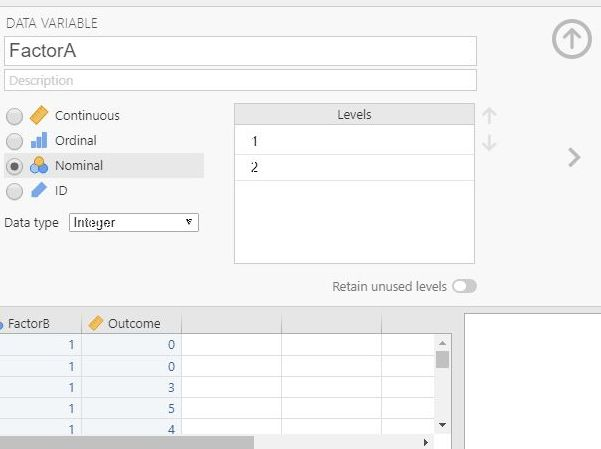</kbd>

#### Steps for Entering Data
 
6. Enter the data for all of
the participants. Notice 
that each participant has
scores on both of the
Factors and on the Outcome 
Variable. There will be as 
many rows as people. 

7. On the categorical Factors,
use the values that you
indicated when defining the
variables earlier. Note that 
the combination of values in 
the Factors will define the
multiple groups of the 
factorial design.

8. If your data set has more
than two levels for either 
(or both) of the Factors,
simply be sure to add an 
indicator and an outcome 
value for each additional
person.

<kbd>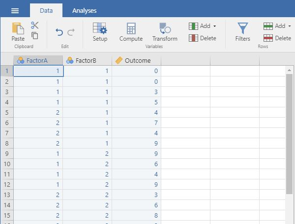</kbd>

---

### Descriptives (Frequencies and Descriptives) 

#### Steps for Obtaining Frequency-Related Statistics

1. First, enter the data
(described elsewhere). 

2. On the "Analyses" tab, 
select the "Exploration
Descriptives" option.

<kbd></kbd>

#### Steps for Obtaining a Frequency Distribution

3. A set of options will then 
appear for you to choose 
the variables and
statistics of interest.

4. Select the variables you 
wish to analyze by 
clicking on them in the
lefthand box and then the 
arrow to move them into
the righthand box.

5. Be sure that "Frequency
tables" is checked.
Without this checked, you
will not get a frequency 
distribution.

6. Output will automatically
appear on the right side 
of the window. 

<kbd></kbd>

#### Steps for Obtaining Summary Statistics

7. Though some basic summary
statistics are displayed 
by default, you can make 
changes by expanding the 
"Statistics" dropdown 
menu.

8. As you select the desired
statistics, the output on
the right side of the
window will be 
automatically updated. 

9. Individual tables (or even 
the whole section of 
Output) can be copied
using the dropdown arrow
options in the output. 
These can be pasted into 
other word processing
software for printing
purposes.

<kbd></kbd>

---

### Compute (Transformations and Standardized Scores)

#### Steps for Obtaining the Compute Menu

1. First, enter the data (described elsewhere).

2. After the data are entered, click on the column representing the data you wish to transform.

3. Select the “Compute” option from the menu. This will bring up a new set of options.

<kbd></kbd>

#### Steps for Computing Transformations

4. Type in the new you wish to give the new variable (here it is “trOutcome).

5. Click on the “fx” button to obtain the dropdown menu.  

6. Click on the variable you wish to transform (“Outcome”). This will place it in the formula editor. Then add, subtract, multiply, or divide as needed to get the transformation you want.

7. Hit “Enter” on your keyboard to perform the data transformation.

8. To hide the setup menu, click on the large UP arrow button to the right of the variable name.

<kbd>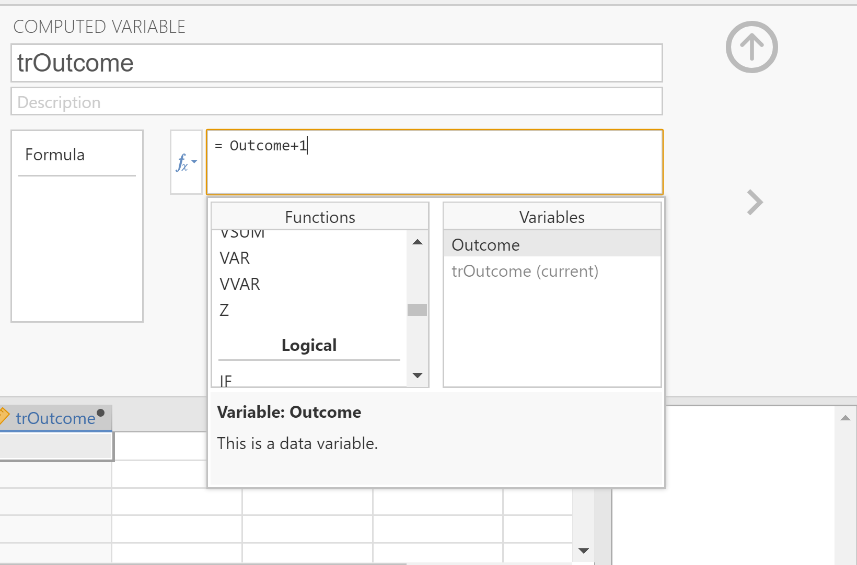</kbd>

#### Steps for Viewing the Transformed Scores

9. Note that transformed variables are not included in the output. Rather, they are saved as new variables in the data view window. 

10.	These variables can be used in subsequent analyses. You can follow the previous tutorials to get descriptive statistics for these variables.

<kbd>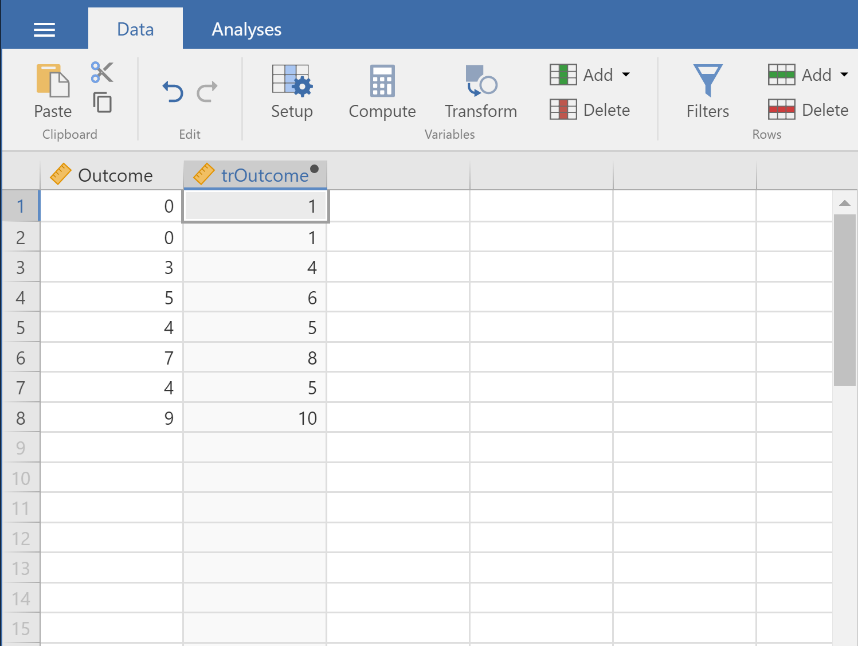</kbd>

#### Steps for Obtaining Standardized Scores

11.	In addition, you can obtain standardized scores. First, enter the data (described elsewhere).

12.	After the data are entered, click on the column representing the data you wish to transform.

13.	Select the “Compute” option from the menu. This will bring up a new set of options.

<kbd>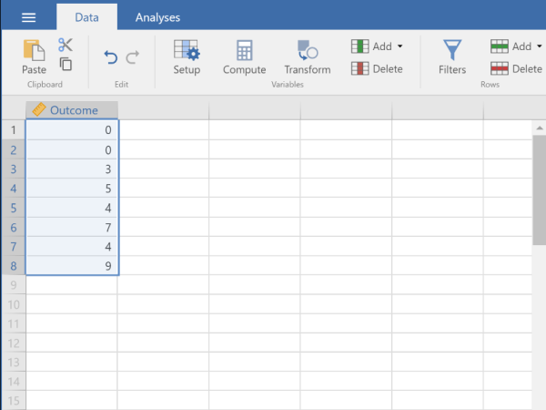</kbd>

#### Steps for Computing Standardized Scores

14.	Type in the new you wish to give the new variable (here it is “zOutcome).

15.	Click on the “fx” button to obtain the dropdown menu.  On the left side under functions, click on “z” to place it in the formula editor.

16.	Click on the variable you wish to transform (“Outcome”). This will place it in the formula editor. 

17.	Hit “Enter” on your keyboard to perform the data transformation.

18.	To hide the setup menu, click on the large UP arrow button to the right of the variable name.

<kbd>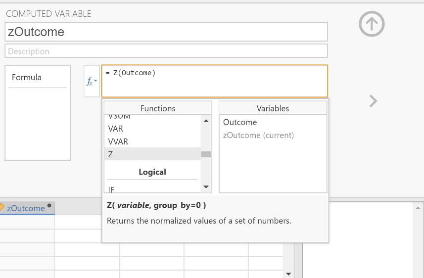</kbd>

#### Steps for Viewing the Standardized Scores

19.	Note that transformed variables are not included in the output. Rather, they are saved as new variables in the data view window. 

20.	These variables can be used in subsequent analyses. You can follow the previous tutorials to get descriptive statistics for these variables.

<kbd>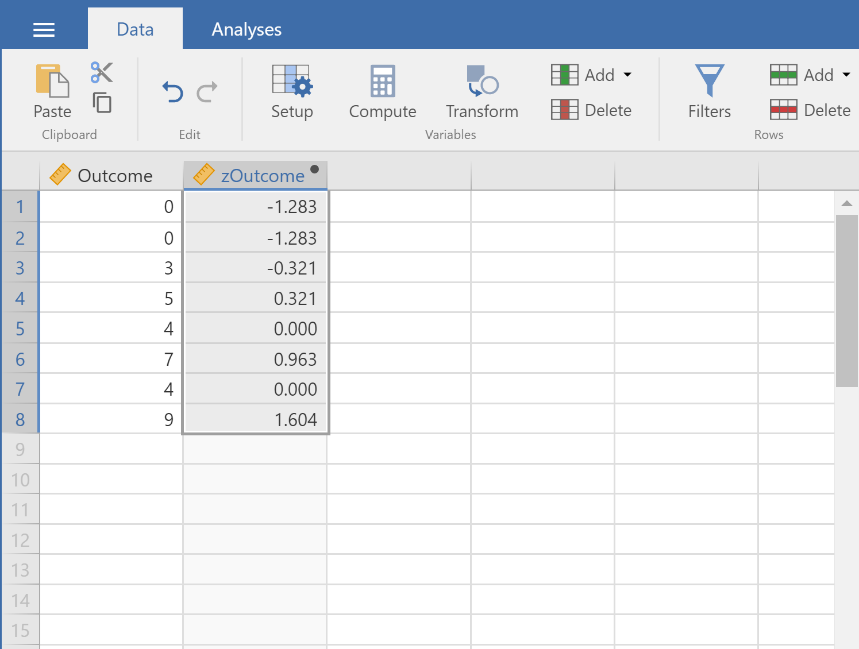</kbd>

---

### Correlations (Bivariate) 

#### Steps for Obtaining Correlational Statistics 

1. First, enter data involving multiple variables 
(described elsewhere). 

2. On the "Analyses" tab, 
select the "Regression 
Correlation Matrix" option.

<kbd>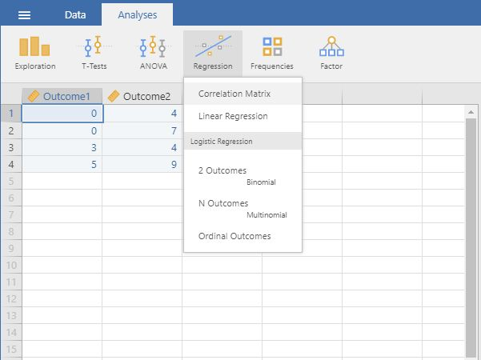</kbd>

#### Steps for Obtaining Correlations (and Significance Tests)

3. A set of options will then 
appear for you to choose 
the variables and
statistics of interest.

4. Select the variables you 
wish to analyze by 
clicking on them in the
lefthand box and then the 
arrow to move them into
the righthand box.

5. Output (with no descriptive
statistics) will 
automatically appear on
the right side of the
window. Output can be
copied and pasted into 
other documents for
printing.

6. If you wish descriptive
statistics associated with 
each variable, follow the
"Descriptives" procedures
described earlier in this
manual.

<kbd>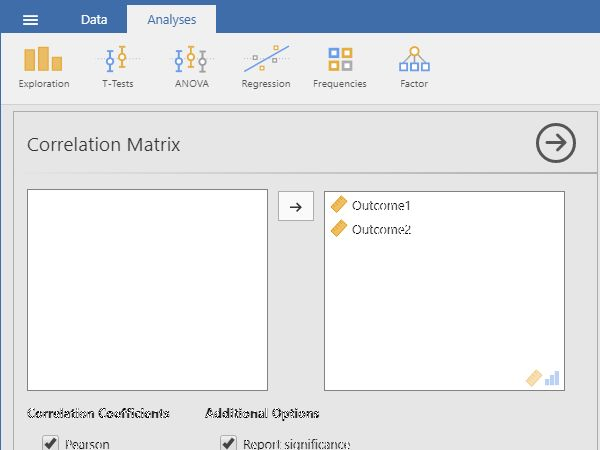</kbd>

---

### T Test (Confidence Intervals) 

#### Steps for Obtaining One Sample Inferential Statistics

1. First, enter the data (described elsewhere). 

2. On the “Analysis” tab, select the “T-Tests -> One Sample T-Test” option. 

<kbd></kbd>

#### Steps for Choosing the Variable

3. A set of options will then appear for you to choose the variables and statistics of interest.

4. Select the variable you wish to analyze by clicking on it in the left-hand box and then the arrow to move it into the right-hand box. 

5. Output will automatically appear on the right side of the window. Output can be copied and pasted into other documents for printing.

<kbd></kbd>

#### Steps for Obtaining the Statistics

6. To get the confidence interval for the mean, make sure the “Test Value” is set to zero.

7. Check the “Confidence Interval” box (and alter the width of the interval if desired). 

8. Similarly, select other options that are important for you: “Descriptives” will offer a mean and standard deviation for the variable; and “Descriptives plots” will provide a graph of the confidence interval.

9. Updated output will automatically appear on the right side of the window. Output can be copied and pasted into other documents for printing.

<kbd></kbd>

---

### T Test (One Sample) 

#### Steps for Obtaining One Sample Inferential Statistics

1. First, enter the data
(described elsewhere). 

2. On the "Analysis" tab, 
select the "T-Tests → One
Sample T-Test" option. 

<kbd>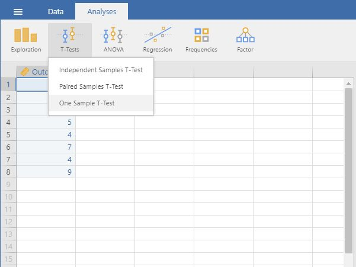</kbd>

#### Steps for Obtaining Significance Tests

3. A set of options will then 
appear for you to choose 
the variables and
statistics of interest.

4. Select the variable you wish 
to analyze by clicking on
it in the lefthand box
and then the arrow to move 
it into the righthand 
box. 

5. Output will automatically
appear on the right side 
of the window. Output can
be copied and pasted into
other documents for
printing.

<kbd>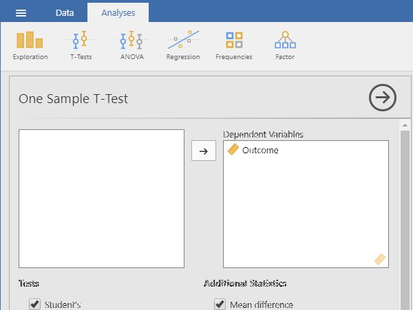</kbd>

#### Steps for Obtaining Additional Statistics

6. Be sure to enter a known or
hypothesized mean into the 
"Test Value" field. If you 
do not enter a value here, 
jamovi will automatically
use zero as the comparison 
mean.

7. If you wish to view (and 
alter) the width of the
confidence interval, check 
the "Confidence Interval"
box. 

8. Similarly, select other
options that are important 
for you: "Mean Difference" 
will display the size of 
the difference between the 
two means; "Effect size" 
will display Cohen's d;
and "Descriptives" will
offer a mean and standard
deviation for the group. 

9. Updated output will
automatically appear on
the right side of the
window. Output can be
copied and pasted into 
other documents for
printing.

<kbd>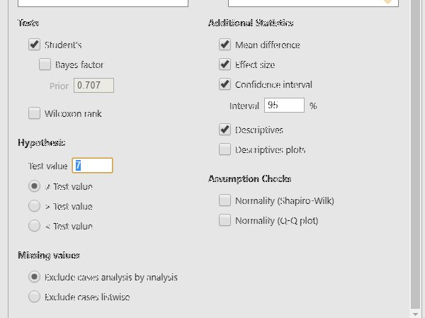</kbd>

---

### T Test (Paired Samples) 

#### Steps for Obtaining Paired Sample Inferential Statistics

1. First, enter paired samples
or repeated measures data
(described elsewhere). 

2. On the "Analysis" tab, 
Select the "T-Tests →
Paired Samples T-Test" 
option.

<kbd>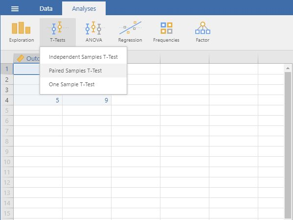</kbd>

#### Steps for Obtaining the Significance Test

3. A set of options will then 
appear for you to choose 
the variables and
statistics of interest.

4. Select the variables you 
wish to analyze by 
clicking on both of them 
while holding down the 
"CTRL" key. Then click on
the arrow to move the pair 
of variables to the
righthand box.

5. Output will automatically
appear on the right side 
of the window. Output can
be copied and pasted into
other documents for
printing.

<kbd>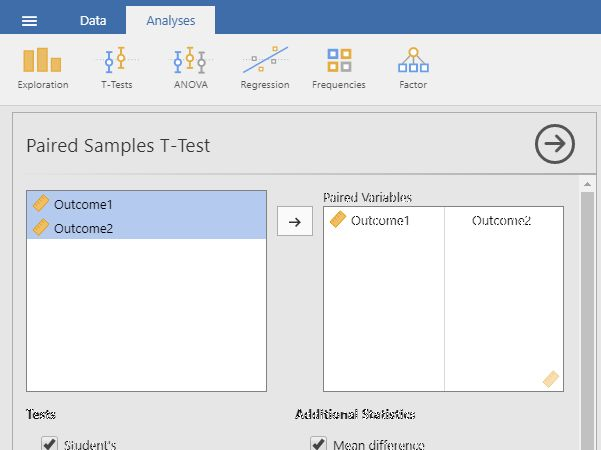</kbd>

#### Steps for Obtaining Additional Statistics 

6. If you wish to view (and 
alter) the width of the
confidence interval, check 
the "Confidence Interval"
box. 

7. Similarly, select other
options that are important 
for you: "Mean Difference" 
will display the size of 
the difference between the 
two means; "Effect size" 
will display Cohen's d;
and "Descriptives" will
offer means and standard 
deviations for each
variable.

8. Updated output will
automatically appear on
the right side of the
window. Output can be
copied and pasted into 
other documents for
printing.

<kbd>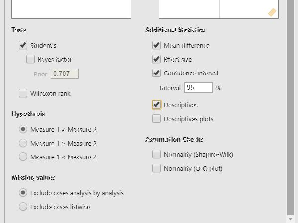</kbd>

---

### T Test (Independent Samples) 

#### Steps for Obtaining Two Sample Inferential Statistics

1. First, enter two sample data 
(described elsewhere). 

2. On the "Analysis" tab, 
select the "T-Tests →
Independent Samples T-Test"
option.

<kbd>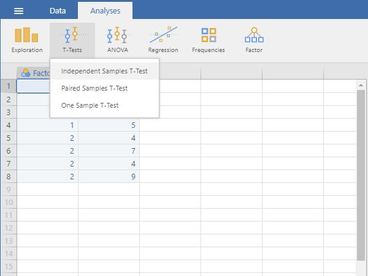</kbd>

#### Steps for Obtaining the Significance Test

3. A set of options will then 
appear for you to choose the 
variables and statistics of
interest.

4. Select the outcome variable
and click the arrow to move
it into the "Dependent 
Variables" box.

5. Move the Independent 
Variable to the "Grouping
Variable" box. 

6. Output will automatically
appear on the right side of
the window. Output can be
copied and pasted into other 
documents for printing.

<kbd>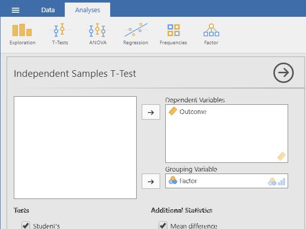</kbd>

 #### Steps for Obtaining Additional Statistics

7. If you wish to view (and 
alter) the width of the
confidence interval, check 
the "Confidence Interval"
box. 

8. Similarly, select other
options that are important 
for you: "Mean Difference" 
will display the size of the 
difference between the two 
group's means; "Effect size" 
will display Cohen's d; and
"Descriptives" will offer
means and standard 
deviations for each group. 

9. Updated output will
automatically appear on the
right side of the window.
Output can be copied and 
pasted into other documents
for printing.

<kbd>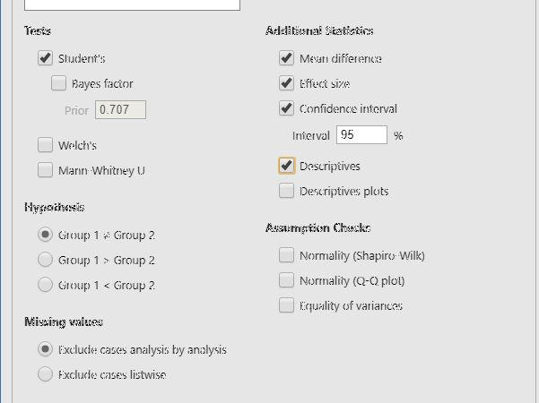</kbd>

---

### ANOVA (OneWay ANOVA)

 #### Steps for Obtaining Multiple Sample Inferential  Statistics

1. First, enter multiple group
data (described elsewhere).

2. On the "Analysis" tab, 
select the "ANOVA → ANOVA" 
option.

<kbd>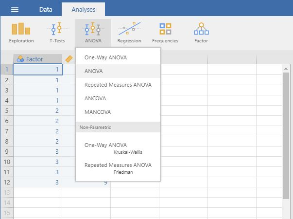</kbd>

#### Steps for Obtaining the Significance Test

3. A set of options will then 
appear for you to choose the 
variables and statistics of
interest.

4. Select the outcome variable
and click the arrow to move
it into the "Dependent 
Variable" box. 

5. Move the Factor (Independent 
Variable) to the "Fixed
Factors" box.

6. Output will automatically
appear on the right side of
the window. Output can be
copied and pasted into other 
documents for printing.

<kbd></kbd>

#### Steps for Obtaining Additional Statistics

7. Choose an effect size
measure from the "Effect 
Size" list.

8. If you wish descriptive
statistics for each group, 
use the "Descriptives" 
command described earlier in 
the sourcebook.

9. Updated output will
automatically appear on the
right side of the window.
Output can be copied and 
pasted into other documents
for printing.

<kbd></kbd>

---

### Post Hoc Tests (OneWay ANOVA) 

#### Steps for Obtaining Multiple Sample Inferential  Statistics

1. First, enter multiple group
data (described elsewhere).

2. On the "Analysis" tab, 
select the "ANOVA → ANOVA" 
option.

<kbd></kbd>

#### Steps for Obtaining the Significance Test

3. A set of options will then 
appear for you to choose the 
variables and statistics of
interest.

4. Select the outcome variable
and click the arrow to move
it into the "Dependent 
Variable" box. 

5. Move the Factor (Independent 
Variable) to the "Fixed
Factors" box.

6. Output will automatically
appear on the right side of
the window. Output can be
copied and pasted into other 
documents for printing.

<kbd></kbd>

#### Steps for Obtaining Additional Statistics

7. Choose an effect size
measure from the "Effect 
Size" list.

8. If you wish descriptive
statistics for each group, 
use the "Descriptives" 
command described earlier in 
the sourcebook.

9. Updated output will
automatically appear on the
right side of the window.
Output can be copied and 
pasted into other documents
for printing.

<kbd></kbd>

 #### Steps for Obtaining Post Hoc Tests

10. If you wish to obtain post 
hoc tests for the purpose of 
making comparisons between 
groups, click the "Post Hoc
Tests" dropdown button. 

11. Move the factor (Independent 
Variable) name from the
lefthand box to the 
righthand box.

12. Select "Tukey" to get Tukey
HSD post hoc tests (or 
whatever option you prefer). 

13. Updated output will
automatically appear on the
right side of the window.
Output can be copied and 
pasted into other documents
for printing.

<kbd>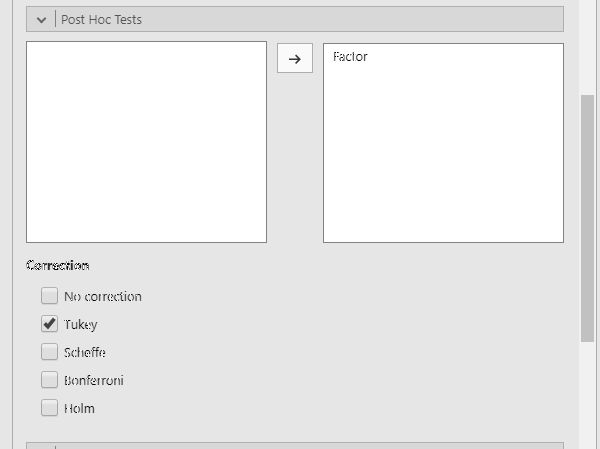</kbd>

---

### Repeated Measures ANOVA

 #### Steps for Obtaining Repeated Measures Inferential Statistics

1. First, enter repeated
measures data (described 
elsewhere).

2. On the "Analysis" tab, 
select the "ANOVA → Repeated 
Measures ANOVA" option.

<kbd>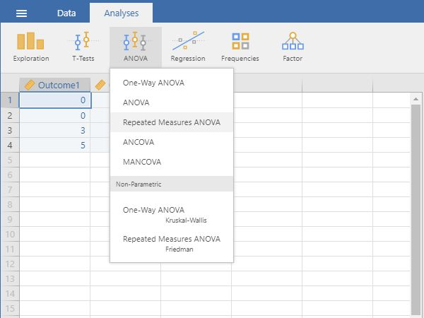</kbd>

#### Steps for Labeling the Within Subjects Variable/Factor

3. A set of options will then 
appear for you to choose the 
variables and statistics of
interest.

4. In the "Repeated Measures
Factors" box, you will 
define the repeated measures 
factor. This box is
necessary for labeling the 
repeated measurements of the 
same underlying factor.

5. Click on "RM Factor 1" and 
type in the name you wish to 
give to the repeated 
measures factor. In this 
example, "Factor" is used as 
the name.

6. Below that, click on "Level
1" to type the name of the 
individual level of the
repeated measures factor.
You may do the same for each 
level. In this example,
there were only 2 levels of
the factor.

<kbd>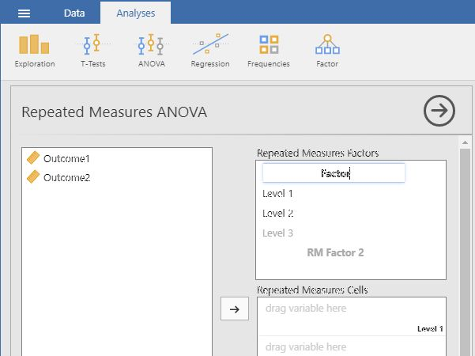</kbd>

#### Steps for Obtaining the Significance Test

7. In the "Repeated Measures
Cells" box, you will 
indicate which 
measurements/columns in the
data set reflect the 
instances of the repeated
measurements.

8. Select the instances you 
wish to associate with the 
factor by clicking on them 
and then arrow to move them. 
In this example, "Outcome1"
reflects the first level of
the factor and "Outcome2"
reflects the second level of 
the factor.

9. Note that this factor only 
exists in the computer's 
memory. For examples,
nowhere in the data set will 
you see a variable called
"Time."

10. Output will automatically
appear on the right side of
the window. Output can be
copied and pasted into other 
documents for printing.

<kbd>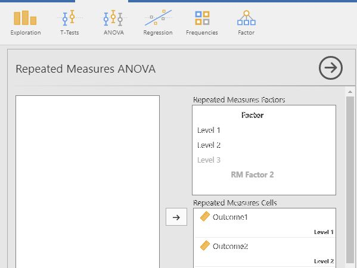</kbd>

#### Steps for Obtaining Additional Statistics

11. Choose an effect size
measure from the "Effect 
Size" list.

12. If you wish descriptive
statistics associated with 
each variable, follow the
"Descriptives" procedures
described earlier in this
sourcebook.

13. Updated output will
automatically appear on the
right side of the window.
Output can be copied and 
pasted into other documents
for printing.

<kbd>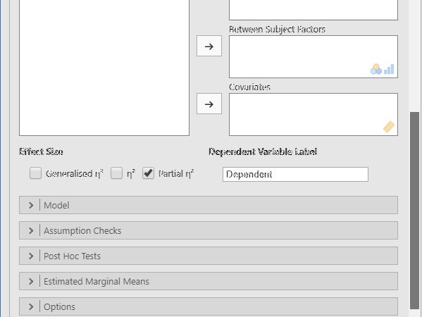</kbd>

---

### ANOVA (Factorial ANOVA)

#### Steps for Obtaining Factorial Inferential Statistics

1. First, enter factorial data
(described elsewhere). 

2. On the "Analysis" tab, 
select the "ANOVA → ANOVA" 
option.

<kbd></kbd>

#### Steps for Obtaining the Significance Test 

3. A set of options will then 
appear for you to choose the 
variables and statistics of
interest.

4. Select the outcome variable
and click the arrow to move
it into the "Dependent 
Variable" box. 

5. Move the multiple Factors
(Independent Variables) to 
the "Fixed Factors" box. 
(The interaction term will 
be automatically generated 
in the output.)

6. Output will automatically
appear on the right side of
the window. Output can be
copied and pasted into other 
documents for printing.

<kbd>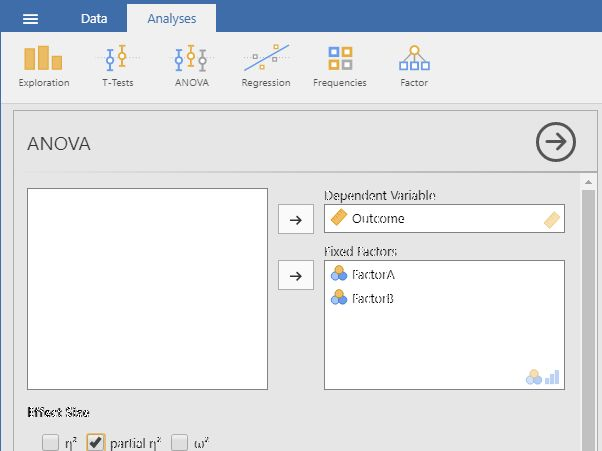</kbd>

#### Steps for Obtaining Additional Statistics

7. Choose an effect size
measure from the "Effect 
Size" list.

8. If you wish descriptive
statistics associated with 
each variable, follow the
"Descriptives" procedures
described earlier in this
sourcebook.

9. Updated output will
automatically appear on the
right side of the window.
Output can be copied and 
pasted into other documents
for printing.

<kbd>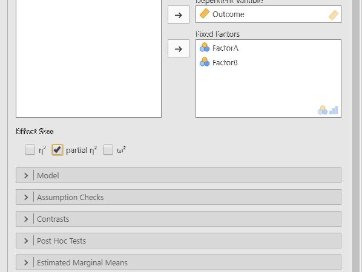</kbd>

