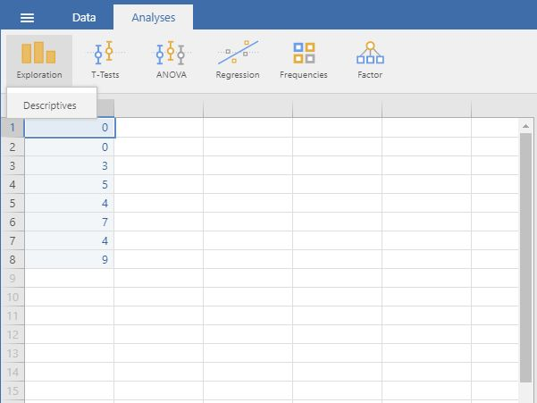
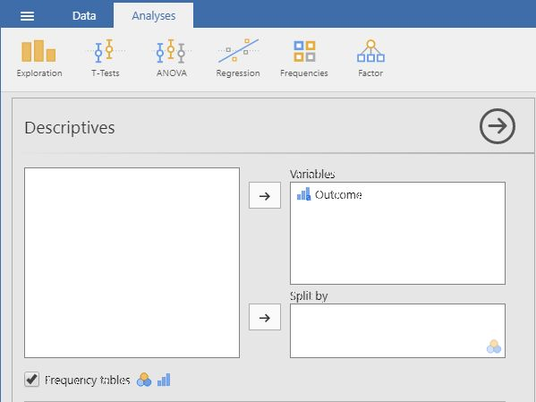
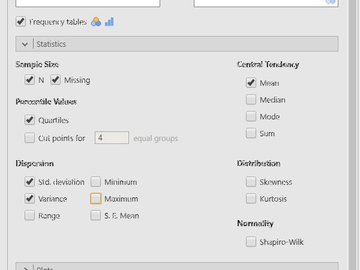

## jamovi: Using the Software

### Descriptives (Frequencies and Descriptives) 

#### Steps for Obtaining Frequency-Related Statistics

1. First, enter the data
(described elsewhere). 

2. On the "Analyses" tab, 
select the "Exploration
Descriptives" option.

<kbd></kbd>

#### Steps for Obtaining a Frequency Distribution

3. A set of options will then 
appear for you to choose 
the variables and
statistics of interest.

4. Select the variables you 
wish to analyze by 
clicking on them in the
lefthand box and then the 
arrow to move them into
the righthand box.

5. Be sure that "Frequency
tables" is checked.
Without this checked, you
will not get a frequency 
distribution.

6. Output will automatically
appear on the right side 
of the window. 

<kbd></kbd>

#### Steps for Obtaining Summary Statistics

7. Though some basic summary
statistics are displayed 
by default, you can make 
changes by expanding the 
"Statistics" dropdown 
menu.

8. As you select the desired
statistics, the output on
the right side of the
window will be 
automatically updated. 

9. Individual tables (or even 
the whole section of 
Output) can be copied
using the dropdown arrow
options in the output. 
These can be pasted into 
other word processing
software for printing
purposes.

<kbd></kbd>

