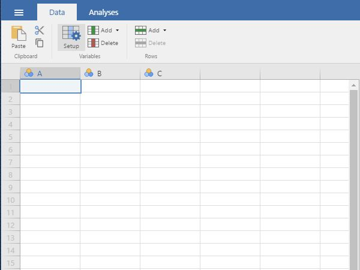
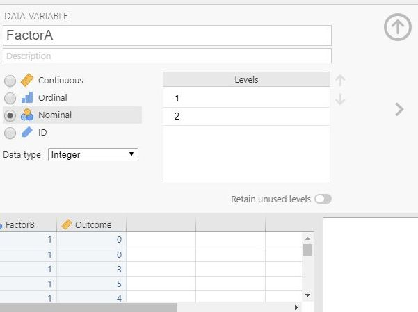
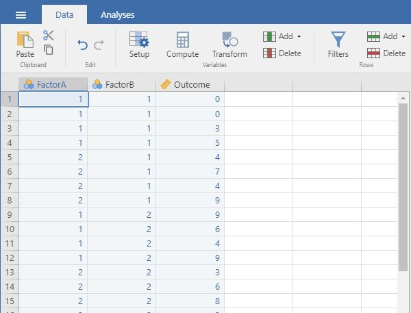

## jamovi: Using the Software

### Entering Factorial Data 

#### Steps for Defining Variables

1. First, click on the "Data" 
tab on the top of the
window. Generally speaking,
this is where you will enter 
the data for all of the
variables in the data set. 

2. Click on a cell in the 
column (i.e., variable) that 
you wish to define. Click on 
"Setup" from the menu. This
will bring up a new set of 
options. 

<kbd></kbd>

#### Steps for Setting Variable Properties

3. You will need to define
multiple variables. Two
variables will represent the 
Factors (Independent 
Variables) and the other 
will represent the Outcome 
(Dependent) Variable.

4. Provide a name and define
the level of measurement for 
the variables by choosing
the appropriate options. In
this example, "FactorA" and
"FactorB" nominal. The 
"Outcome" (Dependent)
variable is continuous.

5. To hide the setup menu,
click on the large UP arrow
button next to the variable
name.

<kbd></kbd>

#### Steps for Entering Data
 
6. Enter the data for all of
the participants. Notice 
that each participant has
scores on both of the
Factors and on the Outcome 
Variable. There will be as 
many rows as people. 

7. On the categorical Factors,
use the values that you
indicated when defining the
variables earlier. Note that 
the combination of values in 
the Factors will define the
multiple groups of the 
factorial design.

8. If your data set has more
than two levels for either 
(or both) of the Factors,
simply be sure to add an 
indicator and an outcome 
value for each additional
person.

<kbd></kbd>

