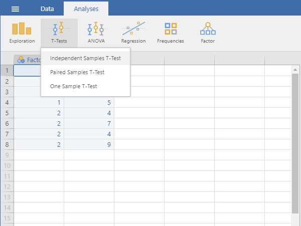

## jamovi: Using the Software

### T Test (Independent Samples) 

#### Steps for Obtaining Two Sample Inferential Statistics

1. First, enter two sample data 
(described elsewhere). 

2. On the "Analysis" tab, 
select the "T-Tests →
Independent Samples T-Test"
option.

<kbd></kbd>

#### Steps for Obtaining the Significance Test

3. A set of options will then 
appear for you to choose the 
variables and statistics of
interest.

4. Select the outcome variable
and click the arrow to move
it into the "Dependent 
Variables" box.

5. Move the Independent 
Variable to the "Grouping
Variable" box. 

6. Output will automatically
appear on the right side of
the window. Output can be
copied and pasted into other 
documents for printing.

<kbd></kbd>

 #### Steps for Obtaining Additional Statistics

7. If you wish to view (and 
alter) the width of the
confidence interval, check 
the "Confidence Interval"
box. 

8. Similarly, select other
options that are important 
for you: "Mean Difference" 
will display the size of the 
difference between the two 
group's means; "Effect size" 
will display Cohen's d; and
"Descriptives" will offer
means and standard 
deviations for each group. 

9. Updated output will
automatically appear on the
right side of the window.
Output can be copied and 
pasted into other documents
for printing.

<kbd></kbd>

