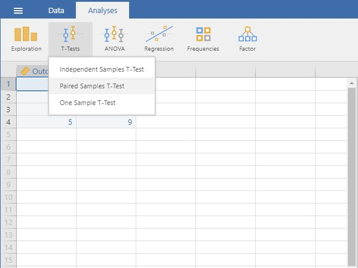
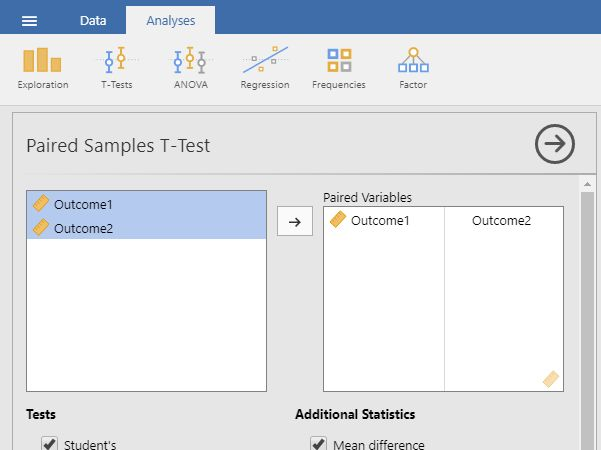
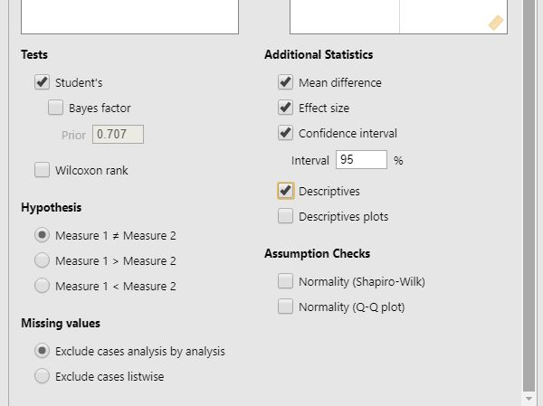

## jamovi: Using the Software

### T Test (Paired Samples) 

#### Steps for Obtaining Paired Sample Inferential Statistics

1. First, enter paired samples
or repeated measures data
(described elsewhere). 

2. On the "Analysis" tab, 
Select the "T-Tests →
Paired Samples T-Test" 
option.

<kbd></kbd>

#### Steps for Obtaining the Significance Test

3. A set of options will then 
appear for you to choose 
the variables and
statistics of interest.

4. Select the variables you 
wish to analyze by 
clicking on both of them 
while holding down the 
"CTRL" key. Then click on
the arrow to move the pair 
of variables to the
righthand box.

5. Output will automatically
appear on the right side 
of the window. Output can
be copied and pasted into
other documents for
printing.

<kbd></kbd>

#### Steps for Obtaining Additional Statistics 

6. If you wish to view (and 
alter) the width of the
confidence interval, check 
the "Confidence Interval"
box. 

7. Similarly, select other
options that are important 
for you: "Mean Difference" 
will display the size of 
the difference between the 
two means; "Effect size" 
will display Cohen's d;
and "Descriptives" will
offer means and standard 
deviations for each
variable.

8. Updated output will
automatically appear on
the right side of the
window. Output can be
copied and pasted into 
other documents for
printing.

<kbd></kbd>

